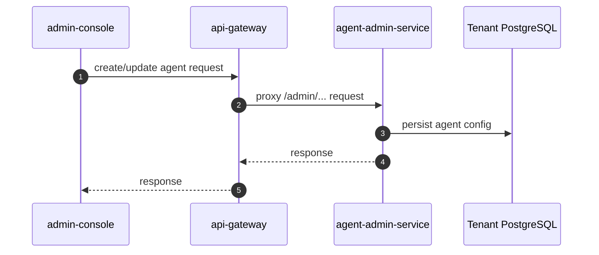
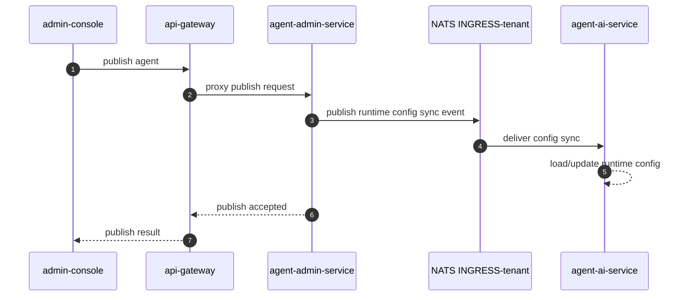
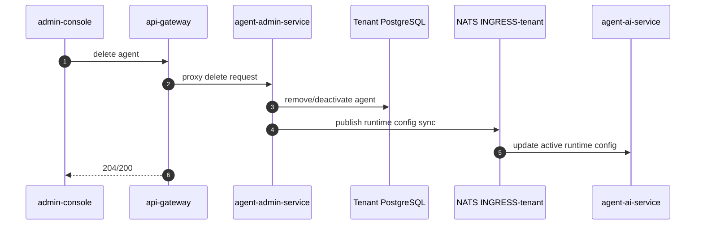
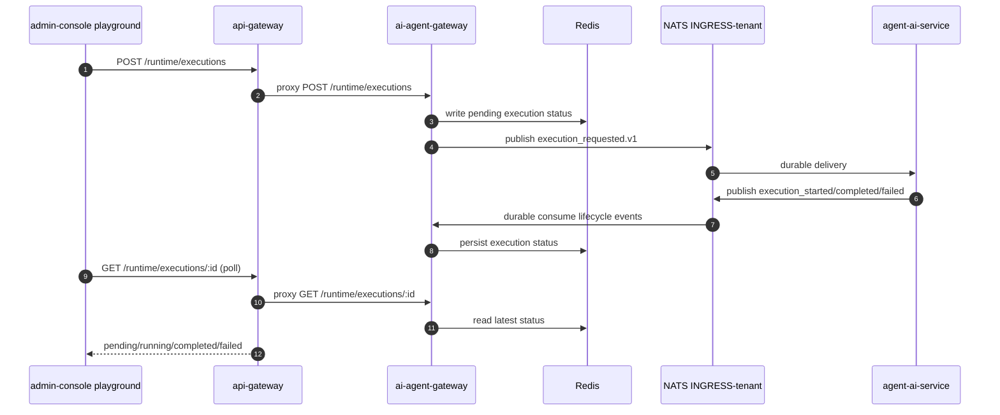
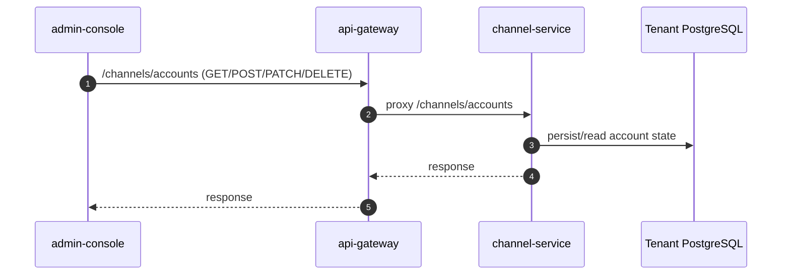

# UI Flows

This document explains how UI actions in Angular consoles map to backend services and internal execution paths.

All UI traffic goes through `api-gateway`.

## YoizenClaw Agent CRUD (admin-console)

### Component to Backend Mapping

| UI area | Frontend location | Gateway path | Backend owner |
|---|---|---|---|
| Agent management | `admin-console` YoizenClaw screens | `/admin/*` via gateway | `agent-admin-service` |
| Runtime test chat (playground) | `features/automation/ai/playground.component.ts` | `/runtime/executions` | `ai-agent-gateway` |

### Create / Edit Agent

### Publish Agent

### Delete Agent

## Test Chat (Playground)

The playground does not go through Temporal workflow orchestration. It submits execution directly to runtime gateway and then polls execution status.

### Execution Flow

### Result Delivery Mode

- Current playground uses polling (`GET /runtime/executions/:id` every ~1s, max wait ~5m).
- Runtime gateway also exposes SSE stream endpoint (`/runtime/executions/stream`) for future UI use.

## Channel Account Management (admin-console)

The admin-console uses the account API surface exposed by gateway.

### Account CRUD Flow

### Notes

- Telegram bot token and provider credentials are sent via account APIs; storage ownership is in `channel-service`.

## Workflow Builder — outbound reply node (admin-console)

The visual workflow builder represents a `channelSend` action as a **Channel** node with
`Direction = Outbound (send)`. Two fields support "answer the message that just arrived":

- **Recipient → "Reply to sender"** sets `to = {{request.from}}` (the inbound chat/sender id).
- **Channel Account → "Same as incoming message"** sets `accountId = {{request.envelope.accountId}}`
  and `channel`/`provider` to `{{request.channel}}` / `{{request.provider}}` — the reply rides the
  **same account that received the message**. This is the default for new reply nodes.

"Same as incoming message" is account-agnostic: it resolves from the triggering message at
runtime, so the workflow keeps working even if the underlying channel account is recreated, and
the builder no longer shows a blank, unselectable account dropdown for these replies. Pick a
specific account instead only for cross-account / cross-channel sends. Implementation:
`SOURCE_ACCOUNT_TEMPLATE` in `workflow-node-defaults.ts`, surfaced by `workflow-node-config.component.ts`.

## Message trace (Processes › Diagnostics, admin-console)

A role-gated (`diagnostics:read`) debug view that follows a single message across services by its
`correlation_id`. It renders the **business trace** natively — the causal chain
(`correlation_id`/`causation_id`/`depth`) plus the pub/sub fan-out (which durable consumers each
event reaches, including the silent `audit-service` sink) — and hands off to the **tech trace**:
`Open in Tempo` (OTel `traceid` span waterfall) and `Open in Temporal` (workflow run history). It
also preloads recent correlations from the last 5 minutes.

Slice 1 (route `/processes/trace[/:correlationId]`) is frontend-only and assembles the chain
client-side from the existing audit list endpoints (`/audit/channel-events`, `/audit/events`); the
chain-tree endpoint isn't exposed through the gateway. Live consumer health and per-message
delivery are later slices. Temporal/Tempo links render only when `temporalUiBaseUrl` / `tempoBaseUrl`
are configured. Entry points: direct lookup, the recent list, and a "View chain" link on the
Workflow → Executions row. Spec: `.sdd/changes/processes-message-trace/`.

## References

- `services/admin-console/src/app/core/services/agent-runtime.service.ts`
- `services/admin-console/src/app/features/automation/ai/playground.component.ts`
- `services/admin-console/src/app/core/services/channel-admin.service.ts`
- `services/api-gateway/src/modules/runtime/runtime.controller.ts`
- `services/api-gateway/src/modules/channels/channels.controller.ts`
