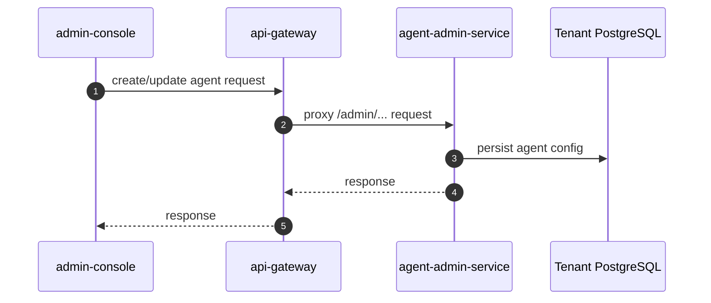
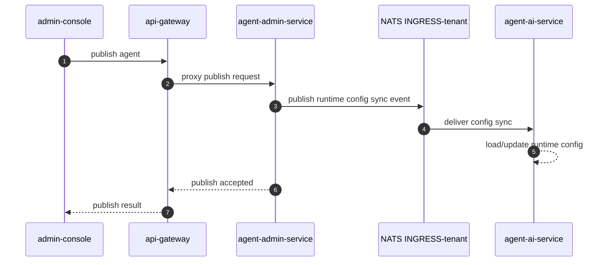
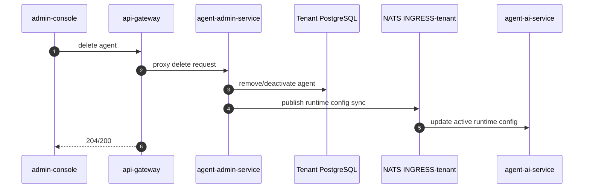
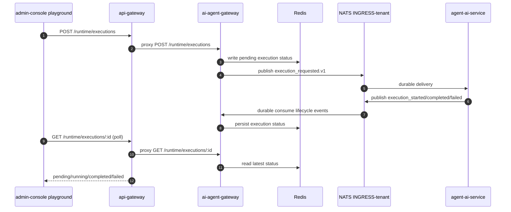
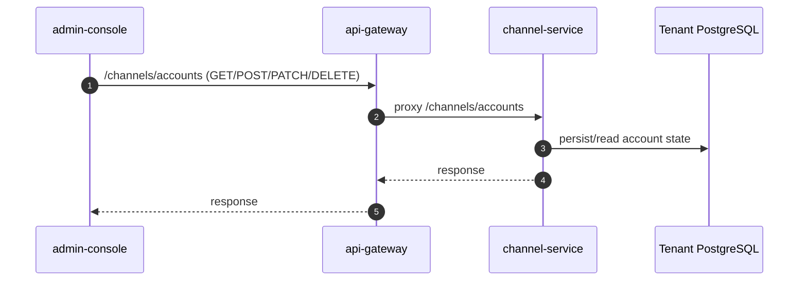

# UI Flows

This document explains how UI actions in Angular consoles map to backend services and internal execution paths.

All UI traffic goes through `api-gateway`. The console's `environment.apiUrl` is
`"/api"` (both `environment.ts` and `environment.prod.ts`), which matches the
gateway's `app.setGlobalPrefix("api")` — so every path written below without the
prefix is really `/api/<path>` on the wire.

## YoizenClaw Agent CRUD (admin-console)

### Component to Backend Mapping

| UI area | Frontend location | Gateway path | Backend owner |
|---|---|---|---|
| Agent management | `admin-console` YoizenClaw screens | `/admin/*` via gateway | `agent-admin-service` |
| Runtime test chat (playground) | `features/automation/ai/playground.component.ts` | `/runtime/executions` | `ai-agent-gateway` |

### Create / Edit Agent

### Publish Agent

### Delete Agent

## Test Chat (Playground)

The playground does not go through Temporal workflow orchestration. It submits execution directly to runtime gateway and then polls execution status.

### Execution Flow

### Result Delivery Mode

- The playground polls: `PlaygroundComponent.waitForExecution()` loops on
  `GET /api/runtime/executions/:id` with a fixed `setTimeout(1000)` between reads and a
  `Date.now() + 300_000` deadline (5 min), returning on `completed`/`failed` and
  throwing `Execution '<id>' timed out` otherwise. There is no backoff and no SSE.
- The streaming endpoint is **`POST /api/runtime/executions/stream`** (`@Post("stream")`
  on `RuntimeController`), not a GET. Today its consumer is the SDK's `runtime.stream()`,
  not the console — see [runtime-streaming.md](../architecture/runtime-streaming.md).

## Channel Account Management (admin-console)

The admin-console uses the account API surface exposed by gateway.

### Account CRUD Flow

### Notes

- Telegram bot token and provider credentials are sent via account APIs; storage ownership is in `channel-service`.

## Workflow Builder — outbound reply node (admin-console)

The visual workflow builder represents a `channelSend` action as a **Channel** node with
`Direction = Outbound (send)`. Two fields support "answer the message that just arrived":

- **Recipient → "Reply to sender"** sets `to = {{request.from}}` (the inbound chat/sender id).
- **Channel Account → "Same as incoming message"** sets `accountId = {{request.envelope.accountId}}`
  and `channel`/`provider` to `{{request.channel}}` / `{{request.provider}}` — the reply rides the
  **same account that received the message**. This is the default for new reply nodes.

"Same as incoming message" is account-agnostic: it resolves from the triggering message at
runtime, so the workflow keeps working even if the underlying channel account is recreated, and
the builder no longer shows a blank, unselectable account dropdown for these replies. Pick a
specific account instead only for cross-account / cross-channel sends. Implementation:
`SOURCE_ACCOUNT_TEMPLATE` in `workflow-node-defaults.ts`, surfaced by `workflow-node-config.component.ts`.

## Message trace (direct Processes route, admin-console)

A direct debug view at `/processes/trace` and `/processes/trace/:correlationId` follows a single message across services by its `correlation_id`. It is under the shell `authGuard`; the component itself requires `diagnostics:read` before loading data, but there is no route-level permission guard and it is not listed as a Processes sub-nav item.

It renders the **business trace** natively — the causal chain (`correlation_id`/`causation_id`/`depth`) plus pub/sub fan-out — and hands off to the **tech trace** through `Open in Tempo` (OTel `traceid`) and `Open in Temporal` (workflow run history).

The frontend assembles the chain client-side from existing audit list endpoints (`/audit/channel-events`, `/audit/events`) plus workflow executions (`/workflows/executions?correlation_id=...`). The gateway does not expose an audit chain-tree endpoint. Temporal/Tempo links render only when `temporalUiBaseUrl` / `tempoBaseUrl` are configured. Entry points are direct lookup, recent traces, and deep links with a correlation id. Spec: `.sdd/changes/processes-message-trace/`.

## References

- `services/admin-console/src/app/core/services/agent-runtime.service.ts`
- `services/admin-console/src/app/features/automation/ai/playground.component.ts`
- `services/admin-console/src/app/core/services/channel-admin.service.ts`
- `services/api-gateway/src/modules/runtime/runtime.controller.ts`
- `services/api-gateway/src/modules/channels/channels.controller.ts`
