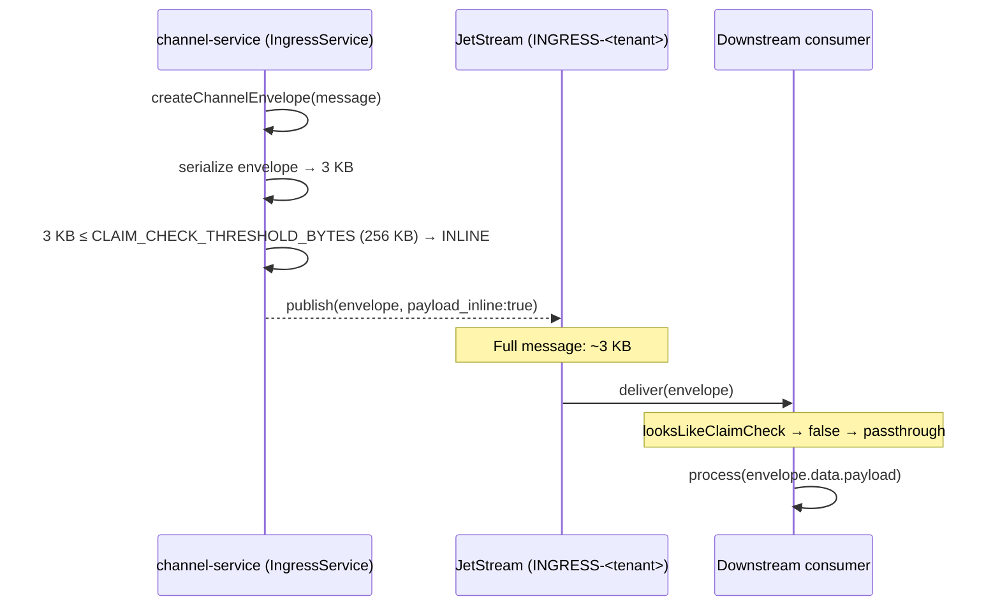
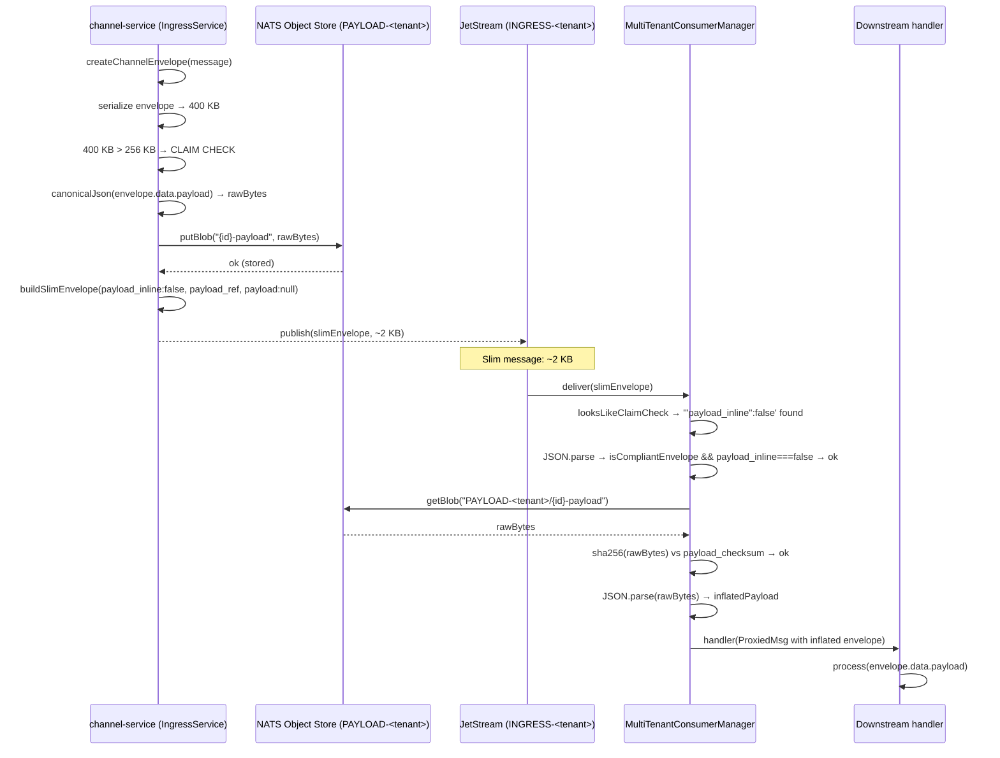
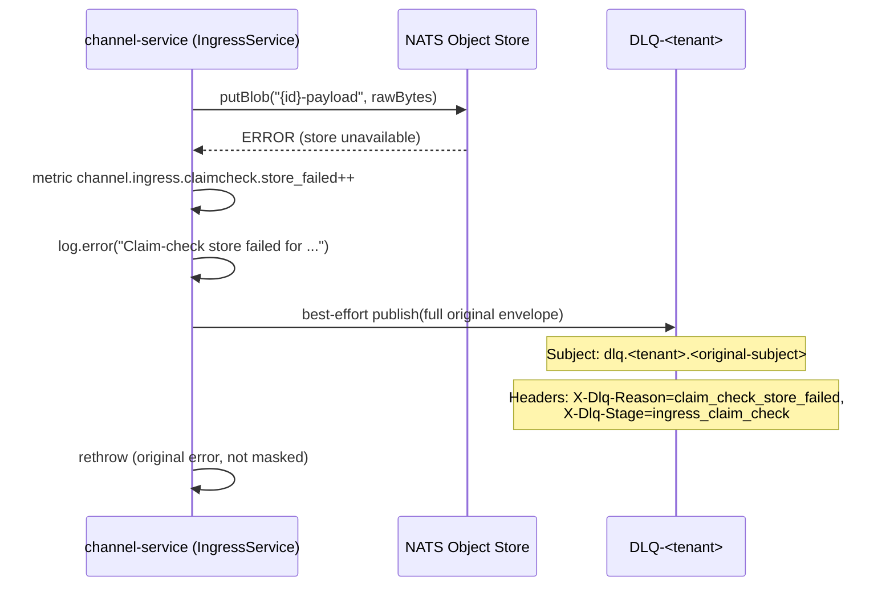
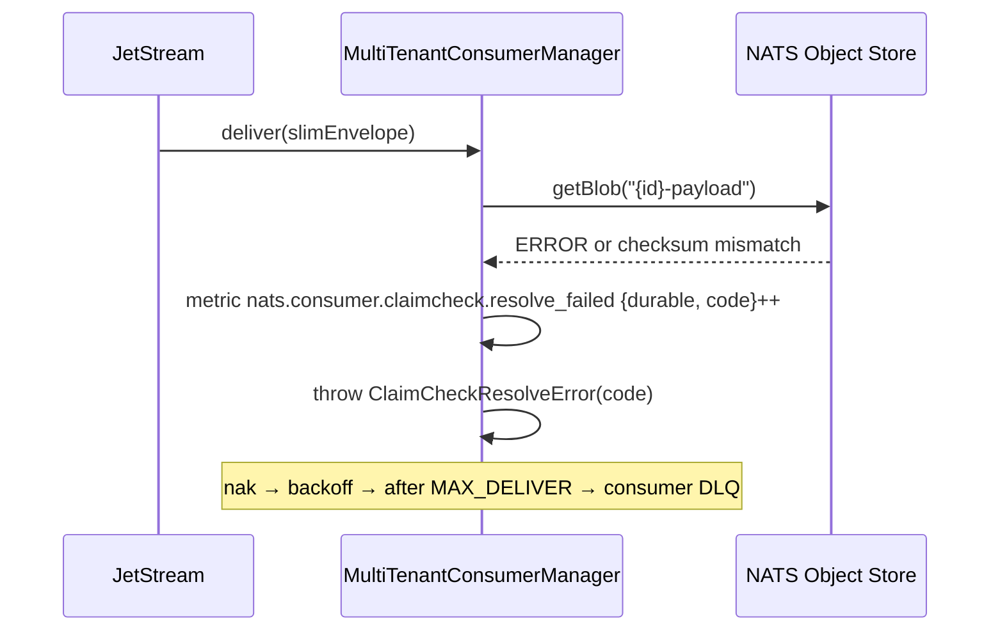

# Claim-Check Pattern: Large Payloads

**Status:** Operational reference — as-built system
**Audience:** Dev + Infra
**Last updated:** 2026-06-11

> Operational reference for NATS/JetStream: [`service-bus.md`](service-bus.md).
> Envelope contract source of truth: `packages/shared/src/interfaces.ts`.

---

## 1. Summary

NATS is designed for small messages (sweet spot below 100 KB, default max 1 MB). For serialized envelopes that exceed the configured threshold, the platform uses the Claim-Check pattern: store only the payload in NATS Object Store and send a lightweight envelope with a reference over the bus.

The pattern is **implemented for canonical channel publish**: `channel-service` stores oversized `ChannelEnvelope` payloads and `MultiTenantConsumerManager` resolves slim envelopes with checksum verification. Stage-1 `WebhookIngressEnvelope` messages from `api-gateway` are not claim-checked; they are published inline.

---

## 2. Pattern Concept and Architecture

The analogy is a coat check: you leave your coat, receive a ticket, and enter the venue with only the ticket. Anyone who needs the coat presents the ticket to retrieve it.

```
┌──────────────┐     ┌──────────────────┐     ┌──────────────┐
│   Producer    │     │   NATS JetStream  │     │   Consumer    │
│ (IngressSvc)  │     │   (slim bus)      │     │  (downstream) │
└──────┬───────┘     └────────┬─────────┘     └──────┬───────┘
       │                      │                       │
       │  ┌──────────────────────────────────┐       │
       └──┤   NATS Object Store              ├───────┘
          │   PAYLOAD-<tenant>               │
          └──────────────────────────────────┘
```

---

## 3. Sequence Diagrams

### 3.1 Inline flow (serialized envelope below threshold)

The common case. The payload travels inside the message.



### 3.2 Claim-check flow (serialized envelope above threshold)



### 3.3 Object Store write failure (producer side)



### 3.4 Blob resolution failure (consumer side)



---

## 4. NATS Object Store

### 4.1 What it is

A native JetStream feature for storing large blobs. It provides versioning, TTL, and key-based access. It is part of NATS — no additional infrastructure required.

### 4.2 Configuration — one bucket per tenant

Configured by `IngressService.getClaimCheckBucket` (`services/channel-service/src/modules/ingress/ingress.service.ts`):

| Parameter | Value | Source |
|-----------|-------|--------|
| Bucket name | `PAYLOAD-<tenantId>` | `buildClaimCheckBucket(tenant)` in `packages/shared/src/channel.utils.ts` |
| Storage | `file` | Durable across server restarts |
| TTL | 7 days (nanoseconds) | `CLAIM_CHECK_BUCKET_TTL_NS` — aligned to `CHANNEL_STREAM_MAX_AGE_NS` |
| Max bytes | 512 MB | `CLAIM_CHECK_BUCKET_MAX_BYTES` |

Constants in: `packages/shared/src/channel.constants.ts`

**Operational note:** `views.os()` does not reconfigure existing buckets — if a bucket was created with different options (e.g., in development), delete it with `nats object rm PAYLOAD-<tenant>` to apply the new parameters.

### 4.3 Key convention

```
{envelopeId}-payload
```

Example: `b7d9e2f4-1a3c-5e7f-9b1d-2c3e4f5a6b7c-payload`

The key is derived from the envelope's `id` field — a direct correlation between bus message and Object Store payload.

### 4.4 Lifecycle

No manual garbage collection. Objects expire by TTL (7 days), aligned with the tenant ingress stream's `max_age`.

### 4.5 Tier sizing (declared but not wired)

> **Status: declared in the tier table, not wired to the bucket**
>
> Messaging tiers shipped 2026-08-01 (`free` / `pro` / `enterprise` — see [`tenant-messaging-tiers.md`](tenant-messaging-tiers.md)) and `TENANT_TIER_LIMITS` in `packages/shared/src/tenant-stream.constants.ts` carries an `object_store_max_bytes` per tier. Nothing reads it: `IngressService.getClaimCheckBucket` still passes the flat `CLAIM_CHECK_BUCKET_MAX_BYTES` / `CLAIM_CHECK_BUCKET_TTL_NS`, so the global bucket configuration applies to every tenant regardless of tier (the tiers loop's decision 5 — claim-check buckets and DLQ streams stay flat).

---

## 5. Activation Threshold

### 5.1 Trigger: serialized envelope size

The threshold is measured against the **full serialized envelope** (not just the payload). This protects the real NATS limit (`max_payload = 1 MB`).

```typescript
// services/channel-service/src/modules/ingress/ingress.service.ts
const payloadBytes = UTF8_TEXT_ENCODER.encode(JSON.stringify(envelope));
if (payloadBytes.byteLength > CLAIM_CHECK_THRESHOLD_BYTES) { /* claim check */ }
```

In contrast, the `data.payload_bytes` field in the slim envelope reports the **canonical byte length of the payload** (`canonicalByteLength(payload)`), not the full envelope. These are two distinct measurements with distinct purposes.

### 5.2 Configured value

| Level | Config | Current value |
|-------|--------|---------------|
| Global | `CLAIM_CHECK_THRESHOLD_BYTES` | `262144` (256 KB) — `packages/shared/src/channel.constants.ts` |

### 5.3 Extended configurability and duplicate constants (pending cleanup)

> **Status: pending — not implemented**
>
> Per-tenant (`tenant.{id}.claim_check_threshold`) and per-agent-category (`agent.{category}.claim_check_threshold`) override levels exist in the original design but not in the code. Only the global threshold is implemented for channel ingress. The shared package exposes `CLAIM_CHECK_THRESHOLD_BYTES`; `agent-ai-service` also has a local 256 KB copy for its unused `ClaimCheckService`, so threshold configuration is not yet centralized.

---

## 6. Checksum Invariant

The producer stores exactly `utf8(canonicalJson(data.payload))` in Object Store and the consumer verifies sha256 over those same raw bytes (without re-canonicalizing). This is the central invariant of the pattern:

```
Producer:
  rawBytes   = UTF8_TEXT_ENCODER.encode(canonicalJson(envelope.data.payload))
  stored     = os.putBlob(key, rawBytes)
  checksum   = computePayloadChecksum(payload)  // sha256(canonicalJson(payload))
  slim.data.payload_checksum = checksum

Consumer (resolveClaimCheckEnvelope in packages/database/src/claim-check.ts):
  rawBytes  = os.getBlob(key)
  actual    = "sha256:" + sha256(rawBytes)       // hash over raw bytes
  assert actual === envelope.data.payload_checksum
  payload   = JSON.parse(rawBytes.toString("utf8"))
```

**Why consumers must NOT re-canonicalize:** the stored bytes are the result of `canonicalJson`, and their sha256 was computed before the store. Re-canonicalizing would do a round-trip `parse → stringify` that could alter the bytes (if `JSON.parse` does not preserve exact key order) and break verification.

---

## 7. Consumer Middleware (As-Built)

### 7.1 Central integration in MultiTenantConsumerManager

Claim-check resolution is not the responsibility of individual consumers. `MultiTenantConsumerManager.wrapHandler` (`packages/database/src/multi-tenant-consumer-manager.ts`) transparently wraps every registered handler:

**Middleware flow:**

1. **Fast pre-check:** `looksLikeClaimCheck(msg.data)` scans for the literal `'"payload_inline":false'` at the byte level. If not found → passthrough to the handler without parsing.
2. **Parse and guard:** `JSON.parse` + `isCompliantEnvelope` + `payload_inline === false`. If any check fails → passthrough.
3. **Resolution:** `resolveClaimCheckEnvelope(envelope, getStore)` → fetch blob → sha256 verification → `JSON.parse`.
4. **Proxy:** the handler receives a proxied `JsMsg` that returns the inflated JSON in `msg.data`. The `ack/nak/term` functions delegate to the original message (explicit binding to preserve NATS's internal `this`).
5. **Error:** `ClaimCheckResolveError` → nak → exponential backoff → after `MAX_DELIVER` attempts → consumer's DLQ.

### 7.2 Error codes

```typescript
type ClaimCheckErrorCode =
  | "ref_missing"       // payload_inline:false but no payload_ref
  | "ref_malformed"     // URI is not nats://objstore/<bucket>/<key>
  | "blob_not_found"    // Object Store does not have the key
  | "checksum_mismatch" // sha256 does not match
```

Source: `packages/database/src/claim-check.ts`

### 7.3 Consumer metrics

| Metric | Labels | Measures |
|--------|--------|----------|
| `nats.consumer.claimcheck.resolved` | `{durable}` | Successfully resolved envelopes |
| `nats.consumer.claimcheck.resolve_failed` | `{durable, code}` | Resolution failures, with error code |

Implemented in `packages/observability/src/nats-consumer-metrics.ts`, registered via `createNatsConsumerMetrics`.

---

## 8. Producer Metrics

Defined in `services/channel-service/src/modules/ingress/ingress.metrics.ts`:

| Metric | Labels | Measures |
|--------|--------|----------|
| `channel.ingress.claim_check_count` | `{channel, tenant}` | Messages that triggered claim-check |
| `channel.ingress.claimcheck.stored` | `{tenant}` | Payloads stored successfully |
| `channel.ingress.claimcheck.store_failed` | `{tenant}` | Failures writing to Object Store |

---

## 9. ClaimCheckService in agent-ai-service

`agent-ai-service` has its own `ClaimCheckService` (`services/agent-ai-service/src/modules/claim-check/claim-check.service.ts`) with methods `checkPayloadSize`, `storePayload`, and `resolvePayload`. The module is registered in `AppModule` but is currently **not connected to any message handler**.

> **Status: exists but unused**
>
> `ClaimCheckService` in `agent-ai-service` is not integrated into the consumption pipeline. Claim-check resolution for that service's consumers is handled by the central `MultiTenantConsumerManager` middleware, not by this local service.

---

## 10. Implementation Considerations

### 10.1 Operation ordering invariant

Always store in Object Store **before** publishing to the bus:

```
CORRECT:   store(rawBytes) → publish(slimEnvelope)
INCORRECT: publish(slimEnvelope) → store(rawBytes)
```

If you publish first and the store fails, you leave a broken reference in the bus.

### 10.2 Atomicity

The operation is two steps (store + publish). If the publish fails after the store, an orphaned object remains in Object Store. This is acceptable: the TTL cleans up orphans automatically. A distributed transaction would add complexity disproportionate to the benefit.

### 10.3 Idempotency of `putBlob`

If the same event is retried (e.g., due to a publish failure), `putBlob` with the same key overwrites the previous value. This is idempotent by NATS Object Store design.

### 10.4 Consumers that do not need the payload

Some consumers only need envelope metadata (e.g., a metrics service counting message sizes). They can use `data.payload_bytes` for statistics without resolving the reference. By default `MultiTenantConsumerManager.wrapHandler` resolves the claim-check regardless — set `IMultiTenantConsumerConfig.resolveClaimChecks: false` to opt a consumer out entirely: `wrapHandler` then passes every message through untouched (slim envelope, no resolution attempt, no nak on what would have been a resolve failure). Every other consumer keeps the default (`true`) resolve-then-nak behavior unchanged.

This flag is more than an optimization for consumers that run **DLQ-disabled with unbounded `maxDeliver`** (e.g. `tracking-ingester-service`): resolving in the middleware there would turn an expired `payload_ref` into an infinite poison-message loop, since a resolve failure re-throws → nak → redelivery forever, and the underlying event would never be persisted. Those consumers set `resolveClaimChecks: false` and perform their own best-effort resolution inside the inner handler, persisting a slim/`unresolved` record instead of nak-ing.

### 10.5 Store migration path

The `payload_ref` contract supports different URI schemes:

- `nats://objstore/PAYLOAD-<tenant>/{id}-payload` → NATS Object Store (implemented; current code preserves the tenant ID casing supplied to `buildClaimCheckBucket`)
- `s3://bucket-name/tenant/{id}-payload` → S3/MinIO (future design)
- `mongodb://collection/{id}` → MongoDB (future design)

Migrating to a different store means changing the producer and the implementation of `resolveClaimCheckEnvelope`, without modifying the envelope contract or consumers.
