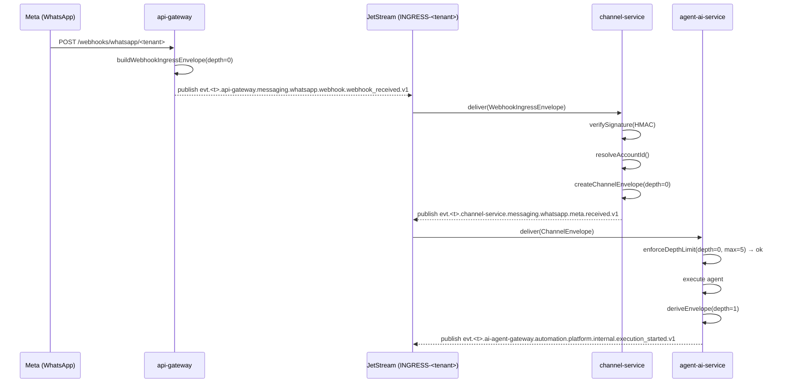

# Ingress: Webhook Bridge and Agent Pipelines

**Status:** Operational reference — as-built system
**Audience:** Dev
**Last updated:** 2026-06-11

> Operational reference for NATS/JetStream: [`service-bus.md`](service-bus.md).
> Envelope contract source of truth: `packages/shared/src/interfaces.ts`.

---

## 1. Overview

The messaging ingress pipeline is a **two-stage bridge** between an external provider (Meta, Telegram, etc.) and the internal event bus (JetStream). Neither stage has access to tenant business data until the message has been authenticated by HMAC signature.

```
External provider
      │
      ▼
[api-gateway]  POST /webhooks/:channel/:tenantId
      │  publishes WebhookIngressEnvelope → INGRESS-<tenant>
      ▼
[channel-service]  durable consumer: channel-webhook-ingress
      │  verifies HMAC signature, parses messages, resolves accountid
      │  publishes ChannelEnvelope → INGRESS-<tenant>
      ▼
Downstream consumers (agent-ai-service, workflow-service, audit-service, etc.)
```

---

## 2. Stage 1: api-gateway

### 2.1 Endpoint

```
POST /webhooks/:channel/:tenantId
GET  /webhooks/:channel/:tenantId   ← hub.challenge verification (Meta)
```

Both endpoints are public (`@Public()`, `@SkipTenant()`). The tenant is resolved only from the path parameter — no JWT and no tenant guard.

File: `services/api-gateway/src/modules/channels/webhooks.controller.ts`

Successful response: HTTP 200 with body `{ "status": "accepted" }`.

### 2.2 WebhookIngressEnvelope

`WebhookIngressPublisherService` builds and publishes a `WebhookIngressEnvelope` (defined in `packages/shared/src/webhook.interfaces.ts`):

| Field | Value |
|-------|-------|
| `producer` | `"api-gateway"` |
| `kind` | `"webhook_received"` |
| `provider` | `"webhook"` |
| `transport.method` | `"webhook"` |
| `transport.protocol` | `"https"` |
| `transport.depth` | `0` |
| `data.raw_body_b64` | Raw body encoded in base64 |
| `data.headers` | Subset filtered by `WEBHOOK_FORWARDED_HEADERS_SET` |
| `accountid` | **Absent** — unknown at this stage |

The envelope ID is a UUID v4 (`crypto.randomUUID()`).

The `accountid` field is deliberately absent: at this point the request has not passed signature verification, and the provider account (WhatsApp Business ID, Telegram bot, etc.) has not been resolved. Including a placeholder would corrupt per-account billing aggregations. See the comment in `webhook-ingress-publisher.service.ts:85`.

Type: `WebhookIngressEnvelope = Omit<EventEnvelope, "accountid"> & { ... }`.

### 2.3 Publish subject

```
evt.<tenantId>.api-gateway.messaging.<channel>.webhook.webhook_received.v1
```

Builder: `buildWebhookIngressSubject(tenantId, channel)` in `packages/shared/src/channel.utils.ts`.

NATS headers included: `x-yoizen-tenant`, `Nats-Msg-Id` (idempotency key = sha256 of the payload), `X-Correlation-Id`, W3C trace context.

### 2.4 Backpressure and timeout

`WebhookIngressPublisherService` implements two protection mechanisms introduced after the 2026-05-22 post-mortem:

- **Inflight cap:** a per-pod counter. If `inFlight >= cap`, a `WebhookPublishUnavailableError` is thrown (→ HTTP 503) before the envelope is built.
- **Publish timeout:** `publishWithTimeout` races `js.publish` against a configurable timer. An ack that takes longer than the timeout becomes a `WebhookPublishUnavailableError` (→ HTTP 503) instead of an opaque 500.

Both values are configurable via `gatewayConfig.webhook`.

---

## 3. Stage 2: channel-service

### 3.1 Durable consumer

`WebhookIngressConsumerService` creates a durable consumer on each `INGRESS-<tenant>` stream using `MultiTenantConsumerManager`:

| Parameter | Value |
|-----------|-------|
| Durable name | `channel-webhook-ingress` |
| Filter subject | `evt.*.api-gateway.messaging.*.webhook.webhook_received.v1` |
| Concurrency | 32 concurrent handlers (configurable via `WEBHOOK_INGRESS_HANDLER_CONCURRENCY`) |

On API pods (not worker pods) the manager runs in `ensureOnly` mode: it creates the durable without processing messages, so KEDA can read `jetstream_consumer_num_pending` even when no workers are active.

File: `services/channel-service/src/modules/webhooks/webhook-ingress-consumer.service.ts`

### 3.2 Processing in WebhookIngressService

`webhook-ingress.service.ts` executes the business logic:

1. Validates the channel (must have a registered `IChannelProvider` in `ChannelRouter`).
2. Queries the tenant/channel's active accounts in MongoDB.
3. Verifies the provider's HMAC signature against each active account.
4. Resolves the concrete `accountid` (disambiguation by `phone_number_id` for WhatsApp or `ig_user_id` for Instagram when multiple accounts verify).
5. Parses the webhook body using the corresponding provider → `InboundMessage[]`.
6. Calls `IngressService.processInbound` via `setImmediate` (non-blocking).

**Telegram signature handling:** if the `X-Telegram-Bot-Api-Secret-Token` header is absent or empty, the request is immediately rejected with `signature_mismatch`. There is no fallback to the first account.

### 3.3 ChannelEnvelope publication

`IngressService` (via `createChannelEnvelope` in `src/domain/envelope.factory.ts`) builds the canonical envelope:

| Field | Value |
|-------|-------|
| `producer` | `"channel-service"` |
| `domain` | `"messaging"` |
| `provider` | Provider name (`"meta"`, `"telegram"`, etc.) |
| `kind` | `"received"` |
| `transport.method` | `"webhook"` |
| `transport.protocol` | `"https"` |
| `accountid` | Resolved real provider account ID |

Canonical subject:

```
evt.<tenant>.channel-service.messaging.<channel>.<provider>.received.v1
```

The **envelope ID is a new UUID v4** independent of the `WebhookIngressEnvelope` ID.

### 3.4 Egress shadow envelopes

`createChannelSentEnvelope` (`envelope.factory.ts:132`) builds shadow envelopes for egress events (`sent`, `delivered`, `send`). Difference from ingress:

```
transport.method   = "stream"
transport.protocol = "internal"
```

### 3.5 Implemented providers

| Provider | Channel(s) | Path |
|----------|-----------|------|
| Meta | whatsapp, instagram | `services/channel-service/src/providers/meta/` |
| Telegram | telegram | `services/channel-service/src/providers/telegram/` |

TikTok, Twitter/X, and other channels mentioned in the original design: **not implemented**.

---

## 4. Anti-Loop Depth Mechanism

### 4.1 The `transport.depth` field

The `depth` field lives inside `EventTransport` (`packages/shared/src/interfaces.ts`). It counts causal depth:

- Every root event (external webhook) has `depth: 0`.
- When a new envelope is derived from an existing one (`deriveEnvelope`), `depth = incoming.depth + 1`.
- If `newDepth > MAX_DEPTH` for the producer's category, `deriveEnvelope` throws `DepthExceededError`.

### 4.2 MAX_DEPTH by category

Defined in `packages/shared/src/envelope.utils.ts`:

```typescript
export const MAX_DEPTH_BY_CATEGORY = {
  root:             0,
  internal_service: 5,
  internal_agent:   5,
  platform_agent:   3,
  thirdparty_agent: 2,
};
```

The default category when not specified is `internal_service` (MAX_DEPTH = 5).

### 4.3 As-built implementation in agent-ai-service

`DepthTrackerService` (`services/agent-ai-service/src/modules/depth-tracker/depth-tracker.service.ts`) has its own `DEFAULT_MAX_DEPTH = 5` and rejects when `currentDepth >= maxDepth` (greater-or-equal, not strictly greater). It throws `DepthExceededError extends PermanentError`, which the consumer runner routes to the DLQ.

> **Status: pending — not fully implemented**
>
> - Per-category dispatch (different MAX_DEPTH depending on whether the agent is internal, platform, or third-party) is **not implemented** in `DepthTrackerService`. The service uses only the flat `DEFAULT_MAX_DEPTH = 5`.
> - The comparison operator is `>=` not `>` — `DepthTrackerService` rejects one level earlier than the shared library for the same max value.
> - A dedicated `depth_exceeded` metric does not exist. The DLQ routing works via the `PermanentError` mechanism, but without a targeted metric.

### 4.4 Full flow diagram (as-built)



---

## 5. Agent Lifecycle Events (As-Built)

The only agent execution lifecycle currently published to the bus is from `ai-agent-gateway`. Subjects are constants in `packages/shared/src/constants.ts`:

| Event | Subject template |
|-------|-----------------|
| `execution_started` | `evt.{tenant}.ai-agent-gateway.automation.platform.internal.execution_started.v1` |
| `execution_completed` | `evt.{tenant}.ai-agent-gateway.automation.platform.internal.execution_completed.v1` |
| `execution_failed` | `evt.{tenant}.ai-agent-gateway.automation.platform.internal.execution_failed.v1` |

`agent-ai-service` consumes specific subjects from `agent-admin-service` and `ai-agent-gateway` via `MessageRouterService`.

> **Objective design (pending)**
>
> The `agent_outbound` / `agent_action` / `agent_observation` event taxonomy described in the original design is not implemented.

---

## 6. Agent Ingress Pipelines (Objective Design — Not Implemented)

> **Status: pending — not implemented**
>
> The pipelines described in this section correspond to the objective design. None of the endpoints or services mentioned are built.

### 6.1 Internal agent

```
authenticateServiceToken
  |> validateAgentOutput
  |> enforceDepthLimit
  |> checkPayloadSize / storeIfClaimCheck
  |> buildEnvelope
  |> publish
```

### 6.2 Third-party agent

```
authenticateApiKey
  |> validateTenantAuthorization
  |> validateAgentOutput (strict: max 1 MB)
  |> enforceDepthLimit
  |> enforceRateLimit
  |> checkPayloadSize / storeIfClaimCheck
  |> buildEnvelope
  |> publish
```

Proposed endpoint: `POST /api/agents/publish` in api-gateway. Does not exist.

### 6.3 Platform agent (push)

```
verifyPlatformSignature
  |> validatePlatformPayload
  |> enforceDepthLimit
  |> checkPayloadSize / storeIfClaimCheck
  |> buildEnvelope
  |> publish
```

### 6.4 Platform agent (pull)

```
callPlatformApi
  |> validatePlatformResponse
  |> enforceDepthLimit
  |> checkPayloadSize / storeIfClaimCheck
  |> buildEnvelope
  |> publish
```

---

## 7. As-Built vs Design Matrix

| Aspect | External provider (as-built) | Internal agent (pending) | Third-party agent (pending) | Platform agent (pending) |
|--------|------------------------------|-------------------------|-----------------------------|--------------------------|
| Trust | High (HMAC signature verified) | High (our infra) | Low (third-party code) | Medium (known SaaS) |
| Authentication | HMAC webhook in channel-service | Service token | API key + tenant auth | OAuth2 / callback signature |
| Endpoint | `POST /webhooks/:channel/:tenantId` | `POST /api/agents/publish` | `POST /api/agents/publish` | webhook callback or poll |
| Implemented | ✅ | ❌ | ❌ | ❌ |
| MAX_DEPTH | 0 (root, depth=0) | 5 (objective) | 2 (objective) | 3 (objective) |
| Depth enforcement | — | `DepthTrackerService` (flat 5, `>=`) | — | — |

---

## 8. Envelope Examples (As-Built)

### 8.1 WebhookIngressEnvelope (api-gateway)

```json
{
  "specversion": "1.0",
  "id": "a3c8f1d2-4b5e-7f9a-b2c3-d4e5f6a7b8c9",
  "source": "//api-gateway/webhooks",
  "type": "io.yoizen.messaging.webhook.received.v1",
  "resource": "tenant/acme/channel/whatsapp/provider/webhook",
  "time": "2026-06-11T12:00:00.000Z",
  "traceid": "4bf92f3577b34da6a3ce929d0e0e4736",
  "causation_id": null,
  "correlation_id": "a3c8f1d2-4b5e-7f9a-b2c3-d4e5f6a7b8c9",
  "tenant": "acme",
  "producer": "api-gateway",
  "domain": "messaging",
  "channel": "whatsapp",
  "provider": "webhook",
  "kind": "webhook_received",
  "idempotencykey": "sha256:...",
  "transport": {
    "method": "webhook",
    "protocol": "https",
    "depth": 0
  },
  "data": {
    "received_at": "2026-06-11T12:00:00.000Z",
    "payload_inline": true,
    "payload_ref": null,
    "payload_bytes": 512,
    "payload_checksum": "sha256:...",
    "payload": { "entry": [ "..." ] },
    "raw_body_b64": "eyJlbnRyeSI6...",
    "headers": {
      "x-hub-signature-256": "sha256=abc...",
      "content-type": "application/json"
    }
  }
}
```

Note: `accountid` is absent — typed as `Omit<EventEnvelope, "accountid">`.

### 8.2 ChannelEnvelope (channel-service — canonical)

```json
{
  "specversion": "1.0",
  "id": "b7d9e2f4-1a3c-5e7f-9b1d-2c3e4f5a6b7c",
  "source": "//channel-service/accounts/69bea8cd868e860918359cc7",
  "type": "io.yoizen.messaging.whatsapp.meta.received.v1",
  "resource": "tenant/acme/account/69bea8cd868e860918359cc7/channel/whatsapp/provider/meta",
  "time": "2026-06-11T12:00:01.000Z",
  "traceid": "4bf92f3577b34da6a3ce929d0e0e4736",
  "causation_id": null,
  "correlation_id": "b7d9e2f4-1a3c-5e7f-9b1d-2c3e4f5a6b7c",
  "tenant": "acme",
  "producer": "channel-service",
  "domain": "messaging",
  "channel": "whatsapp",
  "provider": "meta",
  "accountid": "69bea8cd868e860918359cc7",
  "idempotencykey": "sha256:...",
  "transport": {
    "method": "webhook",
    "protocol": "https",
    "depth": 0
  },
  "data": {
    "received_at": "2026-06-11T12:00:01.000Z",
    "payload_inline": true,
    "payload_ref": null,
    "payload_bytes": 380,
    "payload_checksum": "sha256:...",
    "payload": {
      "messageId": "wamid.HBgL...",
      "from": "5491199998888",
      "timestamp": "1749643200",
      "type": "text",
      "text": { "body": "Hola" },
      "accountId": "69bea8cd868e860918359cc7"
    }
  }
}
```
