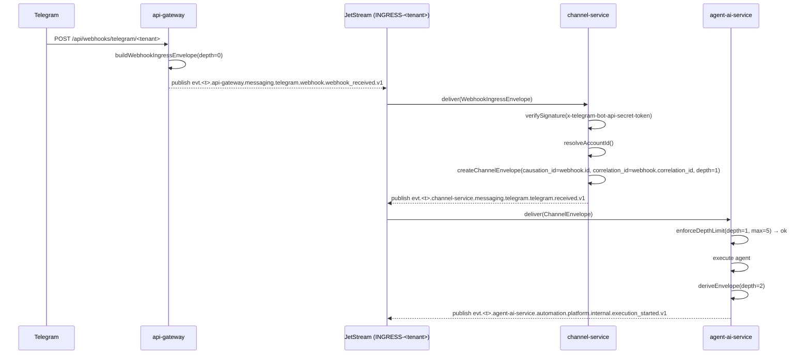

# Ingress: Webhook Bridge and Agent Pipelines

Class: descriptive
Summary: The two-stage webhook bridge (api-gateway receipt then channel-service canonical event) and the agent pipelines fed by it, as built.

**Status:** Operational reference — as-built system
**Audience:** Dev
**Last updated:** 2026-06-11

> Operational reference for NATS/JetStream: [`service-bus.md`](service-bus.md).
> Envelope contract source of truth: `packages/shared/src/interfaces.ts`.

---

## 1. Overview

The messaging ingress pipeline is a **two-stage bridge** between an external provider (Telegram, the generic HTTP channel) and the internal event bus (JetStream). Neither stage has access to tenant business data until the message has been authenticated by its signature/token header.

```
External provider
      │
      ▼
[api-gateway]  POST /api/webhooks/:channel/:tenantId
      │  publishes WebhookIngressEnvelope → INGRESS-<tenant>
      ▼
[channel-service]  durable consumer: channel-webhook-ingress
      │  verifies the signature/token header, parses messages, resolves accountid
      │  publishes ChannelEnvelope → INGRESS-<tenant>
      ▼
Downstream consumers (agent-ai-service, workflow-service, audit-service, etc.)
```

---

## 2. Stage 1: api-gateway

### 2.1 Endpoint

```
POST /api/webhooks/:channel/:tenantId
POST /api/webhooks/:channel/:tenantId/:instance   ← instance-addressed ingress
```

(`@Controller("webhooks")` under api-gateway's `setGlobalPrefix("api")`.)

There is no GET verification route: no surviving provider performs a
challenge/response handshake. Both endpoints are public (`@Public()`, `@SkipTenant()`). The tenant is resolved only from the path parameter — no JWT and no tenant guard.

The instance-addressed route lets a tenant expose one URL per configured channel account: `<instance>` is the account's `externalId`, forwarded verbatim in `data.instance` so `channel-service` can resolve the account by `(channel, externalId)`. The URL selects *which* account; a token header (e.g. `x-http-channel-token`) still authenticates downstream — the URL itself is not the credential.

File: `services/api-gateway/src/modules/channels/webhooks.controller.ts`

Successful response: HTTP 200 with body `{ "status": "accepted" }`, returned only after the stage-1 JetStream publish succeeds.

### 2.2 WebhookIngressEnvelope

`WebhookIngressPublisherService` builds and publishes a `WebhookIngressEnvelope` (defined in `packages/shared/src/webhook.interfaces.ts`):

| Field | Value |
|-------|-------|
| `producer` | `"api-gateway"` |
| `kind` | `"webhook_received"` |
| `provider` | `"webhook"` |
| `transport.method` | `"webhook"` |
| `transport.protocol` | `"https"` |
| `transport.depth` | `0` |
| `data.raw_body_b64` | Raw body encoded in base64 |
| `data.headers` | Subset filtered by `WEBHOOK_FORWARDED_HEADERS_SET` |
| `accountid` | **Absent** — unknown at this stage |

The envelope ID is a UUID v4 (`crypto.randomUUID()`).

The `accountid` field is deliberately absent: at this point the request has not passed signature verification, and the provider account (the Telegram bot, the HTTP channel account, etc.) has not been resolved. Including a placeholder would corrupt per-account billing aggregations. See the comment above the `WebhookIngressEnvelope` literal in `WebhookIngressPublisherService.publishWebhook`.

Type: `WebhookIngressEnvelope = Omit<EventEnvelope, "accountid"> & { ... }`.

### 2.3 Publish subject

```
evt.<tenantId>.api-gateway.messaging.<channel>.webhook.webhook_received.v1
```

Builder: `buildWebhookIngressSubject(tenantId, channel)` in `packages/shared/src/channel.utils.ts`.

NATS headers included: `x-yoizen-tenant`, `Nats-Msg-Id` (idempotency key = sha256 of the payload), `X-Correlation-Id`, W3C trace context.

### 2.4 Backpressure and timeout

`WebhookIngressPublisherService` implements two protection mechanisms introduced after the 2026-05-22 post-mortem:

- **Inflight cap:** a per-pod counter. If `inFlight >= cap`, a `WebhookPublishUnavailableError` is thrown (→ HTTP 503) before the envelope is built.
- **Publish timeout:** `publishWithTimeout` races `js.publish` against a configurable timer. An ack that takes longer than the timeout becomes a `WebhookPublishUnavailableError` (→ HTTP 503) instead of an opaque 500.

Both values are configurable via `gatewayConfig.webhook`.

---

## 3. Stage 2: channel-service

### 3.1 Durable consumer

`WebhookIngressConsumerService` creates a durable consumer on each `INGRESS-<tenant>` stream using `MultiTenantConsumerManager`:

| Parameter | Value |
|-----------|-------|
| Durable name | `channel-webhook-ingress` |
| Filter subject | `evt.*.api-gateway.messaging.*.webhook.webhook_received.v1` |
| Concurrency | 32 concurrent handlers (configurable via `WEBHOOK_INGRESS_HANDLER_CONCURRENCY`) |

On API pods (not worker pods) the manager runs in `ensureOnly` mode: it creates the durable without processing messages, so the consumer exists and its `jetstream_consumer_num_pending` depth stays observable even when no workers are active.

File: `services/channel-service/src/modules/webhooks/webhook-ingress-consumer.service.ts`

### 3.2 Processing in WebhookIngressService

`webhook-ingress.service.ts` executes the business logic:

1. Validates the channel (must have a registered `IChannelProvider` in `ChannelRouter`).
2. Queries the tenant/channel's active accounts through the configured repository/storage engine (`postgres` by default, `mongo` when selected).
3. If the request came through the instance-addressed route (`/api/webhooks/:channel/:tenantId/:instance`), narrows the active-account set to the one whose `externalId` matches `instance`. An unknown instance is rejected with `unknown_instance` — there is no fallback to token-only matching.
4. Verifies the provider's signature/token header against each (possibly narrowed) active account, using `timingSafeEqual`.
5. Resolves the concrete `accountid`: exactly one account must verify. Zero accounts, or more than one, is `signature_mismatch` — no payload hint can break the tie, because no surviving channel carries an account identifier in the body.
6. Parses the webhook body using the corresponding provider → `InboundMessage[]`.
7. Calls `IngressService.processInbound` via `setImmediate` (non-blocking), forwarding the causal chain (`correlationId`, `causationId`, `depth`) inherited from the stage-1 `WebhookIngressEnvelope`, plus the stage-1 header allowlist (`webhookHeaders`), which lands on `data.headers` of the stage-2 envelope (since 2026-07-31).

**Signature handling:** the provider's `signatureHeader` (`x-telegram-bot-api-secret-token` for Telegram, `x-http-channel-token` for the generic HTTP channel) is the only signal that identifies the account — the payload carries no account id. If that header is absent or empty, the request is immediately rejected with `signature_mismatch`, on every channel. There is no fallback to the first active account: an unsigned webhook could otherwise be attributed to an arbitrary account of the tenant.

### 3.3 ChannelEnvelope publication

`IngressService` (via `createChannelEnvelope` in `src/domain/envelope.factory.ts`) builds the canonical envelope:

| Field | Value |
|-------|-------|
| `producer` | `"channel-service"` |
| `domain` | `"messaging"` |
| `provider` | Provider name (`"telegram"`, `"http"`, `"e2e-tests"`) |
| `kind` | `"received"` |
| `transport.method` | `"webhook"` |
| `transport.protocol` | `"https"` |
| `accountid` | Resolved real provider account ID |
| `data.headers` | The stage-1 allowlist minus the verification-secret subset (webhook-derived envelopes only; forwarding since 2026-07-31, secret strip since 2026-08-01). api-gateway filters against `WEBHOOK_FORWARDED_HEADERS` (`WebhookIngressPublisherService.filterHeaders`); channel-service lowercases keys (`WebhookIngressConsumerService.normalizeHeaders`) and, after the signature check, strips `WEBHOOK_SECRET_HEADERS` (`WebhookIngressService.stripSecretHeaders`, envelope.md §4.1) — only `content-type`, `x-request-id`, `user-agent` can reach stage 2. Absent on any non-webhook flow. |

Canonical subject:

```
evt.<tenant>.channel-service.messaging.<channel>.<provider>.received.v1
```

The **envelope ID is a new UUID v4** independent of the `WebhookIngressEnvelope` ID.

### 3.4 Egress shadow envelopes

`createChannelSentEnvelope` (`services/channel-service/src/domain/envelope.factory.ts`) builds shadow envelopes for egress events (`sent`, `delivered`, `send`). Difference from ingress:

```
transport.method   = "stream"
transport.protocol = "internal"
```

### 3.5 Implemented providers

| Provider | Channel | Path |
|----------|---------|------|
| Telegram | telegram | `services/channel-service/src/providers/telegram/` — inbound + outbound, authenticates via `x-telegram-bot-api-secret-token` |
| HTTP (generic) | http | `services/channel-service/src/providers/http/` — inbound only, authenticates via the `x-http-channel-token` header, same account-resolution rules as Telegram |
| e2e-tests | e2e-tests | `services/channel-service/src/providers/e2e-tests/` — outbound-only sink for the automated suite: `parseWebhook` returns `[]` and `verifySignature` always denies, so it has no ingress path at all |

All three are registered directly in the `ChannelRouter` constructor
(`services/channel-service/src/providers/channel-router.ts`).

TikTok, Twitter/X, and other channels mentioned in the original design: **not implemented**.

---

## 4. Anti-Loop Depth Mechanism

### 4.1 The `transport.depth` field

The `depth` field lives inside `EventTransport` (`packages/shared/src/interfaces.ts`). It counts causal depth:

- Every root event (external webhook) has `depth: 0`.
- When a new envelope is derived from an existing one (`deriveEnvelope`), `depth = incoming.depth + 1`.
- If `newDepth > MAX_DEPTH` for the producer's category, `deriveEnvelope` throws `DepthExceededError`.

### 4.2 MAX_DEPTH by category

Defined in `packages/shared/src/envelope.utils.ts`:

```typescript
export const MAX_DEPTH_BY_CATEGORY = {
  root:             0,
  internal_service: 5,
  internal_agent:   5,
  platform_agent:   3,
  thirdparty_agent: 2,
};
```

The default category when not specified is `internal_service` (MAX_DEPTH = 5).

### 4.3 As-built implementation in agent-ai-service

`DepthTrackerService` (`services/agent-ai-service/src/modules/depth-tracker/depth-tracker.service.ts`) enforces the shared contract: a strict `>` against `MAX_DEPTH_BY_CATEGORY`, with the producer category as a parameter defaulting to `internal_service`. It throws `DepthExceededError extends PermanentError`, which the consumer runner routes to the DLQ.

> **Status: enforcement conformant since 2026-07-31; metric still pending**
>
> - Per-category limits and the strict `>` comparison landed with envelope-drift T02 (commit `e0c2e42f`). Until then the service used a flat local `DEFAULT_MAX_DEPTH = 5` with `>=`, rejecting one level earlier than the shared library and ignoring `platform_agent: 3` / `thirdparty_agent: 2`.
> - A dedicated `depth_exceeded` metric does not exist. The DLQ routing works via the `PermanentError` mechanism, but without a targeted metric.

### 4.4 Full flow diagram (as-built)



---

## 5. Agent Lifecycle Events (As-Built)

The agent execution lifecycle spans **two** subject families, each named after
the service that really publishes it. Both are declared as constants in
`packages/shared/src/constants.ts`, built from the producer identity constant so
the subject token and the envelope `producer` field cannot disagree:

| Event | Constant | Subject template |
|-------|----------|-----------------|
| `execution_requested` | `AI_AGENT_GATEWAY_EXECUTION_REQUESTED` | `evt.{tenant}.ai-agent-gateway.automation.platform.internal.execution_requested.v1` |
| `execution_started` | `AGENT_AI_EXECUTION_STARTED` | `evt.{tenant}.agent-ai-service.automation.platform.internal.execution_started.v1` |
| `execution_completed` | `AGENT_AI_EXECUTION_COMPLETED` | `evt.{tenant}.agent-ai-service.automation.platform.internal.execution_completed.v1` |
| `execution_failed` | `AGENT_AI_EXECUTION_FAILED` | `evt.{tenant}.agent-ai-service.automation.platform.internal.execution_failed.v1` |

The **publisher of the three results is `agent-ai-service`**:
`ExecutionHandler.publishStatus`
(`services/agent-ai-service/src/nats-handlers/execution.handler.ts`) and the
job-executor's twin `publishStatus`
(`src/modules/job-executor/job-executor.service.ts`) resolve
`AGENT_AI_EXECUTION_*` with `buildPlatformSubject` and publish an envelope whose
own `producer` field says `agent-ai-service` and whose `type` is
`io.yoizen.platform.runtime.<kind>.v1`. `ai-agent-gateway` only **reads** these
subjects: `ExecutionsService.streamExecutionEvents` relays them to SSE, and
`YoizenClawExecutionClient` awaits them as `EXECUTION_RESULT_EVENT_SUBJECTS`.
`ai-agent-gateway` publishes the *request* side of the flow
(`AI_AGENT_GATEWAY_EXECUTION_REQUESTED` via
`YoizenClawExecutionClient.submitExecution`), not the lifecycle results.

> Until 2026-08-07 all four kinds rode the `ai-agent-gateway` producer token,
> so the three results named a service that did not publish them while their
> envelopes said `agent-ai-service`. The E3 migration
> (`PENDIENTES/04-e3-subject.spec.md`, commits 931d16dd + a3bd82c0) moved them;
> `execution_requested` did not move, because the gateway really is its
> publisher. Persisted history keeps the old token: `TAXONOMY.md` rule 6
> classifies BOTH tokens, forever.

This is not the only lifecycle on the bus: `workflow-service` publishes its own
`evt.<tenant>.workflow-service.workflow.internal.native.execution_started.v1`
family (`execution-completed-publisher.activity.ts`) for Temporal workflow runs.

`agent-ai-service` consumes specific subjects from `agent-admin-service` and `ai-agent-gateway` via `MessageRouterService`.

> **Objective design (pending)**
>
> The `agent_outbound` / `agent_action` / `agent_observation` event taxonomy described in the original design is not implemented.

---

## 6. Agent Ingress Pipelines (Objective Design — Not Implemented)

> **Status: pending — not implemented**
>
> The pipelines described in this section correspond to the objective design. None of the endpoints or services mentioned are built.

### 6.1 Internal agent

```
authenticateServiceToken
  |> validateAgentOutput
  |> enforceDepthLimit
  |> checkPayloadSize / storeIfClaimCheck
  |> buildEnvelope
  |> publish
```

### 6.2 Third-party agent

```
authenticateApiKey
  |> validateTenantAuthorization
  |> validateAgentOutput (strict: max 1 MB)
  |> enforceDepthLimit
  |> enforceRateLimit
  |> checkPayloadSize / storeIfClaimCheck
  |> buildEnvelope
  |> publish
```

Proposed endpoint: `POST /api/agents/publish` in api-gateway. Does not exist.

### 6.3 Platform agent (push)

```
verifyPlatformSignature
  |> validatePlatformPayload
  |> enforceDepthLimit
  |> checkPayloadSize / storeIfClaimCheck
  |> buildEnvelope
  |> publish
```

### 6.4 Platform agent (pull)

```
callPlatformApi
  |> validatePlatformResponse
  |> enforceDepthLimit
  |> checkPayloadSize / storeIfClaimCheck
  |> buildEnvelope
  |> publish
```

---

## 7. As-Built vs Design Matrix

| Aspect | External provider (as-built) | Internal agent (pending) | Third-party agent (pending) | Platform agent (pending) |
|--------|------------------------------|-------------------------|-----------------------------|--------------------------|
| Trust | High (signature/token verified) | High (our infra) | Low (third-party code) | Medium (known SaaS) |
| Authentication | Webhook signature/token in channel-service | Service token | API key + tenant auth | OAuth2 / callback signature |
| Endpoint | `POST /api/webhooks/:channel/:tenantId` | `POST /api/agents/publish` | `POST /api/agents/publish` | webhook callback or poll |
| Implemented | ✅ | ❌ | ❌ | ❌ |
| MAX_DEPTH | 0 (`root`) | 5 (`internal_agent`) | 2 (`thirdparty_agent`) | 3 (`platform_agent`) |
| Depth enforcement | — | `DepthTrackerService` (strict `>`, `MAX_DEPTH_BY_CATEGORY`) | — | — |

The MAX_DEPTH row names the `ProducerCategory` whose limit applies; the values are
the enforced `MAX_DEPTH_BY_CATEGORY` constants (`packages/shared/src/envelope.utils.ts`),
not aspirations — what stays pending in those columns is the ingress PATH, not the
ceiling. Since 2026-07-31 (envelope-drift T02) `DepthTrackerService`
(`services/agent-ai-service/src/modules/depth-tracker/depth-tracker.service.ts`)
enforces every category through its `category` parameter, so the single populated
cell is about which path exists today, not about which categories it can enforce.

---

## 8. Envelope Examples (As-Built)

### 8.1 WebhookIngressEnvelope (api-gateway)

```json
{
  "specversion": "1.0",
  "id": "a3c8f1d2-4b5e-7f9a-b2c3-d4e5f6a7b8c9",
  "source": "api-gateway/webhooks",
  "type": "io.yoizen.messaging.telegram.webhook.webhook_received.v1",
  "resource": "tenant/acme/channel/telegram/provider/webhook",
  "time": "2026-06-11T12:00:00.000Z",
  "traceid": "4bf92f3577b34da6a3ce929d0e0e4736",
  "causation_id": null,
  "correlation_id": "a3c8f1d2-4b5e-7f9a-b2c3-d4e5f6a7b8c9",
  "tenant": "acme",
  "producer": "api-gateway",
  "domain": "messaging",
  "channel": "telegram",
  "provider": "webhook",
  "kind": "webhook_received",
  "idempotencykey": "sha256:...",
  "transport": {
    "method": "webhook",
    "protocol": "https",
    "depth": 0
  },
  "data": {
    "received_at": "2026-06-11T12:00:00.000Z",
    "payload_inline": true,
    "payload_ref": null,
    "payload_bytes": 512,
    "payload_checksum": "sha256:...",
    "payload": { "update_id": 421, "message": { "...": "..." } },
    "raw_body_b64": "eyJ1cGRhdGVfaWQiOjQyMX0=",
    "headers": {
      "x-telegram-bot-api-secret-token": "tok_abc...",
      "content-type": "application/json"
    }
  }
}
```

Note: `accountid` is absent — typed as `Omit<EventEnvelope, "accountid">`.

### 8.2 ChannelEnvelope (channel-service — canonical)

```json
{
  "specversion": "1.0",
  "id": "b7d9e2f4-1a3c-5e7f-9b1d-2c3e4f5a6b7c",
  "source": "channel-service/accounts/69bea8cd868e860918359cc7",
  "type": "io.yoizen.messaging.telegram.telegram.received.v1",
  "resource": "tenant/acme/account/69bea8cd868e860918359cc7/channel/telegram/provider/telegram",
  "time": "2026-06-11T12:00:01.000Z",
  "traceid": "4bf92f3577b34da6a3ce929d0e0e4736",
  "causation_id": "a3c8f1d2-4b5e-7f9a-b2c3-d4e5f6a7b8c9",
  "correlation_id": "a3c8f1d2-4b5e-7f9a-b2c3-d4e5f6a7b8c9",
  "tenant": "acme",
  "producer": "channel-service",
  "domain": "messaging",
  "channel": "telegram",
  "provider": "telegram",
  "accountid": "69bea8cd868e860918359cc7",
  "idempotencykey": "sha256:...",
  "transport": {
    "method": "webhook",
    "protocol": "https",
    "depth": 1
  },
  "data": {
    "received_at": "2026-06-11T12:00:01.000Z",
    "payload_inline": true,
    "payload_ref": null,
    "payload_bytes": 380,
    "payload_checksum": "sha256:...",
    "payload": {
      "messageId": "421",
      "from": "874591203",
      "timestamp": "1749643200",
      "type": "text",
      "text": "Hola",
      "accountId": "69bea8cd868e860918359cc7"
    },
    "headers": {
      "content-type": "application/json",
      "x-request-id": "…",
      "user-agent": "…"
    }
  }
}
```

> `data.headers` carries the stage-1 allowlist on webhook-derived envelopes
> (§3.3, envelope.md §4.1) as of 2026-07-31, **minus** the verification-secret
> subset (`WEBHOOK_SECRET_HEADERS`) which `WebhookIngressService.stripSecretHeaders`
> removes after the signature check as of 2026-08-01 — so
> `x-telegram-bot-api-secret-token` and `x-http-channel-token` can never appear
> here, only `content-type`, `x-request-id`
> and `user-agent`. Envelopes published before 2026-07-31, and any non-webhook
> flow, have no `headers` key at all; envelopes published between 2026-07-31 and
> 2026-08-01 may still carry the secret headers.
