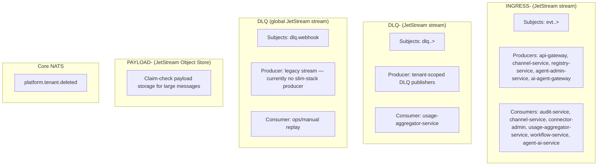

# NATS and JetStream

**Status:** Operational reference — as-built system
**Audience:** Dev + Infra

This document is the canonical operational reference for the platform's messaging infrastructure: cluster topology, stream inventory, subject taxonomy, server configuration, and lifecycle. Related documents:

- [`DOCS/messaging/envelope.md`](envelope.md) — envelope schema, causal chain, idempotency, traceability
- [`DOCS/messaging/claim-check.md`](claim-check.md) — large-payload offload pattern
- [`DOCS/messaging/ingress.md`](ingress.md) — two-stage webhook bridge and agent ingress

## Why JetStream, not Core NATS

NATS JetStream is the default for all platform events because:

- **Durability** — messages persist to disk with configurable replication.
- **Replay** — consumers can re-read from any point in time.
- **Failure tolerance** — a consumer that crashes resumes where it left off.
- **Producer/consumer decoupling** — producers do not need to know who consumes; new consumers can attach without impacting producers.
- **Native deduplication** — JetStream deduplicates by `Nats-Msg-Id` within a configurable window (server default: 2 minutes).
- **Integrated Object Store** — NATS Object Store stores large blobs without additional infrastructure (see [`claim-check.md`](claim-check.md)).
- **Official clients** — Go, Node/Bun, Python, Rust, Java, .NET, and more.
- **Fully open source** — no enterprise edition, no locked features.

### Why not Core NATS

Core NATS is at-most-once with no persistence. If a consumer is not connected at publish time, the message is lost. For ingress events where loss is unacceptable, JetStream is the minimum requirement.

Core NATS is used only for lightweight fire-and-forget signals — currently `platform.tenant.deleted` for cache eviction and DB pool teardown.

## Cluster Topology

### Environment isolation

The dev cluster uses a single NATS node with no per-environment NATS account separation. The environment lives in Kubernetes namespace/cluster separation, not in the NATS subject hierarchy.

```
┌─────────────────────────────────────────────────┐
│                  NATS Cluster                    │
│                                                  │
│  ┌──────────┐  ┌──────────┐  ┌──────────┐      │
│  │  nats-0  │  │  nats-1  │  │  nats-2  │      │
│  │ (leader) │  │(follower)│  │(follower)│      │
│  └──────────┘  └──────────┘  └──────────┘      │
│                                                  │
│  Per-tenant streams                              │
│  INGRESS-ACME, DLQ-ACME, PAYLOAD-ACME           │
│  INGRESS-GLOBEX, DLQ-GLOBEX, …                  │
│                                                  │
│  Platform streams                                │
│  DLQ (global), GATEWAY_AUDIT                    │
└─────────────────────────────────────────────────┘
```

| Environment | Nodes | Notes |
|-------------|-------|-------|
| prod | 3 | Quorum for replication; tolerates 1-node failure |
| staging | 1–3 | 1 node is sufficient; 3 nodes if prod simulation is needed |
| dev | 1 | No replication; local or CI use |

### Kubernetes StatefulSet

NATS is deployed as a StatefulSet in the `nats` namespace. Each pod has a dedicated 50 Gi PersistentVolumeClaim for JetStream storage.

```
┌─────────────── Kubernetes Namespace: nats ───────────────┐
│                                                           │
│  StatefulSet: nats  (replicas: 3)                         │
│  ┌──────────┐  ┌──────────┐  ┌──────────┐               │
│  │  nats-0  │  │  nats-1  │  │  nats-2  │               │
│  │ PVC 50Gi │  │ PVC 50Gi │  │ PVC 50Gi │               │
│  └──────────┘  └──────────┘  └──────────┘               │
│                                                           │
│  Service: nats-headless  (cluster-internal client access) │
└───────────────────────────────────────────────────────────┘
```

Source: `infrastructure/base/nats/statefulset.yaml`

## Stream Topology



## Per-Tenant Stream Limits

### Default limits (implemented)

Actual values come from `packages/shared/src/channel.constants.ts`:

| Limit | Value | Source constant |
|-------|-------|-----------------|
| `max_age` | 7 days | `CHANNEL_STREAM_MAX_AGE_NS` |
| `max_bytes` | 256 MB | `CHANNEL_STREAM_MAX_BYTES` |
| `max_msg_size` | Not explicitly set in provisioning | Server default (1 MB) |
| `duplicate_window` | Not explicitly set | Server default (2 min) |
| `num_replicas` | Not explicitly set | Server default (1) |

### Tenant tiers (partially wired)

> **Status: partial implementation**
>
> `TENANT_TIER_LIMITS` is defined in `packages/shared/src/tenant-stream.constants.ts` with values for `free`, `pro`, and `enterprise`, and some provisioning paths call `buildTenantStreamConfig(..., "free")`. Other ensure/reconcile paths still use legacy default limits (`CHANNEL_STREAM_MAX_AGE_NS` / `CHANNEL_STREAM_MAX_BYTES`) or only ensure stream existence. Treat tenant tiers as partially wired until all stream creation and reconciliation paths share the same tier source.

Objective design (pending):

| Tier | max_bytes | max_age | num_replicas | object_store_max_bytes |
|------|-----------|---------|--------------|------------------------|
| `free` | 1 GB | 7 days | 1 | 512 MB |
| `pro` | 5 GB | 14 days | 1 | 2 GB |
| `enterprise` | 20 GB | 30 days | 3 | 5 GB |

## Streams Reference

| Stream/Bucket | Type | Subjects/Keyspace | Purpose |
|---|---|---|---|
| `INGRESS-<tenant>` | JetStream stream | `evt.<tenant>.>` | Canonical tenant event bus |
| `DLQ-<tenant>` | JetStream stream | `dlq.<tenant>.>` | Tenant-scoped dead letters and post-processing |
| `DLQ` | JetStream stream | `dlq.webhook` | Legacy global DLQ — narrowed from `dlq.>` to free the `dlq.<tenant>.>` namespace for tenant-scoped DLQ streams. Currently no slim-stack producer; retained for ops replay tooling. |
| `PAYLOAD-<tenant>` | JetStream Object Store | Object keys (`<event-id>-payload`) | Claim-check storage for large payloads |
| `GATEWAY_AUDIT` | JetStream stream | `audit.gateway.>` | Cross-tenant gateway request audit trail |
| `PLATFORM_TENANTS` | JetStream stream | `platform.tenant.>` | Tenant lifecycle messages — `platform.tenant.provision.requested` is consumed by the `tenant-provisioner` durable in tenant-service (`Nats-Msg-Id` = tenantId) |
| `platform.tenant.deleted` | Core NATS subject | `platform.tenant.deleted` | Fire-and-forget tenant teardown signal |

## Subject Taxonomy

Canonical format (8 tokens):

```text
evt.<tenant>.<producer>.<domain>.<channel>.<provider>.<kind>.v<version>
```

| Token | Meaning | Example |
|---|---|---|
| `tenant` | Tenant identifier | `acme` |
| `producer` | Service that publishes | `api-gateway` |
| `domain` | Business domain | `messaging`, `automation`, `platform` |
| `channel` | Logical channel | `telegram`, `events`, `platform` |
| `provider` | External/internal provider | `telegram`, `internal`, `gateway` |
| `kind` | Event operation kind | `webhook_received`, `completed`, `execution_requested` |
| `version` | Subject schema version | `v1` |

Examples:

- `evt.acme.api-gateway.messaging.telegram.webhook.webhook_received.v1`
- `evt.acme.registry-service.platform.events.system.service_registered.v1`
- `evt.acme.ai-agent-gateway.automation.platform.internal.execution_requested.v1`

## Envelope Contract (Canonical)

The full envelope schema, field semantics, causal chain, idempotency algorithm, and traceability rules are documented in [`DOCS/messaging/envelope.md`](envelope.md).

Quick reference — source of truth: `packages/shared/src/interfaces.ts` (`EventEnvelope`, `EventTransport`, `EventData`).

## Provisioning and Lifecycle

Tenant streams are pre-provisioned by `tenant-service` during tenant creation, with idempotent safety-net calls from publishers and the per-tenant runtime so cold-start, restore, and out-of-order boot scenarios remain self-healing.

### Ingress Stream Provisioning (`INGRESS-<tenant>`)

Provisioning happens at three layers, in priority order:

1. **Primary (eager, during tenant creation)** — `tenant-service`'s `TenantProvisioningExecutor` invokes `ensureTenantIngressStream(jsm, tenantId)` as a dedicated `nats.ensure-ingress-stream` phase, executed **after** OLTP + usage Postgres readiness and **before** runtime consumers such as `agent-ai-service` attach JetStream durables. This closes the race where a consumer pod would otherwise boot before the tenant stream exists and fail to bind its durable consumer.
2. **Safety net (lazy, before first publish)** — Producers (`api-gateway`, `channel-service`, `registry-service`, `agent-admin-service`, `ai-agent-gateway`) call `ensureTenantIngressStream(jsm, tenantId)` before publishing to `evt.<tenant>.>`. This guards against tenants that pre-date the primary path or whose stream was pruned externally.
3. **Consumer reconciliation (lazy, at runtime startup and interval)** — TypeScript consumers such as `agent-ai-service` use `MultiTenantConsumerManager` to list existing `INGRESS-*` streams, bind the durable consumer, and periodically reconcile newly-created tenant streams. This layer binds consumers; it does not create missing tenant streams.

Common contract across provisioning and consumer-binding layers:

- Stream naming comes from `getTenantStreamName(tenantId)` -> `INGRESS-${tenantId.toUpperCase()}`.
- Subject pattern comes from `getTenantSubjectPattern(tenantId)` -> `evt.${tenantId}.>`.
- Provisioning is idempotent: TS-side calls coalesce concurrent ensures via an in-flight promise map and seed an in-memory per-pod cache on success; the broker error `STREAM_NAME_IN_USE` (`err_code=10058`) is treated as success on every layer.
- Current defaults are `RetentionPolicy.Limits`, max age 7 days, max bytes 256 MB.

Code references:

- `services/tenant-service/src/modules/provisioning/tenant-provisioning-executor.service.ts` (eager pre-provisioning phase)
- `services/agent-ai-service/src/modules/nats-consumer/multi-tenant-consumer.service.ts` (durable config)
- `packages/database/src/multi-tenant-consumer-manager.ts` (stream discovery, durable binding, reconciliation)
- `packages/database/src/nats-provider.ts` (`ensureTenantIngressStream` shared helper)
- `packages/shared/src/tenant-stream.constants.ts`
- `packages/shared/src/channel.constants.ts`

### Durable Consumer Lifecycle (Per Tenant)

- Consumers use `MultiTenantConsumerManager` with `streamPattern: /^INGRESS-/`.
- The manager discovers existing tenant streams and ensures a durable consumer per tenant stream.
- Consumers do not create ingress streams; they reconcile against discovered streams.
- Typical durable names: `audit-service`, `channel-service`, `connector-admin`, `usage-aggregator-service`, `workflow-triggers`, `agent-ai-service-consumer`, `skb-ingestion-worker`, `connector-runtime-invoke` (async `connectors.invoke()` transport, see below).

### Connector-invoke transport pair (rides `INGRESS-<tenant>`, no dedicated stream)

`connector-runtime`'s async invoke API (`manual-loops/connector-invoke-api.md`,
detail: `services/connector-runtime/README.md` "Async invoke transport")
publishes/consumes two additional kinds on the existing per-tenant ingress
stream — a dedicated stream was evaluated and rejected because both subjects
already fall inside `INGRESS-<tenant>`'s `evt.<tenant>.>` filter and
JetStream forbids overlapping stream subject bindings:

```
evt.<tenant>.connector-runtime.platform.endpoint.system.invoke_requested.v1
evt.<tenant>.connector-runtime.platform.endpoint.system.invoke_completed.v1
```

Producer: `connector-runtime`'s HTTP invoke facade (`invoke_requested`, on
`mode: "async"` accept). Consumer: `connector-runtime`'s async invoke
consumer, durable `connector-runtime-invoke` (`invoke_completed` is
published back by the same consumer after it runs the call). Verified with
`services/connector-runtime/scripts/verify-invoke-stream-binding.ts`
(asserts the binding, provisions nothing — there is nothing to provision).

### DLQ Lifecycle

- When DLQ is enabled in manager config, tenant DLQ resources are provisioned alongside the durable.
- Tenant DLQ stream pattern is `DLQ-<tenant>` with subjects `dlq.<tenant>.>`.
- Some services also consume DLQ streams via a second manager instance (for example usage aggregation).

**DLQ message headers**

When a message exhausts its redeliveries (`CHANNEL_MAX_DELIVER = 5`) and terminates in the DLQ, the handler publishes the original payload unmodified as the body and attaches diagnostic NATS headers:

| Header | Description |
|--------|-------------|
| `X-Dlq-Reason` | Termination reason (the `reason` field from `PermanentError`) |
| `X-Dlq-Stage` | Pipeline stage where the failure occurred |
| `X-Dlq-Original-Subject` | Original message subject |
| `X-Dlq-Stream` | Destination DLQ stream name |
| `X-Dlq-Deliveries` | Number of delivery attempts made |
| `X-Dlq-Original-Msg-Id` | Original `Nats-Msg-Id` (if present) |

Implementation: `packages/database/src/multi-tenant-consumer-manager.ts`, method `buildTenantDlqHandler`.

### Claim-Check Pattern

Large payloads (above `CLAIM_CHECK_THRESHOLD_BYTES` = 256 KB) are offloaded to the `PAYLOAD-<tenant>` Object Store so the NATS message envelope stays slim. The full protocol — sequence diagrams, checksum invariant, consumer middleware, and error codes — is in [`DOCS/messaging/claim-check.md`](claim-check.md).

## Server Configuration

Key parameters from `infrastructure/base/nats/configmap.yaml`:

```
# nats.conf (relevant to this architecture)

listen: 0.0.0.0:4222
http:   0.0.0.0:8222

jetstream {
  store_dir: /data/jetstream
  max_mem:   256MB
  max_file:  50GB
}

max_payload: 1MB        # keep at default — see rationale below
max_pending: 64MB
write_deadline: 10s
```

> **Note:** The Spanish source document listed `max_mem: 1GB` and `max_file: 100GB`. The actual values in `infrastructure/base/nats/configmap.yaml` are `max_mem: 256MB` and `max_file: 50GB`. The live cluster values take precedence.

### Why `max_payload` stays at 1 MB

With the Claim-Check pattern in place (see [`claim-check.md`](claim-check.md)), large payloads never travel over the bus. Keeping `max_payload` at the default:

- Avoids excessive broker memory usage during message routing.
- Keeps replication between cluster nodes fast.
- Protects slow consumers from large pending messages.
- Simplifies cluster configuration.

## Pending Lifecycle Designs

### Tenant deactivation (pending — not implemented)

When a tenant is deactivated, the objective design is:

1. The stream is paused — publishes are rejected but existing data is preserved.
2. The Object Store bucket is marked read-only.
3. After the retention period, data expires automatically by TTL.
4. No immediate data deletion — this allows reactivation within the retention window.

### Tier scaling (partially wired)

JetStream supports live stream limit updates without downtime. The connection between tenant tier and stream provisioning is partial: `buildTenantStreamConfig` exists and is used by some providers with a hardcoded `free` tier, but reconciliation/default paths are not yet consistently tier-aware.

## Publish Semantics

JetStream is the primary publish path. Publishing is synchronous with ack-wait. If the broker rejects the write, the producer reports it as an error.

```typescript
// pseudocode
await ensureTenantIngressStream(jsm, tenantId)  // lazy safety net
const ack = await js.publish(subject, encode(envelope), {
  headers,   // Nats-Msg-Id: idempotencykey, traceparent
  timeout: ...,
})
```

> **Objective design (pending) — local DLQ fallback on total broker failure:**
>
> If all retries to the broker fail, events should be written to a local on-disk DLQ. This fallback path is not currently implemented.

## Historical Note

- Older docs referenced `EVENTS` and `RESULTS` as the main business streams.
- Current canonical topology is tenant-scoped `INGRESS-<tenant>` plus DLQ streams.
- Use `INGRESS-<tenant>` as the default event stream in all new docs and implementations.
- A dedicated `SKB-INGESTION` stream previously existed for SKB file ingestion. Its `evt.*.…` subject filter overlapped the per-tenant `evt.<tenant>.>` streams, breaking tenant provisioning. It was removed (PR 4157): the SKB worker now consumes from the per-tenant `INGRESS-*` streams via `MultiTenantConsumerManager`. Clusters bootstrapped before the fix may still carry an orphaned `SKB-INGESTION` stream — delete it manually (`nats stream rm SKB-INGESTION`).
