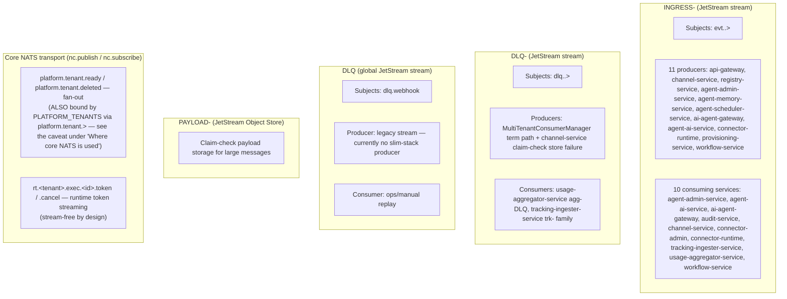

# NATS and JetStream

Class: descriptive
Summary: The canonical operational reference for NATS/JetStream here: cluster topology, stream inventory, subject taxonomy, server configuration and the producer/consumer census.

**Status:** Operational reference — as-built system
**Audience:** Dev + Infra

This document is the canonical operational reference for the platform's messaging infrastructure: cluster topology, stream inventory, subject taxonomy, server configuration, and lifecycle. Related documents:

- [`DOCS/messaging/envelope.md`](envelope.md) — envelope schema, causal chain, idempotency, traceability
- [`DOCS/messaging/claim-check.md`](claim-check.md) — large-payload offload pattern
- [`DOCS/messaging/ingress.md`](ingress.md) — two-stage webhook bridge and agent ingress

## Why JetStream, not Core NATS

NATS JetStream is the default for all platform events because:

- **Durability** — messages persist to disk with configurable replication.
- **Replay** — consumers can re-read from any point in time.
- **Failure tolerance** — a consumer that crashes resumes where it left off.
- **Producer/consumer decoupling** — producers do not need to know who consumes; new consumers can attach without impacting producers.
- **Native deduplication** — JetStream deduplicates by `Nats-Msg-Id` within a configurable window (server default: 2 minutes).
- **Integrated Object Store** — NATS Object Store stores large blobs without additional infrastructure (see [`claim-check.md`](claim-check.md)).
- **Official clients** — Go, Node/Bun, Python, Rust, Java, .NET, and more.
- **Fully open source** — no enterprise edition, no locked features.

### Why not Core NATS

Core NATS is at-most-once with no persistence. If a consumer is not connected at publish time, the message is lost. For ingress events where loss is unacceptable, JetStream is the minimum requirement.

## Message-plane policy (applied in this repo)

This spec treats bus usage as three classes:

1. **Canonical bus (mandatory)**  
   JetStream, envelope-backed, persistent, replayable, and durable.
2. **Core NATS (non-critical exception)**  
   Accepted only when the signal is fan-out/provisional/real-time and explicit replay is not required.
3. **Legacy technical debt**  
   Existing manual adapters or transport patterns that work today but are pending standardization (tracked as follow-up work, not business-logic exceptions).

Rules for the architecture:

- Canonical bus uses `evt.<tenant>.<producer>.<domain>.<channel>.<provider>.<kind>.v<version>`.
- Core NATS exceptions are loss-tolerant by design and must never replace canonical bus requirements for audit, billing, or durable business flow.
- Legacy debt items must be called out in specs and planned for migration before new work reuses the same path.

### Where core NATS *is* used

Core NATS is the transport wherever loss is acceptable and fan-out or
low-latency matters more than replay. There are these producing surfaces, plus
some subscribe-only consumers:

| Surface | Subjects | Producer | Why core, not JetStream |
|---|---|---|---|
| **Tenant teardown fan-out** | `platform.tenant.deleted` (`TENANT_DELETED_SUBJECT`) | `tenant-service`'s `TenantDeletionPublisherService` (`nc.publish`) | **Every** replica caching a per-tenant Postgres pool must receive it; the `PLATFORM_TENANTS` stream is `RetentionPolicy.Workqueue`, which would deliver to exactly one consumer and defeat the fan-out. Misses self-heal via `TenantConnectionManager.verifyConnectivity`. Subscribers: `tenant-deletion-eviction-listener.ts` / `tenant-mongo-deletion-eviction-listener.ts` (`@yoizen/database`) and agent-admin's own listener. |
| **Tenant readiness fan-out** | `platform.tenant.ready` (`TENANT_READY_SUBJECT`) | `tenant-service`'s `TenantReadyPublisher` (`nc.publish`) | Bootstraps tenant schema and shared clients. A miss is recoverable through lazy bootstrap (`ensureSchema`), so it is intentionally fire-and-forget with no replay guarantee. |
| **Runtime token streaming** | `rt.<tenant>.exec.<executionId>.{token,tool_call,tool_result}` and `…​.cancel` (`RUNTIME_STREAM_SUBJECT_PREFIX` / `buildRuntimeStreamSubject`) | `agent-ai-service`'s `ExecutionHandler.publishToken` (`nc.publish`) for tokens; `YoizenClawExecutionClient.publishCancel` (`packages/shared/src/execution-client.ts`) for the cancel control message | High-frequency display-only deltas with no replay value. The `rt.` prefix is **deliberately outside** the `evt.` taxonomy so no stream's subject filter captures it — persisting millions of token deltas into `INGRESS-<tenant>` is exactly the failure this avoids. Full contract: [`DOCS/architecture/runtime-streaming.md`](../architecture/runtime-streaming.md) §1.1. |

One related pattern that is core NATS but not a fire-and-forget signal:

- **Subscribe-only relays over JetStream-published subjects** — `ai-agent-gateway`
  and `YoizenClawExecutionClient` open *core* subscriptions on the `evt.…`
  execution-lifecycle subjects (`createNatsMultiSubjectObservable`) to relay them
  to SSE without burning a durable; the messages themselves are still published
  and retained through JetStream.

> Namespace caveat: `platform.tenant.deleted` (and `platform.tenant.ready`) are
> published with `nc.publish`, but they fall inside `PLATFORM_TENANTS`'s
> `platform.tenant.>` filter, so JetStream also ingests a copy that no consumer
> reads. Only the `rt.` namespace is genuinely bound by no stream.

### Legacy adapter backlog (technical debt, not canonical)

| Service | Pattern | Why it is tracked |
|---|---|---|
| `agent-admin-service` | `LazyNatsConnection` + manual `connect` | Works today, but bypasses shared NATS provider composition. |
| `agent-memory-service` | `LazyNatsConnection` + manual `connect` | Works today, but bypasses shared provider shape and delays standardization checks. |
| `agent-scheduler-service` | `LazyNatsConnection` + manual `connect` | Works today, but bypasses shared provider shape and delays standardization checks. |

All three are functional and intentionally kept under **technical debt** until an explicit migration task lands.

## Cluster Topology

### Environment isolation

The dev cluster uses a single NATS node with no per-environment NATS account separation. The environment lives in Kubernetes namespace/cluster separation, not in the NATS subject hierarchy.

```
┌─────────────────────────────────────────────────┐
│                  NATS Cluster                    │
│                                                  │
│  ┌──────────┐  ┌──────────┐  ┌──────────┐      │
│  │  nats-0  │  │  nats-1  │  │  nats-2  │      │
│  │ (leader) │  │(follower)│  │(follower)│      │
│  └──────────┘  └──────────┘  └──────────┘      │
│                                                  │
│  Per-tenant streams                              │
│  INGRESS-ACME, DLQ-ACME, PAYLOAD-ACME           │
│  INGRESS-GLOBEX, DLQ-GLOBEX, …                  │
│                                                  │
│  Platform streams                                │
│  DLQ (global), GATEWAY_AUDIT                    │
└─────────────────────────────────────────────────┘
```

This repo ships **one** deployable configuration — the dev one. There is no
prod or staging overlay to describe here; the 3-node picture above is the
`infrastructure/base/nats` manifest as written, not a cluster that exists.

| Layer | Nodes | PVC | Notes |
|-------|-------|-----|-------|
| `infrastructure/base/nats/statefulset.yaml` | 3 | 50 Gi | Base manifest: quorum-capable shape, never deployed as-is |
| dev overlays | 1 | 2 Gi | All four dev bases pin `replicas: 1` and the `data` volumeClaimTemplate to 2 Gi — `overlays/local/{local-base,mongo-local-base}/patches/nats-resources.yaml` and `overlays/orbstack/{orbstack-base,mongo-orbstack-base}/patches/nats.yaml` (each family has a postgres and a mongo twin). This is what actually runs. |

### Kubernetes StatefulSet

NATS is deployed as a StatefulSet named `nats` into the
**`support-services-dev`** namespace (set by each overlay's `namespace:` field
— `overlays/local/dev`, `overlays/local/mongo-dev`, `overlays/orbstack/dev`,
`overlays/orbstack/mongo-dev`, `overlays/mongo-dev`).

```
┌────── Kubernetes Namespace: support-services-dev ───────┐
│                                                          │
│  StatefulSet: nats  (base replicas: 3 → dev overlay: 1)  │
│  ┌──────────┐                                            │
│  │  nats-0  │   PVC `data` 50Gi in base, 2Gi in dev      │
│  └──────────┘                                            │
│                                                          │
│  Service: nats-headless (clusterIP: None, serviceName)   │
└──────────────────────────────────────────────────────────┘
```

Source: `infrastructure/base/nats/statefulset.yaml` +
`infrastructure/base/nats/service.yaml`, patched by the two overlay families
listed in the table above.

## Stream Topology



The producer list is the same census as
[`envelope.md`](envelope.md) §2.1; the consumer list is every service that
registers a `MultiTenantConsumerManager` with `TENANT_STREAM_PATTERN` /
`INGRESS_STREAM_PATTERN`. Individual durables — several services own more than
one — are in the [Durable Consumer Lifecycle](#durable-consumer-lifecycle-per-tenant)
table below.

## Per-Tenant Stream Limits

### Default limits (implemented)

Actual values come from `packages/shared/src/channel.constants.ts`:

| Limit | Value | Source constant |
|-------|-------|-----------------|
| `max_age` | 7 days | `CHANNEL_STREAM_MAX_AGE_NS` |
| `max_bytes` | 256 MB | `CHANNEL_STREAM_MAX_BYTES` |
| `max_msg_size` | Not explicitly set in provisioning | Server default (1 MB) |
| `duplicate_window` | Not explicitly set | Server default (2 min) |
| `num_replicas` | Not explicitly set | Server default (1) |

### Tenant tiers

SHIPPED 2026-08-01 (tenant-messaging-tiers T01–T05): a tenant's
`messagingTier` (`free`/`pro`/`enterprise`) selects the `INGRESS-<TENANT>`
limits at PROVISIONING time, clamped by the environment ceilings; tier
changes reconcile the live stream with a shrink guard. The flat limits above
remain the lazy-ensure fallback on publish paths (they no-op once the stream
exists). Full as-built description:
[`tenant-messaging-tiers.md`](tenant-messaging-tiers.md).

## Streams Reference

| Stream/Bucket | Type | Subjects/Keyspace | Purpose |
|---|---|---|---|
| `INGRESS-<tenant>` | JetStream stream | `evt.<tenant>.>` | Canonical tenant event bus |
| `DLQ-<tenant>` | JetStream stream | `dlq.<tenant>.>` | Tenant-scoped dead letters and post-processing |
| `DLQ` | JetStream stream | `dlq.webhook` | Legacy global DLQ — narrowed from `dlq.>` to free the `dlq.<tenant>.>` namespace for tenant-scoped DLQ streams. Currently no slim-stack producer; retained for ops replay tooling. |
| `PAYLOAD-<tenant>` | JetStream Object Store | Object keys (`<event-id>-payload`) | Claim-check storage for large payloads |
| `GATEWAY_AUDIT` | JetStream stream | `audit.gateway.>` | Cross-tenant gateway request audit trail |
| `PLATFORM_TENANTS` | JetStream stream | `platform.tenant.>` | Tenant lifecycle messages — `platform.tenant.provision.requested` is consumed by the `tenant-provisioner` durable in tenant-service (`Nats-Msg-Id` = tenantId) |
| `platform.tenant.deleted` | Core NATS subject | `platform.tenant.deleted` | Fire-and-forget tenant teardown signal |
| `platform.tenant.ready` | Core NATS subject | `platform.tenant.ready` | Fire-and-forget tenant bootstrap signal |

## Subject Taxonomy

Canonical format (8 tokens):

```text
evt.<tenant>.<producer>.<domain>.<channel>.<provider>.<kind>.v<version>
```

| Token | Meaning | Example |
|---|---|---|
| `tenant` | Tenant identifier | `acme` |
| `producer` | Service that publishes | `api-gateway` |
| `domain` | Business domain | `messaging`, `automation`, `platform` |
| `channel` | Logical channel | `telegram`, `events`, `platform` |
| `provider` | External/internal provider | `telegram`, `internal`, `gateway` |
| `kind` | Event operation kind | `webhook_received`, `completed`, `execution_requested` |
| `version` | Subject schema version | `v1` |

Examples:

- `evt.acme.api-gateway.messaging.telegram.webhook.webhook_received.v1`
- `evt.acme.registry-service.platform.events.system.service_registered.v1`
- `evt.acme.ai-agent-gateway.automation.platform.internal.execution_requested.v1`

## Envelope Contract (Canonical)

The full envelope schema, field semantics, causal chain, idempotency algorithm, and traceability rules are documented in [`DOCS/messaging/envelope.md`](envelope.md).

Quick reference — source of truth: `packages/shared/src/interfaces.ts` (`EventEnvelope`, `EventTransport`, `EventData`).

## Provisioning and Lifecycle

Tenant streams are pre-provisioned by `tenant-service` during tenant creation, with idempotent safety-net calls from publishers and the per-tenant runtime so cold-start, restore, and out-of-order boot scenarios remain self-healing.

### Ingress Stream Provisioning (`INGRESS-<tenant>`)

Provisioning happens at three layers, in priority order:

1. **Primary (eager, during tenant creation)** — `tenant-service`'s `TenantProvisioningExecutor` invokes `ensureTenantIngressStream(jsm, tenantId)` as a dedicated `nats.ensure-ingress-stream` phase, executed **after** OLTP + usage Postgres readiness and **before** runtime consumers such as `agent-ai-service` attach JetStream durables. This closes the race where a consumer pod would otherwise boot before the tenant stream exists and fail to bind its durable consumer.
2. **Safety net (lazy, before first publish)** — Producers (`api-gateway`, `channel-service`, `registry-service`, `agent-admin-service`, `agent-memory-service`, `ai-agent-gateway`, `provisioning-service`) call `ensureTenantIngressStream(jsm, tenantId)` before publishing to `evt.<tenant>.>`. This guards against tenants that pre-date the primary path or whose stream was pruned externally. Note this is a **subset** of the 11 producers in the topology diagram above — these 7 are the ones that call the lazy ensure; the rest publish without it and rely on layer 1.
3. **Consumer reconciliation (lazy, at runtime startup and interval)** — TypeScript consumers such as `agent-ai-service` use `MultiTenantConsumerManager` to list existing `INGRESS-*` streams, bind the durable consumer, and periodically reconcile newly-created tenant streams. This layer binds consumers; it does not create missing tenant streams.

Common contract across provisioning and consumer-binding layers:

- Stream naming comes from `getTenantStreamName(tenantId)` -> `INGRESS-${tenantId.toUpperCase()}`.
- Subject pattern comes from `getTenantSubjectPattern(tenantId)` -> `evt.${tenantId}.>`.
- Provisioning is idempotent: TS-side calls coalesce concurrent ensures via an in-flight promise map and seed an in-memory per-pod cache on success; the broker error `STREAM_NAME_IN_USE` (`err_code=10058`) is treated as success on every layer.
- Current defaults are `RetentionPolicy.Limits`, max age 7 days, max bytes 256 MB.

Code references:

- `services/tenant-service/src/modules/provisioning/tenant-provisioning-executor.service.ts` (eager pre-provisioning phase)
- `services/agent-ai-service/src/modules/nats-consumer/multi-tenant-consumer.service.ts` (durable config)
- `packages/database/src/multi-tenant-consumer-manager.ts` (stream discovery, durable binding, reconciliation)
- `packages/database/src/nats-provider.ts` (`ensureTenantIngressStream` shared helper)
- `packages/shared/src/tenant-stream.constants.ts`
- `packages/shared/src/channel.constants.ts`

### Durable Consumer Lifecycle (Per Tenant)

- Consumers use `MultiTenantConsumerManager` with `streamPattern: /^INGRESS-/`.
- The manager discovers existing tenant streams and ensures a durable consumer per tenant stream.
- Consumers do not create ingress streams; they reconcile against discovered streams.
- Durable names, as declared in code (`rg -o 'DURABLE_NAME = "([a-z-]+)"' -r '$1' services`):
  `adapter-internal-sync`, `agent-ai-service-consumer`, `ai-agent-gateway-results`,
  `audit-events`, `auto-reply`, `channel-audit`, `channel-egress`,
  `channel-webhook-ingress`, `connector-runtime-invoke` (async `connectors.invoke()`
  transport, see below), `execution-audit`, `ingestion-worker`,
  `skb-ingestion-worker`, `workflow-projector`, `workflow-triggers`.
  Declared elsewhere: `tenant-provisioner` (`TENANT_PROVISIONER_DURABLE`,
  `packages/shared/src/tenant-events.ts`), `gateway-audit-writer`
  (`GATEWAY_AUDIT_CONSUMER_NAME`, `packages/shared/src/constants.ts`),
  `agg-INGRESS` / `agg-DLQ` (`USAGE_INGRESS_DURABLE` / `USAGE_DLQ_DURABLE`
  defaults in `services/usage-aggregator-service/src/config.ts`), and the
  `trk-` family (`TRK_DURABLE_PREFIX`,
  `services/tracking-ingester-service/src/lib/consume-events.ts`).
  Note these are DURABLE names, not service names — several services own more than one.

### Connector-invoke transport pair (rides `INGRESS-<tenant>`, no dedicated stream)

`connector-runtime`'s async invoke API (`manual-loops/connector-invoke-api.md`,
detail: `services/connector-runtime/README.md` "Async invoke transport")
publishes/consumes two additional kinds on the existing per-tenant ingress
stream — a dedicated stream was evaluated and rejected because both subjects
already fall inside `INGRESS-<tenant>`'s `evt.<tenant>.>` filter and
JetStream forbids overlapping stream subject bindings:

```
evt.<tenant>.connector-runtime.platform.endpoint.system.invoke_requested.v1
evt.<tenant>.connector-runtime.platform.endpoint.system.invoke_completed.v1
```

Producer: `connector-runtime`'s HTTP invoke facade (`invoke_requested`, on
`mode: "async"` accept). Consumer: `connector-runtime`'s async invoke
consumer, durable `connector-runtime-invoke` (`invoke_completed` is
published back by the same consumer after it runs the call). Verified with
`services/connector-runtime/scripts/verify-invoke-stream-binding.ts`
(asserts the binding, provisions nothing — there is nothing to provision).

### Provisioning-service audit events (rides `INGRESS-<tenant>`, no dedicated stream)

`provisioning-service` (`manual-loops/declarative-provisioning.md`, detail:
`services/provisioning-service/README.md` "Audit events") publishes 7 best-effort,
fire-and-forget event kinds on the existing per-tenant ingress stream — same pattern
as the connector-invoke transport pair above (no dedicated stream; a publish failure
is logged and swallowed, never fails the underlying operation):

```
evt.<tenant>.provisioning-service.provisioning.platform.internal.apply_started.v1
evt.<tenant>.provisioning-service.provisioning.platform.internal.resource_applied.v1
evt.<tenant>.provisioning-service.provisioning.platform.internal.apply_completed.v1
evt.<tenant>.provisioning-service.provisioning.platform.internal.apply_failed.v1
evt.<tenant>.provisioning-service.provisioning.platform.internal.secret_written.v1
evt.<tenant>.provisioning-service.provisioning.platform.internal.secret_resolved.v1
evt.<tenant>.provisioning-service.provisioning.platform.internal.secret_access_denied.v1
```

Classification: `TAXONOMY.md` rule 22 (`platform`/`provisioning`, the four
`apply_*`/`resource_applied` kinds) and rule 23 (`platform`/`secrets-audit`, the three
secret kinds) — kept as two distinct `business_fn` values even though both rule
families share the same producer/domain/channel/provider tokens, per human decision
(secrets audit is a distinct business concern from apply-run bookkeeping).

**Causal chain shape** — sibling-hop pattern (same shape as workflow-step-events and
the connector-invoke transport pair):

- `apply_started` is the run ROOT: its `id` is generated up front and reused as its own
  `correlation_id`, with `causation_id: null` and `depth: 0`.
- `resource_applied` (one per resource action), `apply_completed`, and `apply_failed`
  are all SIBLINGS off that root — each cites the run's `apply_started` id as
  `causation_id` (never a preceding sibling event), inherits its `correlation_id`, and
  sits at constant `depth: 1`.
- `secret_written` (a `PUT /secrets/:name` write) is its OWN standalone root
  (`correlation_id` = own id, `causation_id: null`, `depth: 0`) — it is an operator
  action, not a step inside an existing apply-run chain.
- `secret_resolved` and `secret_access_denied` are SIBLINGS at `depth: 1`, each citing
  the CALLER-SUPPLIED `correlationId` as both `correlation_id` and `causation_id` — so
  a `secret_resolved` emitted mid-apply-run reuses that run's `apply_started`
  correlation id (joining the same chain), while a standalone broker call (e.g. a
  denied resolve attempt) gets its own fresh chain.

Producer/consumer: `provisioning-service` publishes all 7 kinds internally
(`ApplyEventsPublisher`, `SecretAuditPublisher`); there is no dedicated consumer today
— events are picked up by the generic tenant-scoped consumers
(`tracking-ingester-service`, `usage-aggregator-service`) like every other
`INGRESS-<tenant>` event.

### DLQ Lifecycle

- When DLQ is enabled in manager config, tenant DLQ resources are provisioned alongside the durable.
- Tenant DLQ stream pattern is `DLQ-<tenant>` with subjects `dlq.<tenant>.>`.
- Some services also consume DLQ streams via a second manager instance (for example usage aggregation).

**DLQ message headers**

When a message exhausts its redeliveries (`CHANNEL_MAX_DELIVER = 5`) and terminates in the DLQ, the handler publishes the original payload unmodified as the body and attaches diagnostic NATS headers:

| Header | Description |
|--------|-------------|
| `X-Dlq-Reason` | Termination reason (the `reason` field from `PermanentError`) |
| `X-Dlq-Stage` | Pipeline stage where the failure occurred |
| `X-Dlq-Original-Subject` | Original message subject |
| `X-Dlq-Stream` | Destination DLQ stream name |
| `X-Dlq-Deliveries` | Number of delivery attempts made |
| `X-Dlq-Original-Msg-Id` | Original `Nats-Msg-Id` (if present) |

Implementation: `packages/database/src/multi-tenant-consumer-manager.ts`, method `buildTenantDlqHandler`.

### Claim-Check Pattern

Large payloads (above `CLAIM_CHECK_THRESHOLD_BYTES` = 256 KB) are offloaded to the `PAYLOAD-<tenant>` Object Store so the NATS message envelope stays slim. The full protocol — sequence diagrams, checksum invariant, consumer middleware, and error codes — is in [`DOCS/messaging/claim-check.md`](claim-check.md).

## Server Configuration

Key parameters from `infrastructure/base/nats/configmap.yaml`:

```
# nats.conf (relevant to this architecture)

listen: 0.0.0.0:4222
http:   0.0.0.0:8222

jetstream {
  store_dir: /data/jetstream
  max_mem:   256MB
  max_file:  50GB
}

max_payload: 1MB        # keep at default — see rationale below
max_pending: 64MB
write_deadline: 10s
```

> **Note:** The Spanish source document listed `max_mem: 1GB` and `max_file: 100GB`. The actual values in `infrastructure/base/nats/configmap.yaml` are `max_mem: 256MB` and `max_file: 50GB`. The live cluster values take precedence.

### Why `max_payload` stays at 1 MB

With the Claim-Check pattern in place (see [`claim-check.md`](claim-check.md)), large payloads never travel over the bus. Keeping `max_payload` at the default:

- Avoids excessive broker memory usage during message routing.
- Keeps replication between cluster nodes fast.
- Protects slow consumers from large pending messages.
- Simplifies cluster configuration.

## Pending Lifecycle Designs

### Tenant deactivation (pending — not implemented)

When a tenant is deactivated, the objective design is:

1. The stream is paused — publishes are rejected but existing data is preserved.
2. The Object Store bucket is marked read-only.
3. After the retention period, data expires automatically by TTL.
4. No immediate data deletion — this allows reactivation within the retention window.

### Tier scaling

SHIPPED 2026-08-01: tier changes now use JetStream's live `streams.update` via
`TenantsService.reconcileMessagingTier` — full existing config with the four
tier limit fields overridden, a 409 shrink guard on `max_bytes` below current
usage, and broker rejections surfaced with their reason. See
[Tenant tiers](#tenant-tiers) and
[`tenant-messaging-tiers.md`](tenant-messaging-tiers.md).
`buildTenantStreamConfig` still has no caller.

## Publish Semantics

JetStream is the primary publish path. Publishing is synchronous with ack-wait. If the broker rejects the write, the producer reports it as an error.

```typescript
// pseudocode
await ensureTenantIngressStream(jsm, tenantId)  // lazy safety net
const ack = await js.publish(subject, encode(envelope), {
  headers,   // Nats-Msg-Id: idempotencykey, traceparent
  timeout: ...,
})
```

> **Objective design (pending) — local DLQ fallback on total broker failure:**
>
> If all retries to the broker fail, events should be written to a local on-disk DLQ. This fallback path is not currently implemented.

## Historical Note

- Older docs referenced `EVENTS` and `RESULTS` as the main business streams.
- Current canonical topology is tenant-scoped `INGRESS-<tenant>` plus DLQ streams.
- Use `INGRESS-<tenant>` as the default event stream in all new docs and implementations.
- A dedicated `SKB-INGESTION` stream previously existed for SKB file ingestion. Its `evt.*.…` subject filter overlapped the per-tenant `evt.<tenant>.>` streams, breaking tenant provisioning. It was removed (PR 4157): the SKB worker now consumes from the per-tenant `INGRESS-*` streams via `MultiTenantConsumerManager`. Clusters bootstrapped before the fix may still carry an orphaned `SKB-INGESTION` stream — delete it manually (`nats stream rm SKB-INGESTION`).
