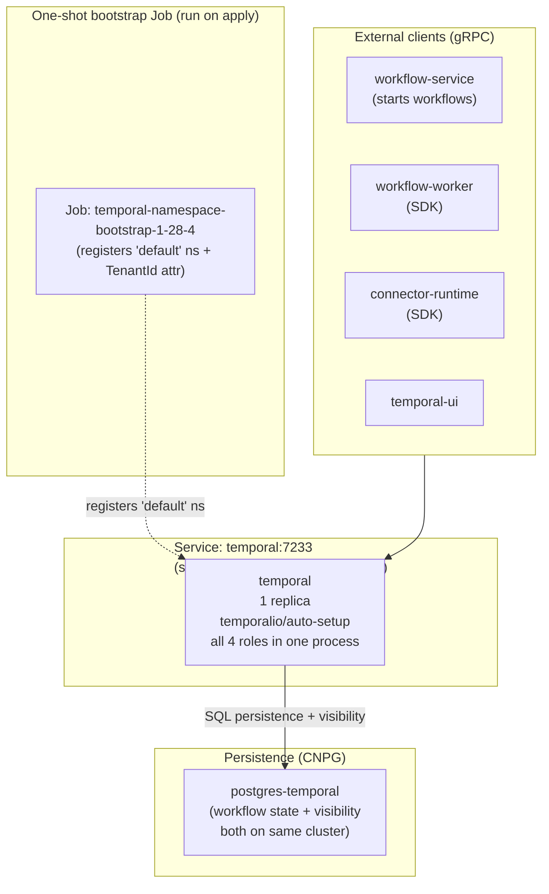

# RUNBOOK — Temporal Operations

> Day-2 reference for operating the Temporal cluster.
> Scope: anything Temporal-related that's NOT a one-time migration.
>
> **Current topology (developer mode):** single `temporalio/auto-setup`
> Deployment named `temporal`. All four internal roles (frontend, history,
> matching, worker) run in one process. This reverted from the 4-role HA
> split that was used during stress testing.
>
> Companion docs (historical context, not current operations):
> - [`DOCS/runbooks/temporal-ha-migration.md`](./temporal-ha-migration.md) —
>   the one-time migration to 4-role HA (no longer the active config).
> - [`DOCS/runbooks/temporal-visibility-split.md`](./temporal-visibility-split.md) —
>   the visibility datastore split to its own CNPG cluster (also historical —
>   developer mode uses one shared `postgres-temporal` cluster for both).

---

## 1. Quick reference card

```bash
# Replace with your env (dev is the only active env):
NS=support-services-dev

# Health probe (returns "WorkflowService: SERVING" when OK)
kubectl -n $NS exec deploy/temporal -c temporal -- \
  tctl --address temporal:7233 cluster health

# All pods for the temporal Deployment
kubectl -n $NS get pods -l app.kubernetes.io/name=temporal

# Purge all workflow state (clean slate)
./scripts/purge-temporal.sh --namespace=$NS --yes
```

---

## 2. Topology



The single `temporal` Deployment runs `temporalio/auto-setup:1.28.4`. The `auto-setup`
image runs schema setup internally on every first boot, then starts all four internal
Temporal services in one process. Clients connect to the `temporal` Service on `:7233`
(selector: `app.kubernetes.io/name=temporal, temporal.io/role=frontend`).

Developer mode uses **one** `postgres-temporal` CNPG cluster for both workflow
state and visibility. Both `POSTGRES_SEEDS` and `VISIBILITY_POSTGRES_SEEDS` point
to `postgres-temporal-rw` (see §4.3).

---

## 3. Service inventory

### 3.1 Kubernetes resources

```bash
kubectl -n $NS get -l app.kubernetes.io/name=temporal \
  deploy,svc,job,cm
```

Expected resources (after bootstrap + healthy steady-state):

| Kind | Name | Replicas / count |
|---|---|---|
| Deployment | `temporal` | 1 |
| Deployment | `temporal-ui` | 1 (Web UI only) |
| Service | `temporal` | ClusterIP (selector: `temporal.io/role=frontend`) |
| Service | `temporal-ui` | ClusterIP for the Web UI |
| ConfigMap | `temporal-dynamic-config` | `production-sql.yaml` (runtime dynamic config, 60s polling) |
| Job | `temporal-namespace-bootstrap-1-28-4` | One-shot: registers `default` ns + `TenantId` search attribute |

> **Not present in developer mode**: `temporal-frontend/history/matching/worker`
> Deployments, `temporal-internode` headless Service, role-metrics Services,
> `temporal-schema-setup-*` Job (schema runs inside `auto-setup` itself),
> `temporal-shard-rebalancer` CronJob (not needed — single process).

### 3.2 Persistence (CNPG)

- [`postgres-temporal`](../../infrastructure/base/postgres/postgres-temporal-cluster.yaml) —
  workflow state AND visibility (`temporal` + `temporal_visibility` databases).
  1 instance in dev overlays; 2 instances HA in base.

> The `postgres-temporal-visibility` CNPG cluster described in
> `runbooks/temporal-visibility-split.md` is **not active** in developer mode.
> Both `POSTGRES_SEEDS` and `VISIBILITY_POSTGRES_SEEDS` point to
> `postgres-temporal-rw`.

### 3.3 Image versions (all pinned, no `:latest`)

| Image | Tag | Where |
|---|---|---|
| Temporal server (auto-setup) | `temporalio/auto-setup:1.28.4` | `temporal` Deployment |
| Temporal admin tools (namespace bootstrap) | `temporalio/admin-tools:1.28.4-tctl-1.18.4-cli-1.6.2` | `temporal-namespace-bootstrap` Job |

---

## 4. Configuration

### 4.1 Static config — `auto-setup` environment variables

`temporalio/auto-setup` is configured entirely through environment variables
defined in
[`deployment-autosetup.yaml`](../../infrastructure/base/temporal/deployment-autosetup.yaml):

| Env | Value | Notes |
|---|---|---|
| `SKIP_SCHEMA_SETUP` | `false` | Run schema setup on every first boot. Idempotent — safe if schema already exists. |
| `BIND_ON_IP` | `0.0.0.0` | Bind on all interfaces (required on dual-stack dev clusters) |
| `PROMETHEUS_ENDPOINT` | `0.0.0.0:9090` | Metrics exporter |
| `PUBLIC_FRONTEND_ADDRESS` | `temporal:7233` | Internal worker calls frontend here |
| `DB` | `postgres12` | Driver |
| `POSTGRES_SEEDS` | `postgres-temporal-rw` | Default datastore |
| `VISIBILITY_POSTGRES_SEEDS` | `postgres-temporal-rw` | **Same cluster as default** (see §3.2) |
| `DBNAME` / `VISIBILITY_DBNAME` | `temporal` / `temporal_visibility` | DB names |
| `POSTGRES_USER` / `POSTGRES_PWD` | from `postgres-temporal-credentials` Secret | DB creds |
| `VISIBILITY_POSTGRES_USER` / `VISIBILITY_POSTGRES_PWD` | same Secret | Same cluster → same creds |
| `NUM_HISTORY_SHARDS` | `16` | Hard-coded value; changing after schema bootstrap orphans history |
| `DYNAMIC_CONFIG_FILE_PATH` | `/etc/temporal/config/dynamicconfig/production-sql.yaml` | See §4.2 |

> **`NUM_HISTORY_SHARDS` in env var** (unlike the HA split which hard-coded it
> in a configmap template): in `auto-setup` mode the value is passed via env var.
> Still treat it as immutable after first schema bootstrap — changing it
> after bootstrap silently routes new workflows to different shards.

### 4.2 Dynamic config — `production-sql.yaml`

[`configmap-dynamic-config.yaml`](../../infrastructure/base/temporal/configmap-dynamic-config.yaml).
Mounted read-only at `/etc/temporal/config/dynamicconfig/`. Re-read
every 60s. Current keys (intentionally minimal):

```yaml
frontend.workerHeartbeatsEnabled:
  - value: true
frontend.listWorkersEnabled:
  - value: true
```

To add a new key without a Deployment restart: edit this ConfigMap,
`kubectl apply`, wait up to 60s for the change to land.

---

## 5. Bootstrap procedures

### 5.1 Fresh cluster (clean slate)

```bash
NS=support-services-dev

# 1. Optional: wipe stale workflow state on the CNPG cluster.
#    Only needed when re-bootstrapping with existing Postgres data.
./scripts/purge-temporal.sh --namespace=$NS --skip-restart --yes

# 2. Apply the kustomize overlay. Creates:
#    - ConfigMap (dynamic config)
#    - Job (namespace-bootstrap)
#    - Services (temporal, temporal-ui)
#    - Deployment (temporal, temporal-ui)
kubectl apply -k infrastructure/overlays/local/dev

# 3. Wait for the Deployment to be ready.
kubectl -n $NS rollout status deploy/temporal --timeout=5m

# 4. Wait for the namespace bootstrap Job (registers 'default' +
#    TenantId search attribute — without this, workflow-worker and
#    connector-runtime SDK clients crash on first boot).
kubectl -n $NS wait --for=condition=complete \
  job/temporal-namespace-bootstrap-1-28-4 --timeout=7m

# 5. Cluster health smoke check.
kubectl -n $NS exec deploy/temporal -c temporal -- \
  tctl --address temporal:7233 cluster health
# Expect: temporal.api.workflowservice.v1.WorkflowService: SERVING
```

The bootstrap scripts ([`bootstrap-minikube.sh`](../../bootstrap-minikube.sh),
[`bootstrap-orbstack.sh`](../../bootstrap-orbstack.sh)) run steps 2-4 automatically.

### 5.2 Re-apply (idempotent path, after config change)

```bash
kubectl apply -k infrastructure/overlays/local/dev
# Idempotent:
# - ConfigMap changes: dynamic config re-read within 60s; env var
#   changes require a Deployment restart.
# - Job manifest: kubectl no-op if spec unchanged (Jobs are immutable).
# - Deployment: standard rolling update if spec.template changed.
```

If you changed env vars in `deployment-autosetup.yaml`:
```bash
kubectl rollout restart deploy/temporal -n $NS
kubectl rollout status   deploy/temporal -n $NS --timeout=5m
```

### 5.3 Version bump (Temporal server)

```bash
# 1. Update the version in deployment-autosetup.yaml,
#    job-namespace-bootstrap.yaml, and this runbook.
OLD=1.28.4
NEW=1.29.2  # example
# Also bump admin-tools compound tag in job-namespace-bootstrap.yaml:
# https://hub.docker.com/v2/repositories/temporalio/admin-tools/tags?name=$NEW
# Also rename the Job to temporal-namespace-bootstrap-<NEW-DASHED>

# 2. Delete the OLD Job (Jobs are immutable — re-apply is a no-op).
kubectl -n $NS delete job/temporal-namespace-bootstrap-1-28-4 \
  --ignore-not-found

# 3. Apply + wait for the new Job + rollout (same as §5.1 steps 2-5).
```

---

## 6. Day-2 operations

### 6.1 Inspect cluster health

```bash
# Frontend gRPC health
kubectl -n $NS exec deploy/temporal -c temporal -- \
  tctl --address temporal:7233 cluster health
# Expect: WorkflowService: SERVING

# Pod state
kubectl -n $NS get pods -l app.kubernetes.io/name=temporal
```

### 6.2 Inspect failed / timed-out workflows

```bash
# Sample TimedOut workflows
kubectl -n $NS exec deploy/temporal -c temporal -- \
  temporal workflow list \
    --address temporal:7233 --namespace default \
    --query "ExecutionStatus='TimedOut'" \
    --limit 10 --output json

# Show full event history of one workflow
kubectl -n $NS exec deploy/temporal -c temporal -- \
  temporal workflow show \
    --address temporal:7233 --namespace default \
    --workflow-id "$WID" --run-id "$RID" --output json
```

### 6.3 Purge workflow state

Drop ALL workflow state without dropping schema. Useful between
back-to-back test runs. Implemented by
[`scripts/purge-temporal.sh`](../../scripts/purge-temporal.sh):

```bash
./scripts/purge-temporal.sh --namespace=$NS --yes

# Variants:
./scripts/purge-temporal.sh --namespace=$NS --skip-restart --yes
# ^ wipe but leave temporal at 0 replicas (you'll restart later)

./scripts/purge-temporal.sh --namespace=$NS counts
# ^ read-only: print row counts in workflow tables
```

### 6.4 Bump postgres-temporal resources

Persistence sizing lives in the overlays:

- [`postgres-temporal-resources.yaml`](../../infrastructure/overlays/local/local-base/patches/postgres-temporal-resources.yaml)
  (local / minikube)
- [`postgres-temporal.yaml`](../../infrastructure/overlays/orbstack/orbstack-base/patches/postgres-temporal.yaml)
  (orbstack)

Apply with `kubectl apply -k ...` and watch with:

```bash
kubectl -n $NS get cluster.postgresql.cnpg.io/postgres-temporal -w
```

---

## 7. Image / version pinning rules

### 7.1 Temporal version matrix

When bumping `temporalio/auto-setup` from version X to Y, you MUST also:

| Place | Change | Why |
|---|---|---|
| `deployment-autosetup.yaml` | `image: temporalio/auto-setup:Y` | Server binary |
| `job-namespace-bootstrap.yaml` | `image: temporalio/admin-tools:Y-tctl-<TCTL>-cli-<CLI>` | Admin tools MUST match the server version. Pick the latest `Y-tctl-*-cli-*` from <https://hub.docker.com/v2/repositories/temporalio/admin-tools/tags?name=Y> |
| Job name | `temporal-namespace-bootstrap-Y-DASHED` | Forces re-creation (Jobs are immutable) |
| `runbooks/temporal.md` (this file), bootstrap scripts | Same version refs | Documentation truth |

### 7.2 `NUM_HISTORY_SHARDS` is effectively immutable after first bootstrap

`deployment-autosetup.yaml` sets `NUM_HISTORY_SHARDS: "16"` via env var.
**Do not change this after the cluster has been bootstrapped.** Every
workflow's owning shard is derived from this value. Changing it silently
routes new workflows to different shards while old ones remain on their
original shards — they become invisible to each other.

Changing it is only safe on a clean DB (after `purge-temporal.sh`).

---

## 8. Known hazards

### 8.1 SDK clients crash without `default` namespace + `TenantId` attribute

`temporalio/auto-setup` creates the `default` namespace on boot, but does
NOT register custom search attributes. Without our
`temporal-namespace-bootstrap` Job:

- `workflow-worker` and `connector-runtime` SDK clients crash on first
  boot with `Namespace default is not found.` (if the Job hasn't run yet).
- `workflow-service-worker` fails every `workflow.start` call with
  `Namespace default has no mapping defined for search attribute TenantId`
  (because workflows use `searchAttributes: { TenantId: [...] }`).

**Fix in repo**: the
[`job-namespace-bootstrap.yaml`](../../infrastructure/base/temporal/job-namespace-bootstrap.yaml)
runs both registrations idempotently after the frontend is `SERVING`.

**You hit this if**: SDK pods crashloop with `NamespaceNotFoundFailure`
shortly after a fresh bootstrap. Check:
`kubectl logs job/temporal-namespace-bootstrap-1-28-4 -n $NS`.

### 8.2 Version-suffixed Job re-creation on rollback

If you bump from version X to Y, then need to roll back to X within
10 min, the old `temporal-namespace-bootstrap-X` Job may have been GC'd
(`ttlSecondsAfterFinished: 600`) or may still exist. Re-applying tries to
create a same-name Job with a different spec — **K8s rejects the spec
change as immutable**.

**Mitigation**: delete the stale Job before reapplying:
```bash
kubectl -n $NS delete job/temporal-namespace-bootstrap-1-28-4 \
  --ignore-not-found
kubectl apply -k infrastructure/overlays/...
```

### 8.3 `auto-setup` ignores `VISIBILITY_POSTGRES_SEEDS` during schema setup

The `temporalio/auto-setup` ENTRYPOINT runs schema setup for both the
default DB and visibility DB, but always against `POSTGRES_SEEDS` — it
does not honour `VISIBILITY_POSTGRES_SEEDS` for the migration phase.

**In developer mode this is not a problem** because both env vars point to
the same cluster (`postgres-temporal-rw`). If you ever split visibility
onto its own cluster, re-read `runbooks/temporal-visibility-split.md` for
the workaround (`ensure-temporal-visibility-schema.sh`).

---

## 9. Alerts reference

All alerts live in
[`infrastructure/base/observability/prometheus/alerts.yaml`](../../infrastructure/base/observability/prometheus/alerts.yaml).

### 9.1 Temporal server alerts (`temporal-server` group)

| Alert | Fires when | First responder action |
|---|---|---|
| `TemporalServerDown` | Prometheus can't scrape any temporal pod for >1m | Check pod state, frontend gRPC port, postgres reachability |
| `TemporalScheduleToStartHigh` | Workflow tasks p95 schedule_to_start >5s for 2m | Check workflow-worker health; single auto-setup pod is bottleneck |
| `TemporalActivityScheduleToStartHigh` | Activity tasks p95 schedule_to_start >5s for 2m | Check connector-runtime / workflow-worker health |
| `TemporalWorkflowTimeoutsSpike` | Workflow timeouts >0.5/s for 2m | Check `TemporalScheduleToStartHigh` and postgres-temporal status |
| `TemporalPersistenceLatencyHigh` | Persistence operation p99 >100ms for 2m | Check postgres IO, connections, autovacuum lag |
| `TemporalStickyCacheHitLow` | Sticky cache hit ratio <70% for 10m | Worker pods too few or being scaled-down. Bump `minReplicaCount`. |

> `TemporalHistoryShardImbalance` was removed from alerts — shard imbalance
> between separate history pods is not applicable in the single auto-setup topology.

### 9.2 Temporal Postgres alerts (`temporal-postgres` group)

| Alert | Fires when | First responder action |
|---|---|---|
| `TemporalPostgresDown` | CNPG pod unreachable >1m | Check CNPG cluster status: `kubectl get cluster.postgresql.cnpg.io` |
| `TemporalPostgresReplicationLagHigh` | Replication lag >10s for 2m | Standby falling behind. Investigate IO on standby or long queries. |
| `TemporalPostgresDeadTuplesHigh` | >100k dead tuples on history_node/tasks/etc for 10m | Autovacuum falling behind. Check `autovacuum_*` params in overlays. |
| `TemporalPostgresConnectionsSaturated` | >80% of max_connections for 5m | Bump `max_connections` in overlays or investigate stuck sessions. |
| `TemporalPostgresCheckpointSyncSlow` | Checkpoint sync >1000ms/s for 5m | IO saturation. Tune `checkpoint_timeout` / `max_wal_size`. |
| `TemporalPostgresWalSizeGrowing` | WAL >10GB for 10m | Replication slot stuck or checkpoint not progressing. |
| `TemporalServerErrors` | `temporal_service_errors` rate >0.5/s for 5m | Possible persistence-backend degradation. Cross-check postgres alerts above. |

---

## 10. References

- **Manifests**: [`infrastructure/base/temporal/`](../../infrastructure/base/temporal/)
- **Persistence**: [`infrastructure/base/postgres/postgres-temporal-cluster.yaml`](../../infrastructure/base/postgres/postgres-temporal-cluster.yaml)
- **Overlays**: [`infrastructure/overlays/local/local-base/patches/postgres-temporal-resources.yaml`](../../infrastructure/overlays/local/local-base/patches/postgres-temporal-resources.yaml), [`infrastructure/overlays/orbstack/orbstack-base/patches/postgres-temporal.yaml`](../../infrastructure/overlays/orbstack/orbstack-base/patches/postgres-temporal.yaml)
- **Bootstrap scripts**: [`bootstrap-minikube.sh`](../../bootstrap-minikube.sh), [`bootstrap-orbstack.sh`](../../bootstrap-orbstack.sh)
- **Purge script**: [`scripts/purge-temporal.sh`](../../scripts/purge-temporal.sh)
- **Prometheus alerts**: [`infrastructure/base/observability/prometheus/alerts.yaml`](../../infrastructure/base/observability/prometheus/alerts.yaml)
- **Historical HA migration runbook**: [`DOCS/runbooks/temporal-ha-migration.md`](./temporal-ha-migration.md)
- **Historical visibility-split runbook**: [`DOCS/runbooks/temporal-visibility-split.md`](./temporal-visibility-split.md)
