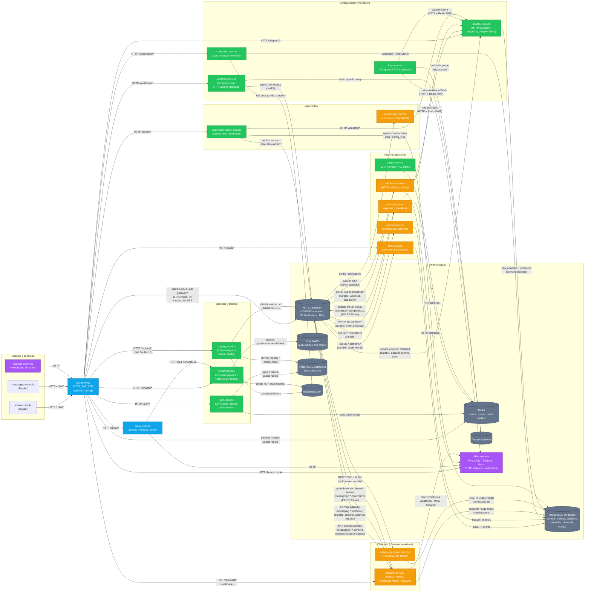
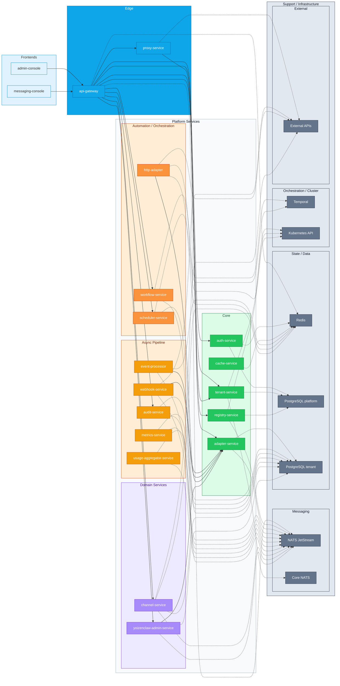
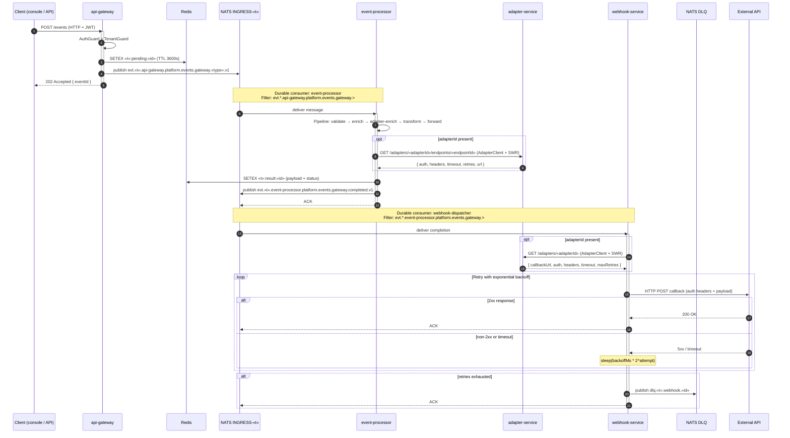

# Services — Mapa de comunicación

Esta guía describe cómo se comunican los servicios alojados en `services/`. La plataforma combina **HTTP síncrono** (a través del API Gateway), **mensajería asíncrona** sobre **NATS JetStream** (streams per-tenant `INGRESS-<tenant>` / `DLQ-<tenant>` y un `DLQ` global), **Core NATS** para eventos fire-and-forget (`platform.tenant.deleted`), **PostgreSQL por tenant** (tier Dedicated: StatefulSets dedicados; tier Shared: logical DB en CloudNativePG), **Redis** como cache compartida, y **Temporal** para orquestación de workflows.

> Resumen rápido: las consolas Angular (`admin-console`, `messaging-console`) hablan **solo** con el `api-gateway`. El gateway autentica vía `auth-service`, valida y publica eventos al stream `INGRESS-<tenant>` del tenant, y proxyea el resto de operaciones a sus servicios destino. El plano asíncrono es procesado por `event-processor`, `audit-service`, `metrics-service`, `webhook-service`, `channel-service` y `usage-aggregator-service`, todos consumiendo de streams `INGRESS-<tenant>`. La orquestación durable se hace con Temporal (`workflow-service` API + `workflow-service` worker como proceso separado + `http-adapter`).

---

## Convención de subjects NATS

Todos los subjects siguen un formato canónico de 8 tokens:

```
evt.<tenant>.<source>.<domain>.<area>.<kind>.<action>.v1
```

| Token | Descripción | Ejemplo |
|-------|-------------|---------|
| `evt` | Prefijo fijo | `evt` |
| `<tenant>` | ID del tenant | `acme` |
| `<source>` | Servicio que emite | `api-gateway`, `channel-service` |
| `<domain>` | Dominio de negocio | `platform`, `messaging` |
| `<area>` | Área funcional | `events`, `channel` |
| `<kind>` | Tipo de entidad/canal | `gateway`, `whatsapp` |
| `<action>` | Acción ocurrida | `received`, `send`, `completed` |
| `v1` | Versión del schema | `v1` |

> En este documento y en el diagrama Mermaid se usan formas abreviadas (p.ej. `evt.<t>.*.events.>`) por legibilidad. Consultar `packages/shared/src/channel.constants.ts` y `channel.utils.ts` para los patterns exactos.

---

## Diagrama de comunicación



---

## Diagrama de capas



**Convención de flechas:** líneas sólidas = relación entre servicios de la plataforma; líneas punteadas = dependencia hacia servicios de soporte / infraestructura.

**Leyenda de capas:**

| Capa | Responsabilidad | Servicios |
|------|-----------------|-----------|
| **Frontends** | UIs Angular que hablan solo con el gateway | `admin-console`, `messaging-console` |
| **Edge** | Autenticación, routing, proxy HTTP | `api-gateway`, `proxy-service` |
| **Platform Core** | Identidad, tenants, config de adapters, cache | `auth-service`, `tenant-service`, `registry-service`, `adapter-service`, `cache-service` |
| **Async Pipeline** | Procesamiento de eventos, auditoría, métricas, webhooks | `event-processor`, `audit-service`, `metrics-service`, `webhook-service`, `usage-aggregator-service` |
| **Automation** | Workflows durables y scheduling | `workflow-service`, `http-adapter`, `scheduler-service` |
| **Channels** | Ingress/egress con proveedores de mensajería | `channel-service` |
| **YoizenClaw** | Plataforma conversacional (admin) | `yoizenclaw-admin-service` |
| **Support / Infrastructure** | Servicios managed/externos que la plataforma consume | NATS, Redis, PostgreSQL, Temporal, Kubernetes API, APIs externas |

---

## Secuencia: evento ingress → webhook callback

Este diagrama muestra el flujo principal de un evento desde que un cliente lo envía hasta que se dispara el callback HTTP al sistema externo.



**Puntos clave del flujo:**

1. El gateway es **fire-and-forget** para el cliente: responde `202` inmediato y el procesamiento es asíncrono.
2. El `event-processor` ejecuta un pipeline de 5 stages que puede enriquecer el evento con config del adapter.
3. El resultado se persiste en Redis para que el gateway lo pueda servir vía SSE o polling (`GET /events/:id/result`).
4. El `webhook-service` hace retry con backoff exponencial; si falla, el evento va a `DLQ` para reproceso manual.
5. Todo el flujo opera sobre el stream `INGRESS-<tenant>` — no hay streams intermedios.

---

## Catálogo de servicios

### Edge / front

| Servicio | Tipo | Habla con |
|----------|------|-----------|
| **`api-gateway`** | NestJS + Fastify (Knative) | Punto de entrada HTTP. JWT (`AuthGuard`), tenant guard (`TenantGuard`), SSE, **publica a NATS `INGRESS-<tenant>`** con subjects `evt.<t>.api-gateway.platform.events.gateway.<type>.v1`, lee resultados de Redis (`<t>:result:<id>`), proxyea a `auth`, `tenant`, `registry`, `audit`, `scheduler`, `workflow`, `adapter`, `yoizenclaw-admin`, `channel`, `proxy`. Polea `GET /routes` cada 15 s al `registry-service` para enrutar tráfico a Knative services del tenant. |
| **`proxy-service`** | NestJS + Fastify | Reenvía requests HTTP a sistemas externos (`generic` por header `x-proxy-target`, `ySocial` y `yFlow` por config del tenant). Solo consume `tenant-service` para resolver las URLs (cache `Map` 60 s, FIFO 512). |
| **`admin-console`** | Angular 21 | Consola tenant-scoped. Habla **solo** con `api-gateway` (login, dashboards, identity, automatización, integraciones, security). |
| **`messaging-console`** | Angular 21 | Consola de mensajería en tiempo real. Habla **solo** con `api-gateway` (cuentas de canal, conversaciones, auto-reply, event stream SSE). |

### Identidad y tenants

| Servicio | Habla con | Notas |
|----------|-----------|-------|
| **`auth-service`** | PostgreSQL plataforma + Redis | Login/credenciales, tokens HS256 (`jose`), users, clients, public-routes (sincroniza a Redis para que el gateway las lea). |
| **`tenant-service`** | Kubernetes API + Core NATS | Crea namespaces `<tenant>-<env>-ns` y provisiona PostgreSQL por tenant. **Tier Dedicated**: crea dos StatefulSets (OLTP Postgres + TimescaleDB para usage). **Tier Shared**: crea logical database en un cluster CloudNativePG compartido. Publica `platform.tenant.deleted` vía **Core NATS** (fire-and-forget pub/sub, no JetStream) para que otros servicios evicten caches/pools. |
| **`registry-service`** | Kubernetes API + PostgreSQL plataforma + NATS JetStream | Registra Knative services del tenant, define rutas, hace canary. Publica `service.upserted.v1` / `service.deleted.v1` en `INGRESS-<tenant>`; el `api-gateway` también consulta `GET /routes` cada 15 s. |

### Configuración y workflows

| Servicio | Habla con | Notas |
|----------|-----------|-------|
| **`adapter-service`** | PostgreSQL por tenant + NATS JetStream | Maneja la config multi-tenant de adapters HTTP y endpoints (auth, retries, headers, timeouts). Es consumido por `event-processor`, `webhook-service`, `http-adapter` vía `AdapterClient` (HTTP + cache SWR en Redis del lado del **cliente**) y por `yoizenclaw-admin-service` vía HTTP directo. Consume `service.upserted/deleted` del `registry-service` (durable: `adapter-internal-sync`) para mantener un mirror `http_adapters` por tenant. Nota: este servicio **no** usa Redis directamente; el SWR cache vive en los servicios consumidores. |
| **`workflow-service`** | Temporal + NATS | API REST (NestJS+Fastify) + Temporal worker como **proceso separado** (mismo image, entrypoints distintos: `dist/main.js` vs `dist/temporal/worker.js`, desplegados como Knative services `workflow-api` y `workflow-worker`). Despacha `endpointCall` y `serviceCall` al task queue `http-adapter` (worker remoto), ejecuta `agentCall`, `jsFunction`, `serviceBusCall` (publish NATS) y `branch` localmente en el worker propio. |
| **`http-adapter`** | Temporal + Redis + adapter-service | Worker Temporal dedicado al task queue `http-adapter`. Resuelve config vía `AdapterClient` (HTTP + Redis SWR), hace `tracedFetch` a APIs externas y resuelve `serviceCall` vía mirror interno o fallback a `registry-service`. |
| **`scheduler-service`** | PostgreSQL por tenant + Kubernetes API | Schedules `cron`, `interval`, `one-time`. Modos `js-inline` (Bun Worker en proceso), `js-k8s` (K8s Job con `oven/bun:1.3-alpine`) y `docker` (K8s Job con imagen custom). |

### Pipeline asíncrono de eventos

| Servicio | Stream / Consumer | Habla con |
|----------|-------------------|-----------|
| **`event-processor`** | `INGRESS-<tenant>` (durable: `event-processor`, filter: `evt.*.api-gateway.platform.events.gateway.>`) → publica completions a `INGRESS-<tenant>` | Pipeline ordenado (validation → enrichment → adapter-enrichment → transform → adapter-forward) y handler-registry vía `@EventType()`. Persiste `<tenant>:result:<id>` en Redis y publica `evt.<t>.event-processor.platform.events.gateway.completed.v1` en `INGRESS-<tenant>`. Usa `MultiTenantConsumerManager` que descubre dinámicamente streams `INGRESS-*`. |
| **`audit-service`** | `INGRESS-<tenant>` (durable: `audit-events`, filter: `evt.*.*.platform.>`) | Persiste cada envelope a la PostgreSQL del tenant; expone `GET /audit/events` paginado. Usa `MultiTenantConsumerManager`. |
| **`metrics-service`** | `INGRESS-<tenant>` (durable, filter: `evt.*.api-gateway.platform.events.gateway.metrics.v1`) | Persiste métricas por tenant en PostgreSQL. |
| **`webhook-service`** | `INGRESS-<tenant>` (durable: `webhook-dispatcher`, filter: `evt.*.event-processor.platform.events.gateway.>`), publica a `DLQ` | Hace los HTTP callbacks (retry exponencial con backoff). Si el evento trae `adapterId`, usa `AdapterClient` (HTTP + Redis SWR) para resolver auth/headers/retries/timeouts. |
| **`cache-service`** | Redis (L2) | Cache key/value con L1 in-memory + L2 Redis (cache-aside). No depende de NATS. |

### Channels (mensajería con proveedores externos)

| Servicio | Habla con | Notas |
|----------|-----------|-------|
| **`channel-service`** | NATS (`INGRESS-<tenant>`) + PostgreSQL por tenant + Redis + APIs externas | Tres responsabilidades: (1) **webhooks ingress** desde Meta/Telegram (recibe vía gateway, normaliza y publica en `INGRESS-<tenant>` con subject `evt.<t>.channel-service.messaging.<channel>.<provider>.received.v1`); (2) **egress** que consume `evt.*.channel-service.messaging.*.*.send.v1` (durable `channel-egress`, `max_deliver=2` para evitar duplicar mensajes a usuarios finales) y dispara HTTP a WhatsApp/Telegram/Instagram; (3) **auto-reply** + accounts CRUD. Consumer ingress: durable `channel-webhook-ingress` con filter `evt.*.api-gateway.messaging.*.webhook.webhook_received.v1`. |
| **`usage-aggregator-service`** | NATS (`INGRESS-*` + `DLQ-*`) + Timescale por tenant | Worker multi-tenant: descubre dinámicamente streams `INGRESS-<TENANT>` / `DLQ-<TENANT>` y agrega rollups de uso a `postgres-usage` (TimescaleDB) por tenant. |

### YoizenClaw

| Servicio | Habla con | Notas |
|----------|-----------|-------|
| **`yoizenclaw-admin-service`** | PostgreSQL por tenant + NATS (publisher) + adapter-service (HTTP directo) | Backend admin de agentes, credenciales, jobs y config files de la plataforma conversacional YoizenClaw. Publica eventos `agent.published`, `credential.rotated`, `runtime.config.synced`, `job.triggered` en `INGRESS-<tenant>`. El runtime de YoizenClaw consume estos eventos para sincronizar configuración. No usa `AdapterClient` con SWR — llama al adapter-service directamente vía HTTP. No depende de tenant-service en runtime (routing a DB por convención de hostname). |

---

## Patrones de comunicación

### 1. HTTP síncrono a través del gateway

Los clientes (consolas y APIs externas) **nunca** llaman directamente a un servicio interno. Todo entra por `api-gateway`, que:

- valida JWT (`AuthGuard`) y resuelve tenant (`TenantGuard`),
- ejecuta proxies dedicados (`/auth`, `/tenants`, `/audit`, `/registry`, `/workflows`, `/schedulers`, `/adapters`, `/admin`, `/channels`, `/proxy`),
- para rutas no-plataforma, matchea contra el `DynamicRouteCacheService` (`Map<string, IRouteEntry[]>` ordenado por longest-prefix, refrescado cada 15 s) y proxea al Knative service del tenant.

### 2. Mensajería NATS JetStream

La plataforma usa streams **per-tenant** como modelo principal:

| Stream | Subjects | Productores principales | Consumers |
|--------|----------|-------------------------|-----------|
| `INGRESS-<tenant>` | `evt.<tenant>.>` | `api-gateway`, `event-processor`, `channel-service`, `registry-service`, `yoizenclaw-admin-service` | `event-processor`, `audit-service`, `metrics-service`, `webhook-service`, `channel-service` (egress + webhook-ingress), `adapter-service` (sync), `usage-aggregator-service`, `YoizenClaw runtime` |
| `DLQ` | `dlq.>` | `webhook-service` (deliveries fallidas) | observabilidad / reproceso manual |
| `DLQ-<tenant>` | `dlq.<tenant>.>` | per-tenant DLQ | `usage-aggregator-service` |

Convenciones clave:
- Durable consumers nombrados, ack explícito
- `max_deliver` ajustado por flujo (5 por defecto, 2 en egress de canales para no spamear usuarios finales)
- Backoff alineado con `ack_wait`
- `MultiTenantConsumerManager` descubre streams dinámicamente por regex (`/^INGRESS-/`, `/^DLQ-/`)

Adicionalmente, **Core NATS** (pub/sub sin persistencia) se usa para:

| Subject | Productor | Consumidores | Propósito |
|---------|-----------|--------------|-----------|
| `platform.tenant.deleted` | `tenant-service` | Todos los servicios con pools por tenant | Fire-and-forget: evictar caches y pools de conexiones DB |

### 3. Persistencia

- **PostgreSQL plataforma**: usado por `auth-service` y `registry-service` para datos cross-tenant (users, clients, registry, canary state).
- **PostgreSQL por tenant** — provisionado por `tenant-service`:
  - **Tier Dedicated**: StatefulSet OLTP dedicado (`postgres.<tenant>-<env>-ns.svc.cluster.local`) + StatefulSet TimescaleDB para usage.
  - **Tier Shared**: Logical database en un cluster CloudNativePG compartido.
  - Usado por: `audit-service`, `metrics-service`, `scheduler-service`, `adapter-service`, `channel-service`, `usage-aggregator-service` y `yoizenclaw-admin-service`.
  - Cada servicio mantiene un `Map<string, Sql>` con pools por tenant y se suscribe a `platform.tenant.deleted` (Core NATS) para evictar pools cuando se elimina un tenant.
- **Redis**: cache compartida (`<tenant>:pending:<id>`, `<tenant>:result:<id>`, `callback:<id>`, public-routes, adapter SWR cache en clientes, OAuth2 tokens).

### 4. Workflows durables

`workflow-service` se despliega como **dos procesos separados** (mismo image, distinto entrypoint):
- **`workflow-api`** (`dist/main.js`): API REST NestJS + cliente Temporal (start/signal/query workflows).
- **`workflow-worker`** (`dist/temporal/worker.js`): Worker Temporal que ejecuta las activities locales (`jsFunction`, `serviceBusCall`, `branch`).

Las acciones `endpointCall` y `serviceCall` se despachan al task queue `http-adapter`, donde **`http-adapter`** (servicio independiente) las ejecuta con `tracedFetch`, resolución vía `AdapterClient` y fallback a `registry-service` cuando corresponde. `agentCall`, `serviceBusCall` y `branch` permanecen en `workflow-worker`.

### 5. Adapter sync

`registry-service` publica `service.upserted.v1` / `service.deleted.v1` en `INGRESS-<tenant>` después del commit. El `adapter-service` mantiene un consumer durable (`adapter-internal-sync`) que materializa esos eventos en una tabla mirror `http_adapters` por tenant. El resto de servicios consume esa config a través de `AdapterClient` (HTTP + cache SWR en Redis **del lado del cliente**), sin hablar nunca con la base del registry.

---

## Quién depende de quién (resumen)

| Servicio | Depende sincrónicamente (HTTP) | Produce a NATS | Consume de NATS | Persistencia |
|----------|-------------------------------|----------------|-----------------|--------------|
| `api-gateway` | auth, tenant, registry, audit, scheduler, workflow, adapter, yoizenclaw-admin, channel, proxy, ksvc dinámicos | `evt.<t>.api-gateway.*` → `INGRESS-<t>` | `evt.<t>.>` (SSE) | Redis |
| `proxy-service` | tenant-service | — | — | — |
| `auth-service` | — | — | — | PG plataforma + Redis |
| `tenant-service` | Kubernetes API | `platform.tenant.deleted` (Core NATS) | — | PG plataforma |
| `registry-service` | Kubernetes API | `service.{upserted,deleted}.v1` → `INGRESS-<t>` | — | PG plataforma |
| `adapter-service` | — | — | `service.{upserted,deleted}.v1` (durable: adapter-internal-sync) | PG por tenant |
| `event-processor` | adapter-service (via AdapterClient) | `evt.<t>.event-processor.*.completed.v1` → `INGRESS-<t>` | `evt.<t>.api-gateway.platform.events.gateway.>` (durable: event-processor) | Redis |
| `audit-service` | — | — | `evt.<t>.*.platform.>` (durable: audit-events) | PG por tenant |
| `metrics-service` | — | — | `evt.<t>.*.*.*.metrics.v1` (durable) | PG por tenant |
| `webhook-service` | adapter-service (via AdapterClient) + URLs externas | `dlq.*` | `evt.<t>.event-processor.platform.events.gateway.>` (durable: webhook-dispatcher) | Redis (SWR en AdapterClient) |
| `cache-service` | — | — | — | Redis |
| `scheduler-service` | Kubernetes API | — | — | PG por tenant |
| `workflow-service` | Temporal | servicebus subjects → NATS | — | Temporal |
| `http-adapter` | Temporal + adapter-service (via AdapterClient) + registry-service + URLs externas | — | — | Redis (SWR en AdapterClient) |
| `channel-service` | APIs Meta/Telegram | `evt.<t>.channel-service.messaging.*` → `INGRESS-<t>` | `*.send.v1` (durable: channel-egress), `*.webhook_received.v1` (durable: channel-webhook-ingress) | PG por tenant + Redis |
| `usage-aggregator-service` | — | — | `INGRESS-*` + `DLQ-*` (multi-tenant discovery) | PG por tenant (Timescale) |
| `yoizenclaw-admin-service` | adapter-service (HTTP directo) | `evt.<t>.yoizenclaw-admin.*` → `INGRESS-<t>` | — | PG por tenant |

---

Para detalles internos (módulos, DTOs, esquemas, métricas) consultar `services/<service>/AGENTS.md` o `services/<service>/README.md`. Para el flujo end-to-end de eventos, ver `DOCS/README.md`.
