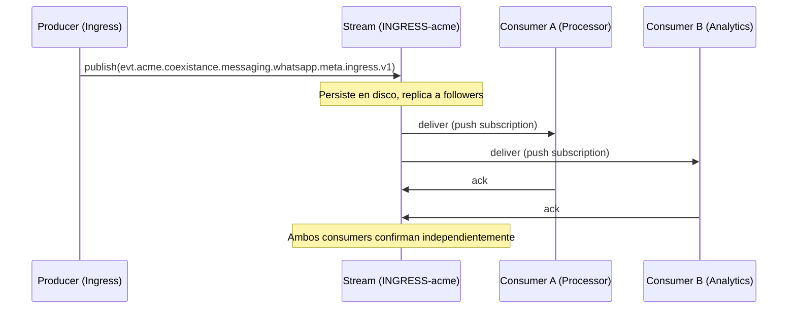
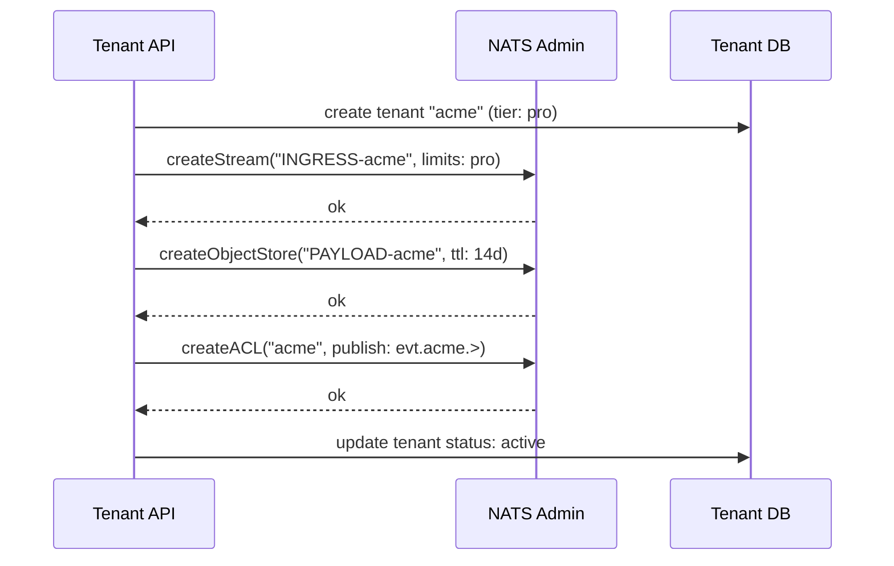
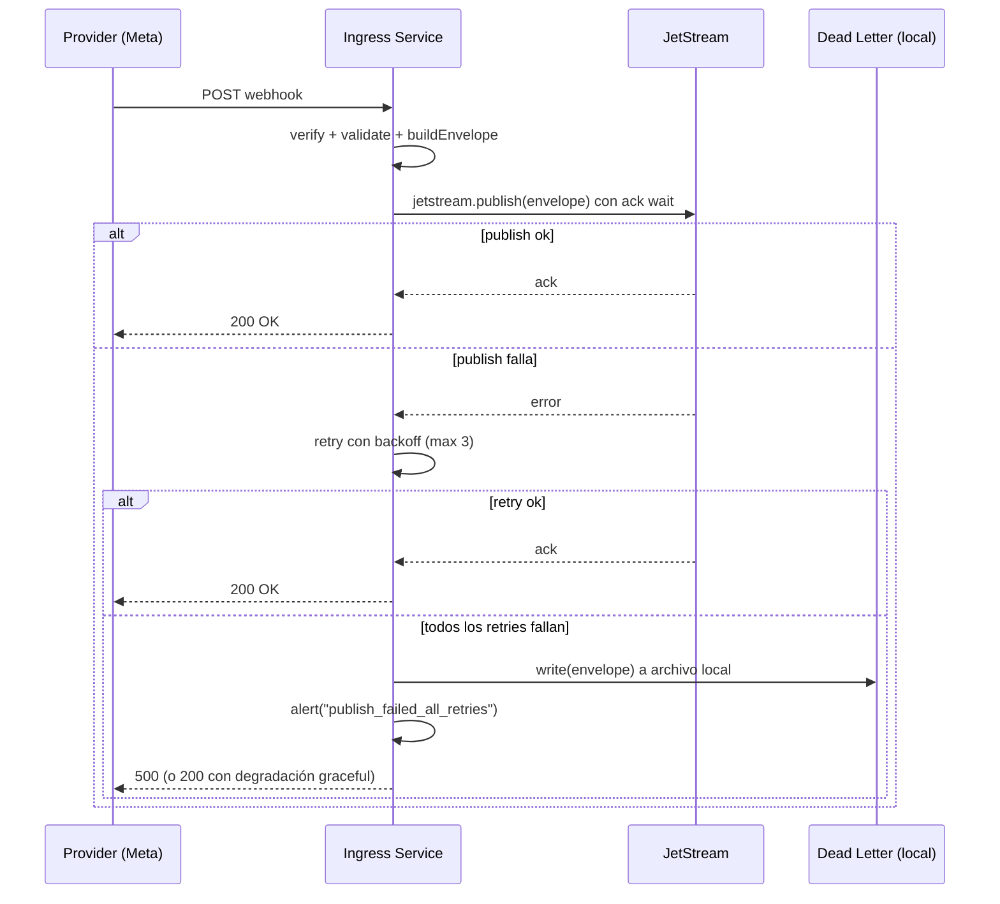

# 01 — Service Bus: NATS JetStream

**Estado:** Borrador para revisión
**Audiencia:** Infra
**Fecha:** 2026-03-21

---

## 1. Resumen

El bus de eventos de `coexistance` está basado en NATS JetStream. Este documento cubre la topología del cluster, la estrategia de streams, el aislamiento por entorno y por tenant, la configuración del servidor, y el ciclo de vida de los streams.

---

## 2. Por qué NATS JetStream

NATS es un sistema de mensajería open source (Apache 2.0) mantenido por Synadia. JetStream es la capa de persistencia de NATS que agrega durabilidad, replay, y desacople de consumers sobre el protocolo base.

Razones de la elección:

- **Durabilidad:** los mensajes se persisten en disco con replicación configurable
- **Replay:** los consumers pueden releer mensajes desde cualquier punto en el tiempo
- **Tolerancia a caídas:** si un consumer cae, retoma donde se quedó al reconectarse
- **Desacople de consumers:** los producers no necesitan saber quién consume. Nuevos consumers pueden subscribirse sin impactar al producer
- **Deduplicación nativa:** JetStream deduplica por `Nats-Msg-Id` dentro de una ventana configurable
- **Object Store integrado:** NATS Object Store permite almacenar blobs grandes sin infra adicional (ver doc 04)
- **Ecosistema:** clientes oficiales para Go, Node/Bun, Python, Rust, Java, .NET, y más
- **Open source completo:** no hay enterprise edition ni features bloqueadas

### 2.1 Por qué no Core NATS

Core NATS es at-most-once y sin persistencia. Si un consumer no está conectado al momento del publish, pierde el mensaje. Para eventos de ingress donde la pérdida no es aceptable, JetStream es el mínimo necesario.

---

## 3. Topología del cluster

### 3.1 Aislamiento por entorno

Cada entorno (dev, staging, prod) opera en un NATS account o cluster separado. No hay tráfico cross-env.

```
┌─────────────────────────────────────────────────┐
│                  NATS Cluster                    │
│                                                  │
│  ┌──────────┐  ┌──────────┐  ┌──────────┐      │
│  │  Node 1  │  │  Node 2  │  │  Node 3  │      │
│  │ (leader)  │  │(follower)│  │(follower)│      │
│  └──────────┘  └──────────┘  └──────────┘      │
│                                                  │
│  ┌────────────────────────────────────────┐     │
│  │        Account: prod                   │     │
│  │  ┌─────────────┐ ┌─────────────┐      │     │
│  │  │INGRESS-acme │ │INGRESS-globex│     │     │
│  │  │ (stream)    │ │ (stream)     │     │     │
│  │  └─────────────┘ └─────────────┘      │     │
│  │  ┌─────────────┐ ┌──────────────┐     │     │
│  │  │PAYLOAD-acme │ │PAYLOAD-globex│     │     │
│  │  │(obj store)  │ │(obj store)   │     │     │
│  │  └─────────────┘ └──────────────┘     │     │
│  └────────────────────────────────────────┘     │
│                                                  │
│  ┌────────────────────────────────────────┐     │
│  │        Account: staging                │     │
│  │  ┌─────────────┐                       │     │
│  │  │INGRESS-acme │  (1 replica)          │     │
│  │  └─────────────┘                       │     │
│  └────────────────────────────────────────┘     │
│                                                  │
│  ┌────────────────────────────────────────┐     │
│  │        Account: dev                    │     │
│  │  ┌─────────────┐                       │     │
│  │  │INGRESS-acme │  (1 replica)          │     │
│  │  └─────────────┘                       │     │
│  └────────────────────────────────────────┘     │
└─────────────────────────────────────────────────┘
```

Esta separación evita que un wildcard accidental en dev toque datos de prod. El entorno (`env`) no vive en el NATS subject — vive en la separación de accounts/clusters.

### 3.2 Cluster mínimo recomendado

| Entorno | Nodos | Justificación |
|---------|-------|---------------|
| prod | 3 | Quorum para replicación R3. Tolera la caída de 1 nodo |
| staging | 1-3 | 1 nodo suficiente. 3 si se quiere simular prod |
| dev | 1 | Sin replicación. Desarrollo local o CI |

### 3.3 Despliegue en Kubernetes

NATS se despliega como StatefulSet en Kubernetes usando el Helm chart oficial (`nats/nats`). Cada nodo tiene un PersistentVolumeClaim para el storage de JetStream.

```
┌─────────────── Kubernetes Namespace: nats ───────────────┐
│                                                           │
│  StatefulSet: nats                                        │
│  ┌──────────┐  ┌──────────┐  ┌──────────┐               │
│  │  nats-0   │  │  nats-1   │  │  nats-2   │              │
│  │  PVC: 50Gi│  │  PVC: 50Gi│  │  PVC: 50Gi│              │
│  └──────────┘  └──────────┘  └──────────┘               │
│                                                           │
│  Service: nats (headless)                                 │
│  Service: nats-lb (load balancer para clientes)           │
└───────────────────────────────────────────────────────────┘
```

---

## 4. Streams por tenant

### 4.1 Estrategia

Cada tenant tiene un stream dedicado. Esto provee aislamiento de storage — un tenant con alto volumen no impacta a los demás (noisy neighbor).

```
Stream name:    INGRESS-{tenant}
Subjects:       evt.{tenant}.>
Storage:        file
Retention:      limits
Discard policy: old (descarta el más viejo cuando se llena)
```

### 4.2 Limits por defecto

| Limit | Default | Notas |
|-------|---------|-------|
| `max_age` | 7 días | Configurable por tenant |
| `max_bytes` | 1 GB | Configurable por tier (free/enterprise) |
| `max_msg_size` | 1 MB | Alineado con `max_payload` del servidor |
| `max_msgs` | -1 (ilimitado) | Controlado por max_bytes y max_age |
| `duplicate_window` | 2 minutos | Para dedup por Nats-Msg-Id |
| `num_replicas` | 3 | Para prod. 1 para dev/staging |

### 4.3 Tiers de tenant

| Tier | `max_bytes` | `max_age` | Notas |
|------|-------------|-----------|-------|
| Free | 1 GB | 7 días | Default |
| Pro | 5 GB | 14 días | Volumen medio |
| Enterprise | 20 GB | 30 días | Alto volumen, retención extendida |

### 4.4 Diagrama de flujo de un stream



---

## 5. Configuración del servidor

### 5.1 Parámetros clave

```
# nats-server.conf (relevantes para esta arquitectura)

max_payload: 1048576          # 1 MB (default, no modificar)

jetstream {
  store_dir: /data/jetstream
  max_mem: 1GB                # memoria máxima para cache
  max_file: 100GB             # disco máximo para JetStream
}
```

### 5.2 Por qué max_payload se mantiene en 1 MB

Con el patrón Claim Check implementado (ver doc 04), los payloads grandes nunca viajan por el bus. No es necesario subir el `max_payload`. Mantenerlo en el default:

- Evita consumo excesivo de memoria en el broker durante routing
- Mantiene la replicación rápida entre nodos
- Protege a consumers lentos de mensajes pendientes pesados
- Simplifica la configuración del cluster

---

## 6. Ciclo de vida

### 6.1 Provisioning de tenant

Cuando se da de alta un tenant, se crean automáticamente:

1. Stream `INGRESS-{tenant}` con limits según el tier
2. Bucket de Object Store `PAYLOAD-{tenant}` con TTL alineado al stream (ver doc 04)
3. ACLs que autorizan al ingress service a publicar en `evt.{tenant}.>` (ver doc 05)



### 6.2 Desactivación de tenant

Cuando se desactiva un tenant:

1. El stream se pausa (se deja de aceptar publishes, pero los datos persisten)
2. El bucket de Object Store se marca como read-only
3. Después del período de retención, los datos expiran automáticamente por TTL
4. No se borran datos inmediatamente — esto permite reactivación dentro del período de retención

### 6.3 Escalado

Si un tenant supera los limits de su tier:

- `max_bytes` lleno → se aplica `discard_policy: old` (se descartan los mensajes más viejos)
- El tenant recibe una alerta (ver doc 06)
- Se puede elevar el tier sin downtime — solo se actualizan los limits del stream via API

---

## 7. Semánticas de publish

### 7.1 Milestone 1: Shadow publish

En milestone 1, el publish a NATS es non-blocking y fire-and-forget respecto al flujo principal:

```
// pseudocódigo
const result = await saveToMongo(parsed)
await notifyWebsocket(parsed)

// shadow publish — no bloquea la respuesta al provider
publishToNats(envelope).catch(logPublishError)
```

El flujo principal (Mongo + websocket) no se ve afectado si el publish al bus falla.

### 7.2 Manejo de fallos (Milestone 1)

Si el publish falla:

- Loguear el error con contexto completo (tenant, channel, event id, error)
- Incrementar métrica `nats.publish.failure` con tags
- NO reintentar
- NO bloquear la respuesta del webhook al provider

### 7.3 Milestone futuro: publish como camino primario

Cuando el bus sea el camino primario:



Esto está fuera de alcance para milestone 1.
