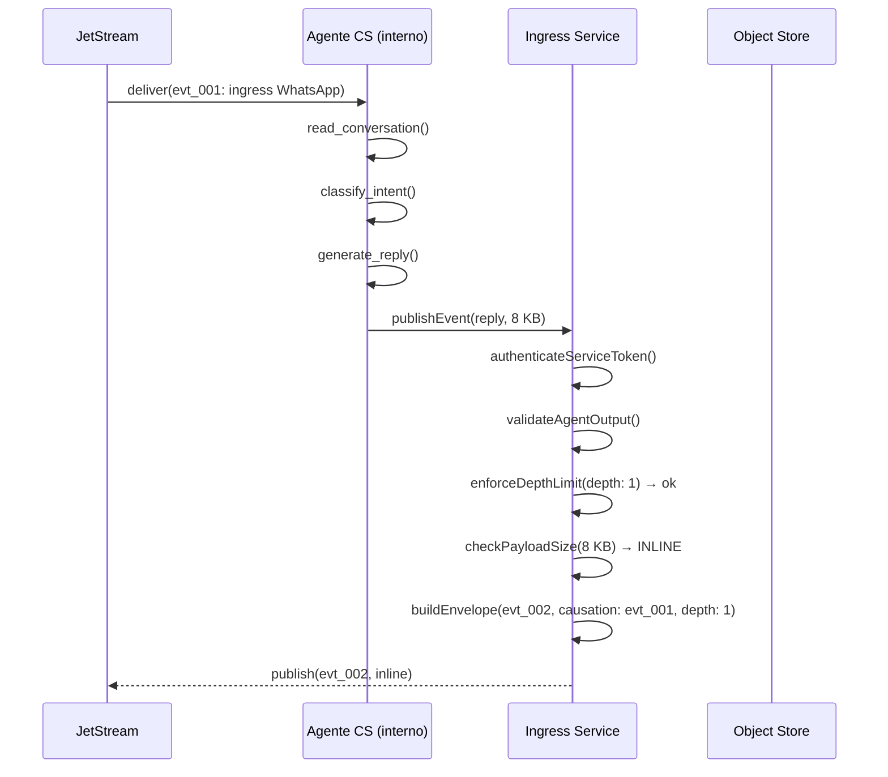
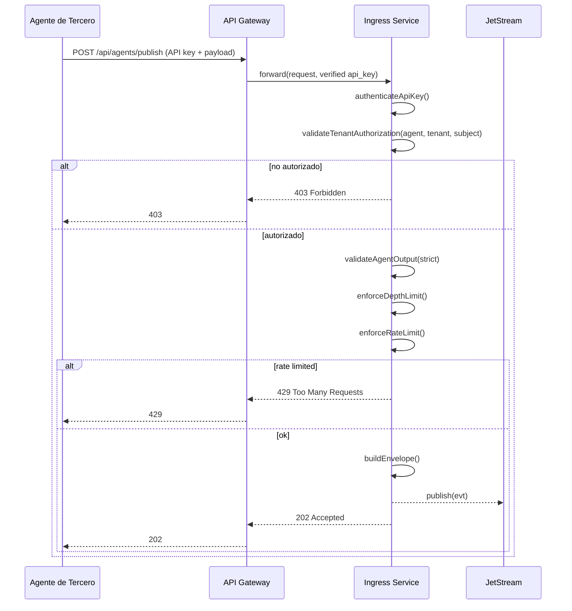
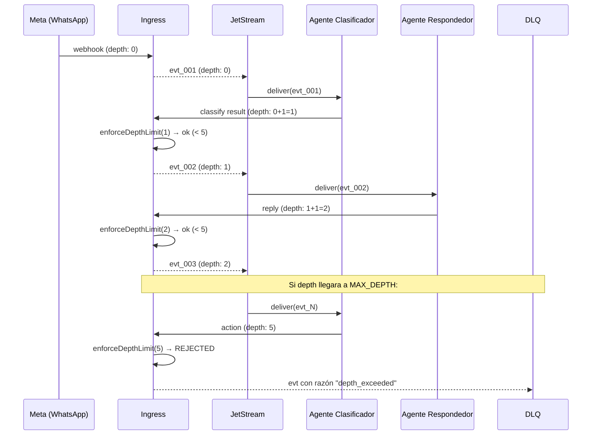

# 03 — Ingress de Agentes AI

**Estado:** Borrador para revisión
**Audiencia:** Dev
**Fecha:** 2026-03-21

---

## 1. Resumen

Un agente AI es un producer legítimo del bus. Este documento define las tres categorías de agentes, sus perfiles de confianza, los pipelines de ingress por categoría, el mecanismo anti-loop, la relación con MCP y A2A, y el roadmap de adopción.

Esto no es parte de milestone 1, pero el diseño del envelope y subject debe contemplarlo desde ahora para evitar refactors.

---

## 2. Categorías de agentes

### 2.1 Agente interno (trust: alto)

Agentes que nosotros desarrollamos y operamos. Corren en nuestra infra, sobre modelos que nosotros invocamos. Control end-to-end.

**Ejemplos:** bot de atención al cliente en WhatsApp, clasificador de intents, agente de escalación automática, monitor de conversaciones que genera alertas.

**Provider en el subject:** `internal`

```
evt.acme.coexistance.messaging.whatsapp.internal.agent_outbound.v1
```

### 2.2 Agente de tercero (trust: bajo)

Agentes desarrollados por un partner, cliente, o integrador externo. Corren fuera de nuestra infra. No controlamos su código ni confiamos en su comportamiento. Es el equivalente AI de una app de tercero en un marketplace.

**Ejemplos:** partner que construye un agente de ventas para su tenant, integrador que conecta su propio modelo de NLP.

**Provider en el subject:** `thirdparty`

```
evt.acme.coexistance.messaging.whatsapp.thirdparty.agent_outbound.v1
```

**Restricciones:**

- No acceden al stream completo del tenant — solo consumer dedicado
- Solo pueden publicar a subjects autorizados por el tenant
- Max payload: 1 MB (vs 4 MB para internos)
- Rate limits más agresivos (50 msgs/seg default)
- API key con rotación obligatoria cada 90 días
- Revocación inmediata disponible

### 2.3 Agente de plataforma (trust: medio)

Servicios AI de providers conocidos (OpenAI, Anthropic, Google, etc.). No los operamos pero son proveedores con SLAs y formatos documentados.

**Dos modalidades:**

- **Push:** el proveedor envía un callback/webhook con el resultado
- **Pull:** nosotros consultamos la API del proveedor y publicamos el resultado

**Provider en el subject:** nombre del proveedor

```
evt.acme.coexistance.messaging.whatsapp.openai.agent_outbound.v1
evt.acme.coexistance.messaging.whatsapp.anthropic.agent_action.v1
```

---

## 3. Transport por categoría

### 3.1 Agente interno

```json
{
  "transport": {
    "method": "agent",
    "protocol": "internal",
    "agent_id": "cs-agent-v2",
    "agent_model": "claude-sonnet-4-6",
    "agent_session": "session_abc123",
    "agent_capabilities": ["reply", "classify", "escalate"],
    "confidence": 0.92,
    "tool_chain": ["read_conversation", "classify_intent", "generate_reply"],
    "depth": 1
  }
}
```

### 3.2 Agente de tercero

```json
{
  "transport": {
    "method": "agent",
    "protocol": "thirdparty",
    "agent_id": "partner-acme-sales-bot",
    "agent_vendor": "partner-xyz",
    "api_key_id": "key_abc123",
    "origin_ip": "203.0.113.42",
    "agent_capabilities": ["reply"],
    "depth": 1
  }
}
```

> Un agente de tercero no declara `agent_model` ni `confidence` — no confiamos en que reporte esos valores correctamente. Si los envía, se guardan pero no se usan para decisiones internas.

### 3.3 Agente de plataforma (push)

```json
{
  "transport": {
    "method": "agent",
    "protocol": "platform",
    "agent_id": "openai-assistant-xyz",
    "platform_provider": "openai",
    "platform_model": "gpt-4o",
    "platform_request_id": "req_abc123",
    "confidence": 0.88,
    "depth": 1
  }
}
```

### 3.4 Agente de plataforma (pull)

```json
{
  "transport": {
    "method": "poll",
    "protocol": "platform",
    "agent_id": "anthropic-classifier",
    "platform_provider": "anthropic",
    "platform_model": "claude-sonnet-4-6",
    "platform_request_id": "msg_abc123",
    "poll_source": "https://api.anthropic.com/v1/messages",
    "confidence": 0.95,
    "depth": 1
  }
}
```

---

## 4. Pipelines de ingress

### 4.1 Agente interno

```
authenticateServiceToken
  |> validateAgentOutput
  |> enforceDepthLimit
  |> checkPayloadSize
  |> storeIfClaimCheck
  |> buildEnvelope
  |> publish
```

### 4.2 Agente de tercero

```
authenticateApiKey
  |> validateTenantAuthorization
  |> validateAgentOutput (strict: max 1 MB)
  |> enforceDepthLimit
  |> enforceRateLimit
  |> checkPayloadSize
  |> storeIfClaimCheck
  |> buildEnvelope
  |> publish
```

El paso `validateTenantAuthorization` verifica que el tenant haya autorizado a este agente para publicar al subject solicitado. Sin esa autorización, el evento se rechaza con 403.

### 4.3 Agente de plataforma (push)

```
verifyPlatformSignature
  |> validatePlatformPayload
  |> enforceDepthLimit
  |> checkPayloadSize
  |> storeIfClaimCheck
  |> buildEnvelope
  |> publish
```

Similar a un webhook externo: el proveedor firma el callback, nosotros verificamos.

### 4.4 Agente de plataforma (pull)

```
callPlatformApi
  |> validatePlatformResponse
  |> enforceDepthLimit
  |> checkPayloadSize
  |> storeIfClaimCheck
  |> buildEnvelope
  |> publish
```

No hay autenticación entrante porque somos nosotros quienes iniciamos el request.

### 4.5 Diagrama de secuencia — agente interno



### 4.6 Diagrama de secuencia — agente de tercero



### 4.7 Funciones compartidas y específicas

**Compartidas (reutilizables entre categorías):**

```
// depth.ts
enforceDepthLimit(causationEvent, maxDepth) -> Result<ok, err>

// envelope.ts
buildAgentEnvelope(output, agentIdentity, context) -> Result<Envelope, err>

// payload-size.ts
checkPayloadSize(rawBody, threshold) -> { inline: boolean, bytes: number }
```

**Específicas por categoría:**

```
// internal/auth.ts
authenticateServiceToken(token, tenant) -> Result<AgentIdentity, err>

// thirdparty/auth.ts
authenticateApiKey(apiKey, tenant) -> Result<AgentIdentity, err>

// thirdparty/authorize.ts
validateTenantAuthorization(agentId, tenant, subject) -> Result<ok, err>

// platform/verify.ts
verifyPlatformSignature(request, platformProvider) -> Result<ok, err>
```

---

## 5. Mecanismo anti-loop

### 5.1 Problema

Cuando un agente consume un evento y publica otro, existe el riesgo de loops infinitos: agente A publica → agente B consume y publica → agente A consume y publica → loop.

### 5.2 Solución: campo `depth`

El campo `depth` vive en `transport` y cuenta la profundidad causal:

- Todo evento raíz (webhook externo, acción manual) tiene `depth: 0`
- Cuando un agente consume un evento con `depth: N` y genera uno nuevo, el nuevo tiene `depth: N + 1`
- Si `depth >= MAX_DEPTH`, el evento se rechaza y va a DLQ con razón `depth_exceeded`

### 5.3 MAX_DEPTH por categoría

| Categoría | MAX_DEPTH default | Justificación |
|-----------|-------------------|---------------|
| Interno | 5 | Cadenas razonables: ingress → clasificar → decidir → responder → confirmar |
| Tercero | 2 | Superficie mínima. Un tercero no debería encadenar más de 2 pasos |
| Plataforma | 3 | Permite request → respuesta → acción derivada |

`MAX_DEPTH` es configurable por tenant y por agente.

### 5.4 Diagrama



---

## 6. Relación con MCP y A2A

### 6.1 MCP (Model Context Protocol)

MCP es request-response: un agente llama a un tool y espera respuesta. No es un mecanismo de eventos. Sin embargo, un MCP server puede exponer el bus como tool:

```
┌────────────┐    tool: publish_event    ┌──────────────┐    publish    ┌───────────┐
│   Agente   │ ────────────────────────→ │  MCP Server  │ ───────────→ │ JetStream │
│            │ ←──────────────────────── │              │ ←─────────── │           │
└────────────┘    Result<ok, err>        └──────────────┘    ack       └───────────┘
```

Relevancia por categoría:

- **Agente interno:** usa MCP tools directamente contra nuestro server
- **Agente de tercero:** usa MCP tools expuestos via API gateway con auth scoped
- **Agente de plataforma:** si el proveedor soporta MCP (como Anthropic), puede usar nuestros tools directamente

### 6.2 A2A (Agent-to-Agent Protocol)

Protocolo de Google para comunicación entre agentes. Define descubrimiento (Agent Cards), delegación de tareas, y coordinación. Relevante cuando múltiples agentes de distintas categorías necesitan coordinarse.

```
┌────────────────┐  A2A: delegate  ┌─────────────────┐
│ Agente Interno │ ──────────────→ │ Agente Plataforma│
│ (clasificador) │ ←────────────── │ (OpenAI)         │
└───────┬────────┘  A2A: result    └────────┬─────────┘
        │                                    │
        │  publish                           │  publish
        ↓                                    ↓
┌───────────────────────────────────────────────────┐
│                  NATS JetStream                    │
└───────────────────────────────────────────────────┘
```

### 6.3 Roadmap de adopción

| Milestone | Alcance |
|-----------|---------|
| M1 | Solo providers externos (WhatsApp, etc.). Sin agentes |
| M2 | Agentes internos publican al bus via MCP server |
| M3 | Agentes de plataforma via integraciones directas (API calls + publish) |
| M4 | Agentes de terceros via API gateway + marketplace de integraciones |
| M5 | Evaluar A2A como protocolo de coordinación multi-agente |

---

## 7. Matriz comparativa

| Aspecto | Provider externo | Agente interno | Agente tercero | Agente plataforma |
|---------|------------------|----------------|----------------|-------------------|
| Trust | Alto (firma verificada) | Alto (nuestra infra) | Bajo (código ajeno) | Medio (SaaS conocido) |
| Autenticación | HMAC webhook | Token de servicio | API key + tenant auth | OAuth2 / firma callback |
| Nuestra infra | No | Sí | No | No |
| Acceso al stream | N/A | Lectura completa | Solo consumer dedicado | Solo lo definido por integración |
| Max payload | 1 MB | 1 MB | 1 MB (claim check a 128 KB) | 1 MB |
| Rate limit | 100 msgs/seg | 200 msgs/seg | 50 msgs/seg | 100 msgs/seg |
| MAX_DEPTH | 0 (raíz) | 5 | 2 | 3 |
| Bidireccional | No | Sí | Sí (limitado) | Sí |
| Riesgo de loop | Ninguno | Alto | Medio | Medio |
| Revocación | Rotar webhook secret | Rotar token | Inmediata por tenant | Rotar OAuth2 |

---

## 8. Ejemplos de eventos

### 8.1 Agente interno — respuesta a ingress

```json
{
  "specversion": "1.0",
  "id": "01JQYYYY",
  "source": "/services/coexistance/agents/cs-agent-v2",
  "type": "io.yoizen.messaging.agent.outbound.v1",
  "resource": "tenant/acme/account/69bea8cd/channel/whatsapp/agent/cs-agent-v2",
  "time": "2026-03-21T15:40:12.100Z",
  "traceid": "4bf92f3577b34da6a3ce929d0e0e4736",
  "causation_id": "01JQXXXX",
  "correlation_id": "conv_acme_wa_5551234_20260321",
  "tenant": "acme",
  "producer": "coexistance",
  "domain": "messaging",
  "channel": "whatsapp",
  "provider": "internal",
  "accountid": "69bea8cd868e860918359cc7",
  "idempotencykey": "sha256:...",
  "transport": {
    "method": "agent",
    "protocol": "internal",
    "agent_id": "cs-agent-v2",
    "agent_model": "claude-sonnet-4-6",
    "agent_session": "session_abc123",
    "agent_capabilities": ["reply", "classify", "escalate"],
    "confidence": 0.92,
    "tool_chain": ["read_conversation", "classify_intent", "generate_reply"],
    "depth": 1
  },
  "data": {
    "received_at": "2026-03-21T15:40:12.100Z",
    "payload_inline": true,
    "payload_ref": null,
    "payload_bytes": 1200,
    "payload_checksum": "sha256:...",
    "payload": {
      "action": "reply",
      "message": { "text": "Hola, en qué puedo ayudarte hoy?", "language": "es" },
      "intent_detected": "greeting"
    }
  }
}
```

### 8.2 Agente de tercero — clasificación

```json
{
  "specversion": "1.0",
  "id": "01JQZZZZ",
  "source": "/services/coexistance/gateway/thirdparty/partner-xyz",
  "type": "io.yoizen.messaging.agent.action.v1",
  "resource": "tenant/acme/account/69bea8cd/channel/whatsapp/agent/partner-acme-sales-bot",
  "time": "2026-03-21T15:41:00.000Z",
  "traceid": "4bf92f3577b34da6a3ce929d0e0e4736",
  "causation_id": "01JQXXXX",
  "correlation_id": "conv_acme_wa_5551234_20260321",
  "tenant": "acme",
  "producer": "coexistance",
  "domain": "messaging",
  "channel": "whatsapp",
  "provider": "thirdparty",
  "accountid": "69bea8cd868e860918359cc7",
  "idempotencykey": "sha256:...",
  "transport": {
    "method": "agent",
    "protocol": "thirdparty",
    "agent_id": "partner-acme-sales-bot",
    "agent_vendor": "partner-xyz",
    "api_key_id": "key_abc123",
    "origin_ip": "203.0.113.42",
    "agent_capabilities": ["classify"],
    "depth": 1
  },
  "data": {
    "received_at": "2026-03-21T15:41:00.000Z",
    "payload_inline": true,
    "payload_ref": null,
    "payload_bytes": 450,
    "payload_checksum": "sha256:...",
    "payload": {
      "action": "classify",
      "classification": {
        "intent": "purchase_inquiry",
        "product_category": "electronics",
        "urgency": "medium"
      }
    }
  }
}
```
