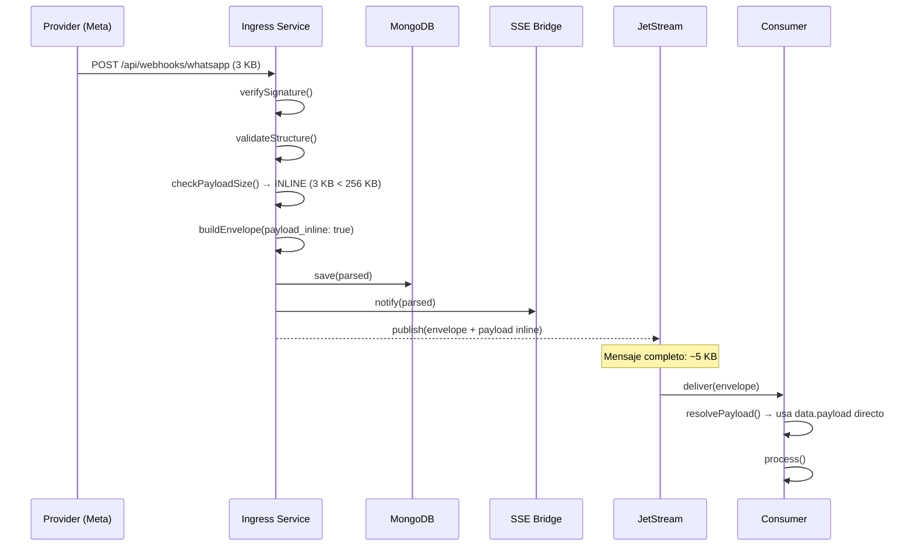
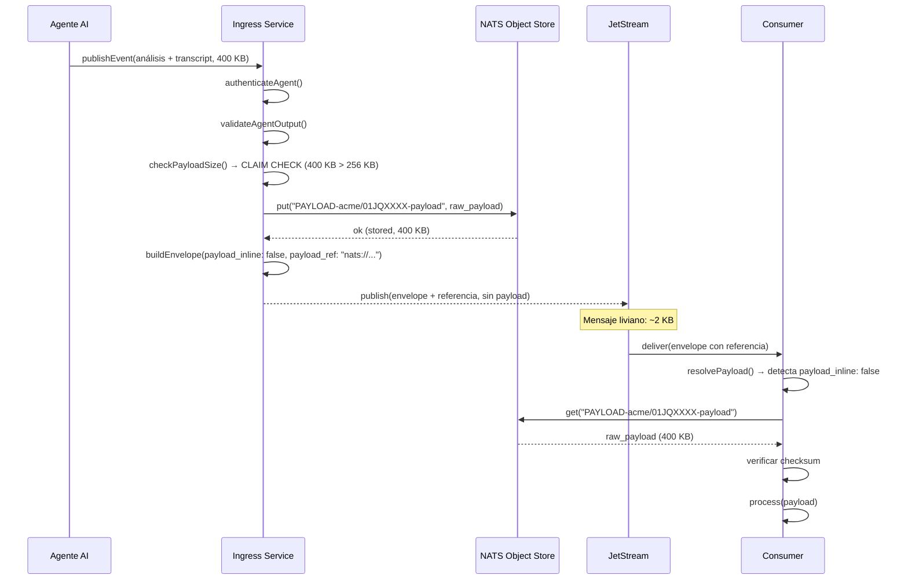
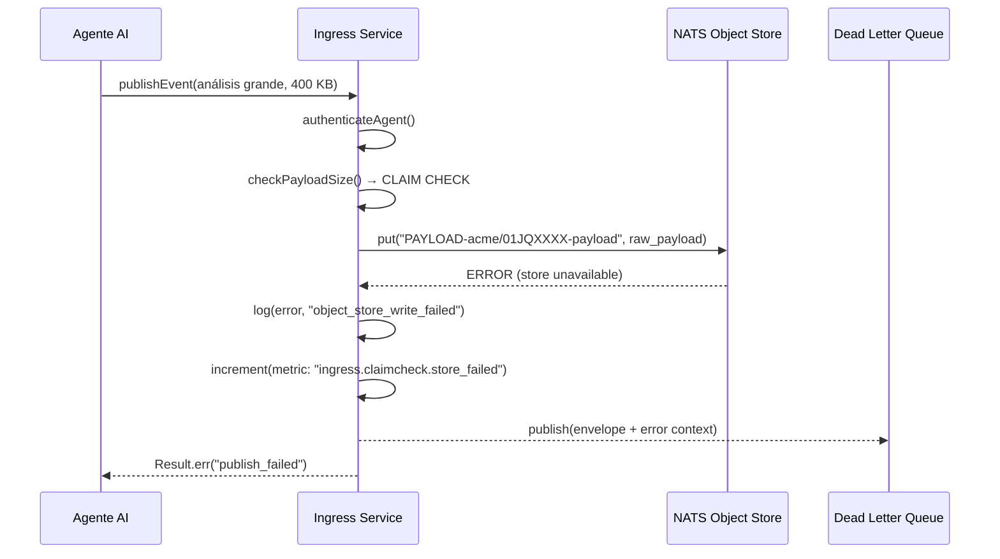
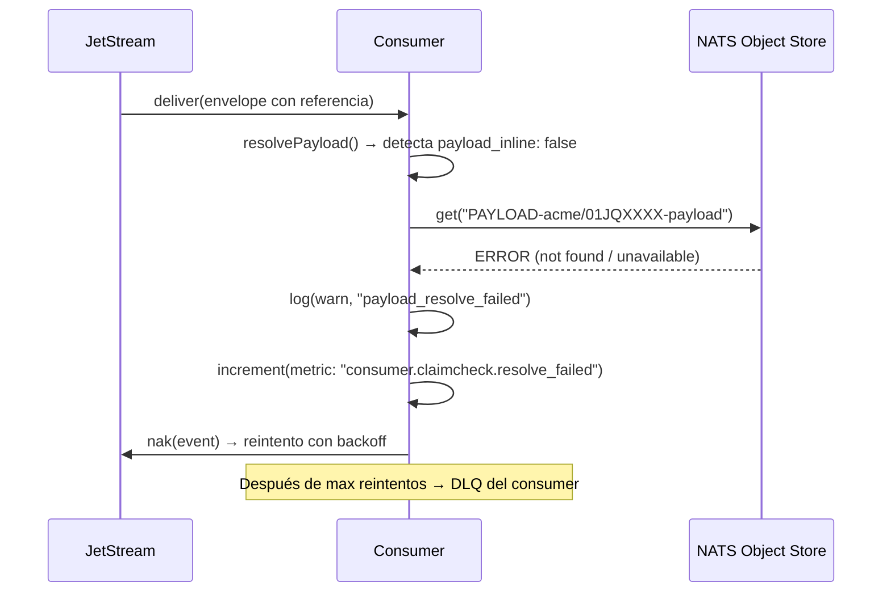
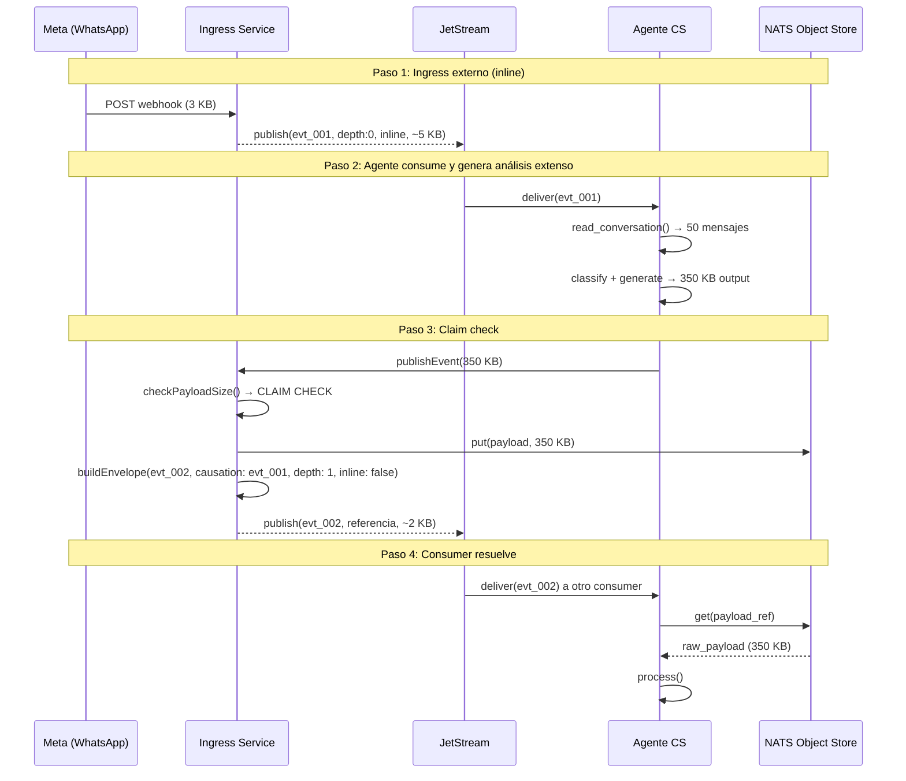
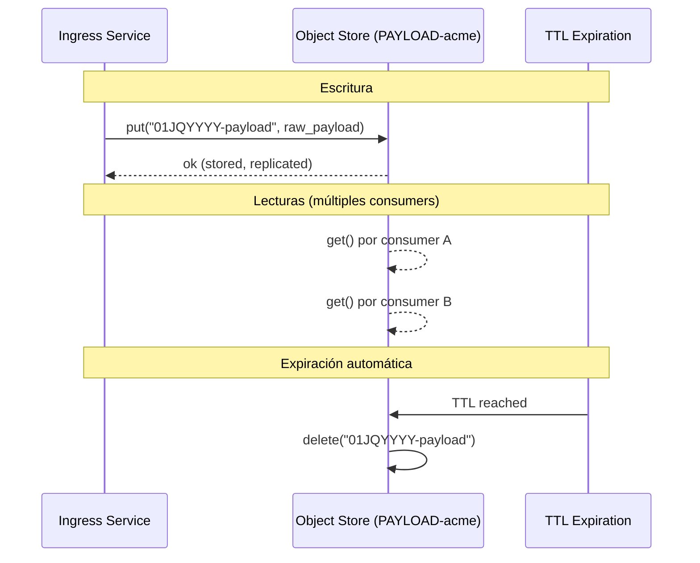

# 04 — Claim Check: Payloads Grandes

**Estado:** Borrador para revisión
**Audiencia:** Dev + Infra
**Fecha:** 2026-03-21

---

## 1. Resumen

NATS está diseñado para mensajes pequeños (sweet spot sub-100 KB, max 1 MB default). Para payloads que superen un umbral, usamos el patrón Claim Check: almacenar el payload en NATS Object Store y enviar solo una referencia por el bus.

---

## 2. Patrón Claim Check

### 2.1 Concepto

Analogía del guardarropa: dejás el abrigo, recibís un ticket, y entrás al salón solo con el ticket. Quien necesite el abrigo presenta el ticket y lo retira.

### 2.2 Arquitectura

```
┌──────────────┐     ┌──────────────────┐     ┌──────────────┐
│   Producer    │     │   NATS JetStream  │     │   Consumer    │
│  (ingress)    │     │   (bus liviano)   │     │  (downstream) │
└──────┬───────┘     └────────┬─────────┘     └──────┬───────┘
       │                      │                       │
       │  ┌──────────────────────────────────┐       │
       └──┤   NATS Object Store              ├───────┘
          │   (payloads grandes)             │
          └──────────────────────────────────┘
```

---

## 3. Diagramas de secuencia

### 3.1 Flujo inline (payload chico, bajo el umbral)

Caso más común. El payload viaja completo dentro del mensaje.



### 3.2 Flujo claim check (payload grande, sobre el umbral)



### 3.3 Fallo en escritura al Object Store



### 3.4 Fallo en lectura por el consumer



### 3.5 Cadena causal completa



---

## 4. NATS Object Store

### 4.1 Qué es

Feature nativa de JetStream que almacena blobs grandes fragmentándolos en chunks. Tiene versionado, TTL, y watchers. Es parte de NATS — zero infra adicional.

### 4.2 Configuración — un bucket por tenant

```
Bucket name:    PAYLOAD-{tenant}
Storage:        file
Max chunk size: 128 KB (default de NATS)
TTL:            alineado al max_age del stream del tenant
Replicas:       alineado al num_replicas del stream del tenant
Max bucket size: 5 GB (configurable por tier)
```

### 4.3 Convención de keys

```
{event_id}-payload
```

Ejemplo: `01JQYYYY-payload`

Key derivada del `id` del evento — correlación trivial entre evento y payload.

### 4.4 Ciclo de vida



No hay garbage collection manual. Los objetos expiran por TTL.

### 4.5 Alternativas evaluadas

| Store | Ventaja | Desventaja | Veredicto |
|-------|---------|------------|-----------|
| **NATS Object Store** | Zero infra, retención unificada, acceso nativo | Query solo por key, no es maduro como S3 | **Elegido** |
| **MongoDB (GridFS)** | Ya en el stack, equipo lo conoce | Retención desacoplada, hay que sincronizar TTLs | Candidato si hay query complejos |
| **S3 / MinIO** | Durabilidad enterprise, lifecycle policies | Infra adicional, latencia | Candidato para escala grande |
| **Redis** | Rápido para lecturas | In-memory, caro para blobs, durabilidad limitada | Descartado |

### 4.6 Migración futura

El contrato `payload_ref` soporta distintos esquemas de URI:

- `nats://objstore/PAYLOAD-acme/01JQYYYY-payload` → NATS Object Store
- `s3://bucket-name/tenant/01JQYYYY-payload` → S3/MinIO
- `mongodb://collection/01JQYYYY` → MongoDB

Migrar de store es cambiar el producer y la implementación de `resolvePayload()`, sin tocar el envelope.

---

## 5. Umbral

### 5.1 Valor recomendado: 256 KB

- `max_payload` del servidor: 1 MB (sin tocar)
- Umbral de claim check: 256 KB
- Margen: 256 KB payload + ~2 KB envelope = ~258 KB, lejos del límite
- 99%+ de los mensajes pasan inline sin overhead

### 5.2 Configurabilidad

| Nivel | Config | Default |
|-------|--------|---------|
| Global | `CLAIM_CHECK_THRESHOLD_BYTES` | 262144 (256 KB) |
| Por tenant | `tenant.{id}.claim_check_threshold` | hereda global |
| Por categoría de agente | `agent.{category}.claim_check_threshold` | hereda tenant |

---

## 6. Función `resolvePayload`

### 6.1 Contrato

```
resolvePayload(data: EventData) -> Result<RawPayload, err>
```

### 6.2 Lógica

```
resolvePayload(data):
  if data.payload_inline:
    return ok(data.payload)

  if not data.payload_ref:
    return err("payload_ref missing for non-inline event")

  raw = fetchFromStore(data.payload_ref)
  if raw is err:
    return err("failed to resolve payload", raw.error)

  checksum = sha256(raw)
  if checksum != data.payload_checksum:
    return err("checksum mismatch", expected, got)

  return ok(raw)
```

---

## 7. Consideraciones de implementación

### 7.1 Orden de operaciones

Siempre guardar en Object Store ANTES de publicar al bus:

```
CORRECTO:  store(payload) → publish(referencia)
INCORRECTO: publish(referencia) → store(payload)
```

Si se publica primero y el store falla, queda una referencia rota en el bus.

### 7.2 Atomicidad

La operación es de dos pasos (store + publish). Si el publish falla después de guardar, queda un objeto huérfano. Esto es aceptable: el TTL limpia los huérfanos automáticamente. La alternativa (transacción distribuida) agrega complejidad desproporcionada.

### 7.3 Idempotencia del store

Si el mismo evento se reintenta, el `put` con la misma key sobrescribe el valor anterior. Idempotente por diseño.

### 7.4 Consumers que no necesitan el payload

Algunos consumers solo necesitan la metadata del envelope (e.g., servicio de métricas). Pueden ignorar `payload_ref` y usar solo `payload_bytes` para estadísticas de tamaño. No todos los consumers necesitan resolver la referencia.
