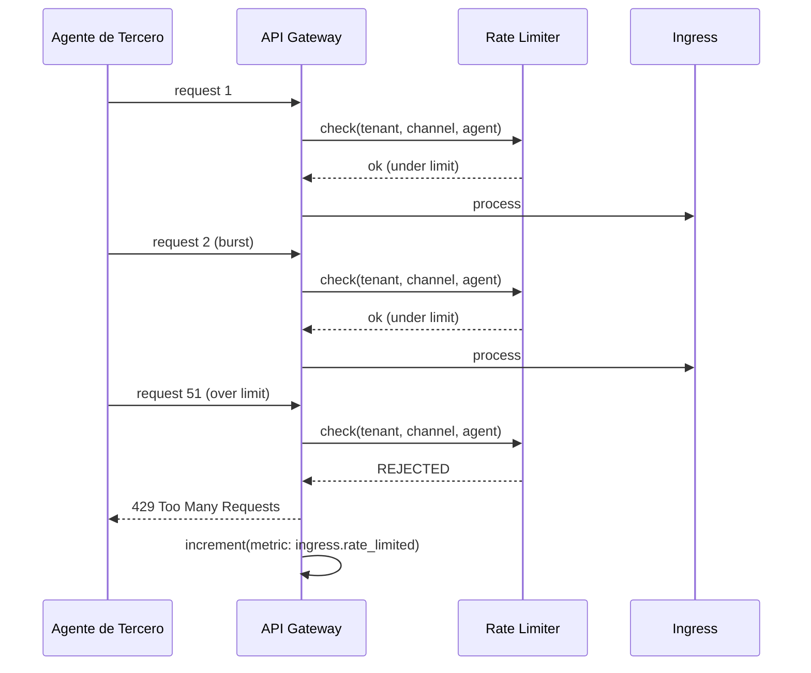
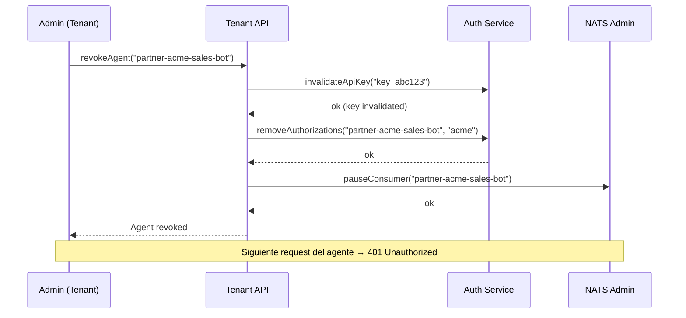

# 05 — Seguridad

**Estado:** Borrador para revisión
**Audiencia:** Infra + Seguridad
**Fecha:** 2026-03-21

---

## 1. Resumen

Este documento define las capas de seguridad del bus: aislamiento por tenant via NATS accounts y ACLs, verificación de firma por provider, autenticación por tipo de agente, política de PII, rate limiting, y mecanismos de revocación.

---

## 2. Modelo de confianza

El bus tiene cuatro tipos de productores, cada uno con un nivel de confianza distinto:

```
┌──────────────────────────────────────────────────────────────────┐
│                     Niveles de confianza                         │
│                                                                  │
│  ┌─────────────────┐  Verificamos firma del provider.            │
│  │ Provider externo │  No controlamos qué manda pero validamos   │
│  │ (trust: alto)    │  autenticidad e integridad.                │
│  └─────────────────┘                                             │
│                                                                  │
│  ┌─────────────────┐  Nuestro código, nuestra infra.             │
│  │ Agente interno   │  Control total sobre comportamiento.        │
│  │ (trust: alto)    │                                             │
│  └─────────────────┘                                             │
│                                                                  │
│  ┌─────────────────┐  SaaS conocido con SLAs y formatos          │
│  │ Agente plataforma│  documentados. No operamos pero             │
│  │ (trust: medio)   │  conocemos el proveedor.                    │
│  └─────────────────┘                                             │
│                                                                  │
│  ┌─────────────────┐  Código ajeno, infra ajena. Máximas         │
│  │ Agente tercero   │  restricciones. Tratamos como               │
│  │ (trust: bajo)    │  potencialmente hostil.                     │
│  └─────────────────┘                                             │
└──────────────────────────────────────────────────────────────────┘
```

---

## 3. Aislamiento por tenant

### 3.1 NATS accounts y ACLs

Cada tenant opera dentro de un scope que restringe:

- **Publish:** solo el servicio de ingress puede publicar en `evt.{tenant}.>`
- **Subscribe:** solo servicios autorizados para ese tenant pueden subscribirse
- **Cross-tenant:** ningún account puede ver tráfico de otro tenant

### 3.2 Diagrama de aislamiento

```
┌──────────────────────────────────────────┐
│          NATS Account: acme              │
│                                          │
│  Publish:    ingress-service ✓           │
│              agente-cs-v2    ✓ (scoped)  │
│              partner-xyz     ✓ (scoped)  │
│              otro-tenant     ✗           │
│                                          │
│  Subscribe:  processor-acme  ✓           │
│              analytics-acme  ✓           │
│              partner-xyz     ✓ (limitado)│
│              globex-service  ✗           │
│                                          │
│  Stream:     INGRESS-acme    (aislado)   │
│  Bucket:     PAYLOAD-acme    (aislado)   │
└──────────────────────────────────────────┘
```

---

## 4. Verificación por tipo de productor

### 4.1 Providers externos — firma de webhook

La verificación de firma DEBE ocurrir ANTES de publicar al bus. Un payload no verificado nunca entra al bus.

| Provider | Mecanismo | Header |
|----------|-----------|--------|
| Meta (WhatsApp, Instagram) | HMAC-SHA256 | `x-hub-signature-256` |
| TikTok | HMAC-SHA256 | `x-tiktok-signature` |
| X/Twitter | HMAC-SHA1 / CRC token | `x-twitter-webhooks-signature` |
| Telegram | IP allowlist + secret token | `x-telegram-bot-api-secret-token` |

```
verifySignature(request, secret) -> Result<ok, err>
```

Si falla → log + rechazo con 401. No se publica nada.

### 4.2 Agentes internos — token de servicio

Cada agente se autentica con un token de servicio scoped al tenant. El token define:

- Qué subjects puede publicar
- Qué kinds de eventos puede generar (e.g., `agent_outbound` sí, `ingress` no)

```
authenticateServiceToken(token, tenant) -> Result<AgentIdentity, err>
```

### 4.3 Agentes de terceros — API key + autorización de tenant

Dos capas de verificación:

1. **API key:** autentica al agente de tercero (quién es)
2. **Autorización de tenant:** verifica que el tenant le haya dado permiso para publicar al subject solicitado (qué puede hacer)

```
authenticateApiKey(apiKey, tenant) -> Result<AgentIdentity, err>
validateTenantAuthorization(agentId, tenant, subject) -> Result<ok, err>
```

Restricciones adicionales:

- Rotación obligatoria de API key cada 90 días
- Max payload: 1 MB (claim check a 128 KB)
- No acceden al stream completo — solo consumer dedicado
- Revocación inmediata disponible (< 1 min)

### 4.4 Agentes de plataforma — OAuth2 / firma de callback

**Modalidad push:** el proveedor firma el callback. Verificamos la firma como haríamos con un webhook externo, pero usando el mecanismo del proveedor de plataforma.

```
verifyPlatformSignature(request, platformProvider) -> Result<ok, err>
```

**Modalidad pull:** nosotros iniciamos el request. No hay autenticación entrante. La validación es sobre la respuesta del proveedor.

---

## 5. Validación de payload

Antes de publicar, el módulo de ingress valida que el body raw tiene la estructura esperada. Es un chequeo estructural liviano, no validación full de schema.

```
validateStructure(rawBody) -> Result<ok, err>
```

Verifica:

- Keys top-level esperadas presentes
- Body es JSON válido (o el formato esperado del provider)
- Tamaño dentro de `max_msg_size`

Si falla → log + envío a DLQ (`dlq.{tenant}.ingress.invalid.v1`). No se publica al stream principal.

Para agentes de terceros, la validación es más estricta:

- Max payload: 1 MB
- Campos requeridos verificados
- `agent_capabilities` declaradas deben coincidir con las autorizadas

---

## 6. Política de PII

### 6.1 Milestone 1: raw completo + protección perimetral

El raw payload viaja completo (teléfonos, nombres, contenido de mensajes). La protección es perimetral:

- ACLs previenen acceso no autorizado al stream
- No hay acceso cross-tenant
- Streams encriptados at rest (JetStream file storage encryption)
- TLS en tránsito entre todos los nodos y clientes
- Object Store (claim check) hereda la misma encriptación

### 6.2 Encriptación

| Capa | Mecanismo | Estado |
|------|-----------|--------|
| Tránsito | TLS 1.3 entre nodos y clientes | Requerido en prod |
| Reposo (streams) | JetStream file encryption | Pendiente de configurar (O16) |
| Reposo (object store) | Hereda del stream | Pendiente de configurar (O16) |

### 6.3 Si cambian requerimientos de compliance

La arquitectura soporta agregar un paso de redacción entre el ingress y el publish sin cambiar el contrato del envelope. Tres opciones:

1. **Redacción selectiva:** se stripean campos específicos del raw antes de publicar (e.g., phone numbers → hashed)
2. **Doble publish:** se publica una versión completa al stream principal (ACL estricto) y una versión redactada a un stream público del tenant
3. **Redacción en Capa 2:** el raw viaja completo en Capa 1. Un consumer de Capa 2 produce eventos canónicos ya redactados

---

## 7. Rate limiting

### 7.1 Límites por tipo

| Tipo | Límite (msgs/seg) | Burst | Configurable |
|------|--------------------|-------|--------------|
| Provider externo (default) | 100 | 500 | Por tenant |
| Provider externo (enterprise) | 1000 | 5000 | Por tenant |
| Agente interno | 200 | 1000 | Por agente |
| Agente de tercero | 50 | 200 | Por contrato |
| Agente de plataforma | 100 | 500 | Por integración |

### 7.2 Enforcement

Rate limiting se aplica a nivel del servicio de ingress (antes del publish), no a nivel de NATS.

- **Webhook:** evento rechazado → respuesta 429 al provider
- **Poll/stream:** evento dropeado + métrica
- **Agente (API):** respuesta 429 al agente

### 7.3 Diagrama



---

## 8. Seguridad por categoría de agente

### 8.1 Resumen de controles

| Control | Interno | Tercero | Plataforma |
|---------|---------|---------|------------|
| Autenticación | Token de servicio | API key + secret | OAuth2 / firma |
| Autorización | Por subject scoped | Tenant debe autorizar explícitamente | Por integración |
| Validación de output | Estándar | Estricta (1 MB, campos requeridos) | Estándar + schema del proveedor |
| Acceso a datos | Stream completo del tenant | Solo consumer dedicado | Solo lo definido por integración |
| Rate limit | 200 msgs/seg | 50 msgs/seg | 100 msgs/seg |
| Rotación de credenciales | Por política interna | Obligatoria cada 90 días | Por OAuth2 expiry |
| Revocación | Rotar token | Inmediata (< 1 min) | Rotar credenciales OAuth2 |
| Anti-loop (MAX_DEPTH) | 5 | 2 | 3 |
| Audit trail | tool_chain, confidence | + origin_ip, api_key_id | + platform_provider, platform_request_id |

### 8.2 Agentes de terceros — sandbox de datos

Un agente de tercero NUNCA puede:

- Leer el stream completo del tenant
- Publicar a subjects no autorizados
- Ver eventos de otros agentes de terceros (salvo autorización explícita)
- Conocer la existencia de otros tenants

Un agente de tercero SOLO puede:

- Recibir eventos via consumer dedicado creado por el tenant
- Publicar a subjects explícitamente autorizados por el tenant
- Ver sus propios eventos publicados

### 8.3 Audit trail

Todos los eventos con `transport.method: "agent"` se loguean con metadata extendida:

**Agente interno:**
- `agent_id`, `agent_model`, `confidence`, `tool_chain`, `depth`

**Agente de tercero:**
- `agent_id`, `agent_vendor`, `api_key_id`, `origin_ip`, `depth`

**Agente de plataforma:**
- `agent_id`, `platform_provider`, `platform_model`, `platform_request_id`, `depth`

---

## 9. Revocación de acceso

### 9.1 Por tipo

| Tipo | Mecanismo | Tiempo efectivo |
|------|-----------|-----------------|
| Provider externo | Rotar webhook secret en el provider | Inmediato (webhooks nuevos fallan verificación) |
| Agente interno | Rotar token de servicio | Según cache de tokens (< 5 min) |
| Agente de tercero | Revocar API key via admin | < 1 minuto |
| Agente de plataforma | Revocar credenciales OAuth2 | Según token expiry (configurable) |

### 9.2 Agentes de terceros — revocación por tenant

El tenant puede revocar el acceso de un agente de tercero desde el panel de administración. La revocación:

1. Invalida la API key del agente
2. Elimina las autorizaciones de subjects
3. Pausa el consumer dedicado del agente
4. Todo en menos de 1 minuto


