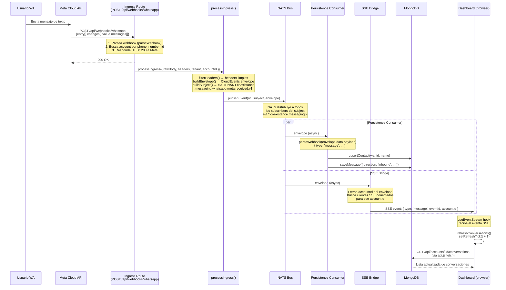

# Flujo 01 — Recibir mensaje de WhatsApp

## Resumen

Un usuario de WhatsApp envía un mensaje de texto a un número de negocio conectado a Coexistance. El mensaje viaja desde Meta Cloud API hasta el navegador del operador, pasando por el bus NATS como evento inmutable.

## Actores

| Actor | Rol |
|-------|-----|
| **Usuario WA** | Persona que envía el mensaje desde WhatsApp |
| **Meta Cloud API** | Plataforma de WhatsApp Business — entrega webhooks |
| **Ingress (routes.js)** | Endpoint HTTP que recibe el webhook |
| **Ingress (pipeline)** | `processIngress` — valida, empaqueta, publica |
| **NATS Bus** | Broker pub/sub — distribuye el evento |
| **Persistence** | Consumer — guarda mensaje y contacto en MongoDB |
| **SSE Bridge** | Consumer — retransmite al navegador via Server-Sent Events |
| **Dashboard (browser)** | React app — muestra el mensaje en tiempo real |

## Diagrama de secuencia



## Subject NATS

```
evt.{tenant}.coexistance.messaging.whatsapp.meta.received.v1
```

Ejemplo concreto:
```
evt.default.coexistance.messaging.whatsapp.meta.received.v1
```

## Estructura del envelope (CloudEvents)

```json
{
  "specversion": "1.0",
  "id": "01JQ...",
  "source": "/services/coexistance/ingress/meta/whatsapp",
  "type": "io.yoizen.messaging.ingress.received.v1",
  "time": "2026-03-22T14:30:00.000Z",
  "traceid": "uuid-v4",
  "correlationId": "wamid.xxx",
  "tenant": "default",
  "producer": "coexistance",
  "domain": "messaging",
  "channel": "whatsapp",
  "provider": "meta",
  "accountid": "mongo-object-id",
  "idempotencykey": "hash-del-payload",
  "transport": {
    "method": "POST",
    "protocol": "https",
    "headers": { "filtered": "..." }
  },
  "data": {
    "payload_inline": true,
    "payload": { "...raw webhook body..." },
    "payload_bytes": 1234,
    "payload_checksum": "sha256:..."
  }
}
```

## Notas de implementación

- El HTTP 200 a Meta se envía ANTES de publicar en NATS — Meta requiere respuesta rápida o reintenta.
- `processIngress` es puro pipeline: filter → envelope → subject → publish. Sin side effects en DB.
- La persistencia ocurre en un consumer separado, desacoplado del webhook handler.
- Si NATS está caído, el webhook igual responde 200 pero el evento se pierde (v0 — sin JetStream).
- El SSE bridge filtra por `accountId` — cada operador solo recibe eventos de sus cuentas conectadas.
- `parseWebhook` dentro de persistence entiende la estructura de Meta (`entry[].changes[].value.messages[]`).
