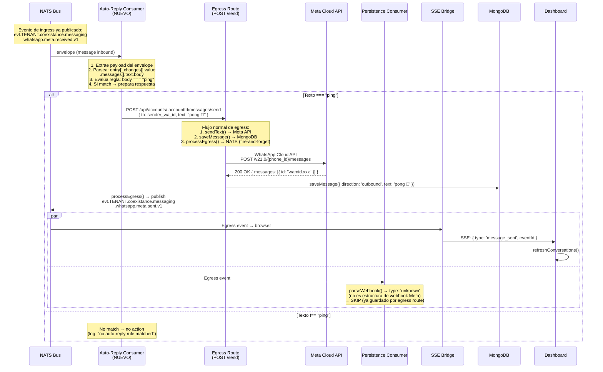

# Flujo 02 — Auto-reply "Pong" (respuesta automática)

## Resumen

Patrón de respuesta automática: cuando llega un mensaje entrante con el texto "ping", un nuevo consumer NATS lo detecta y dispara una respuesta "pong" a través del servicio de egress. Demuestra cómo agregar comportamiento reactivo sin modificar el ingress ni la persistencia.

Este flujo **no existe todavía en el código** — es el próximo paso natural para validar que el bus permite agregar consumers sin tocar los servicios existentes.

## Analogía

Pensalo como un buzón de correo con reglas automáticas. El cartero (ingress) deja la carta en el buzón. El archivador (persistence) la guarda. El notificador (SSE) te avisa. Y ahora agregás una regla: "si la carta dice PING, respondé PONG". La regla no toca al cartero ni al archivador — solo lee del buzón y genera una respuesta nueva.

## Actores

| Actor | Rol |
|-------|-----|
| **NATS Bus** | Broker — entrega el evento de ingress al auto-replier |
| **Auto-Reply Consumer** | NUEVO — escucha eventos `received`, evalúa regla, dispara egress |
| **Egress Route** | POST /api/accounts/:id/messages/send — envía por Meta API |
| **Meta Cloud API** | Entrega el "pong" al usuario de WhatsApp |
| **Persistence** | Guarda el mensaje "pong" saliente (ya existe) |
| **SSE Bridge** | Notifica al dashboard del pong enviado (ya existe) |

## Diagrama de secuencia



## Diseño del consumer

### Ubicación propuesta

```
server/src/services/auto-reply/
├── index.js              # startAutoReply({ nc, env })
├── evaluate-rules.js     # evaluateRules(envelope) → { action, params } | null
└── rules/
    └── ping-pong.js      # Una regla por archivo
```

### evaluate-rules.js (pseudo-código)

```javascript
// Evaluate auto-reply rules against an incoming envelope.
// Returns the first matching action or null.

import { pingPong } from './rules/ping-pong.js'

const RULES = [pingPong]

const evaluateRules = (envelope) => {
  const payload = envelope?.data?.payload
  if (!payload) return null

  for (const rule of RULES) {
    const result = rule(payload)
    if (result) return result
  }

  return null
}

export { evaluateRules }
```

### rules/ping-pong.js

```javascript
// Rule: if inbound text is "ping", reply "pong 🏓"

const pingPong = (payload) => {
  const messages = payload?.entry?.[0]?.changes?.[0]?.value?.messages
  if (!messages || messages.length === 0) return null

  const msg = messages[0]
  if (msg.type !== 'text') return null
  if (msg.text?.body?.toLowerCase().trim() !== 'ping') return null

  return {
    action: 'send_text',
    params: {
      to: msg.from,        // wa_id del remitente
      text: 'pong 🏓',
    },
  }
}

export { pingPong }
```

### index.js

```javascript
// Auto-reply service — subscribes to inbound events,
// evaluates rules, fires egress if matched.

import { subscribeToSubject } from '../../bus/subscribe.js'
import { evaluateRules } from './evaluate-rules.js'

const startAutoReply = ({ nc, env }) => {
  const subject = 'evt.*.coexistance.messaging.whatsapp.meta.received.v1'
  const baseUrl = `http://localhost:${env.PORT}`

  const handler = async (envelope) => {
    const match = evaluateRules(envelope)
    if (!match) return

    const accountId = envelope.accountid
    if (!accountId) {
      console.warn('  [AUTO-REPLY] No accountId in envelope, skip')
      return
    }

    console.log(`  [AUTO-REPLY] Rule matched: ${match.action} → ${match.params.to}`)

    // Fire egress via internal HTTP call (reuses auth + existing route)
    // In production, would use a service token or internal bypass
    try {
      const res = await fetch(
        `${baseUrl}/api/accounts/${accountId}/messages/send`,
        {
          method: 'POST',
          headers: { 'Content-Type': 'application/json' },
          body: JSON.stringify(match.params),
        }
      )
      if (!res.ok) {
        console.error(`  [AUTO-REPLY] Egress call failed: ${res.status}`)
      }
    } catch (e) {
      console.error(`  [AUTO-REPLY] Egress call error: ${e.message}`)
    }
  }

  subscribeToSubject(nc, subject, handler)
  console.log('  [SERVICE] Auto-reply registered — listening for inbound events')
}

export { startAutoReply }
```

## Integración en server.js

```javascript
import { startAutoReply } from './services/auto-reply/index.js'

// Dentro de startServer(), después de registerIngress:
if (nc) {
  startPersistence({ nc, db })
  sseBridge = registerSse(app, { nc, db, env })
  busMetrics = registerHealth(app, { nc, sseBridge })
  registerIngress(app, { db, env, nc, metrics: busMetrics })
  startAutoReply({ nc, env })  // ← NUEVO
}
```

## Notas de diseño

- **Zero coupling:** el auto-reply no importa nada de ingress, persistence ni SSE. Solo lee del bus.
- **Extensible:** agregar reglas es crear un archivo en `rules/` y agregarlo al array `RULES`.
- **Fire-and-forget:** la respuesta pasa por el mismo flujo de egress que un envío manual del operador.
- **Idempotente:** si el mismo evento llega dos veces (retry de NATS), el auto-reply enviaría dos pongs. Solución futura: deduplicación con JetStream o cache de correlationIds procesados.
- **Auth consideration:** el internal HTTP call al egress route necesita auth. Opciones: service token, bypass interno, o llamar directamente a sendText + processEgress sin HTTP.
