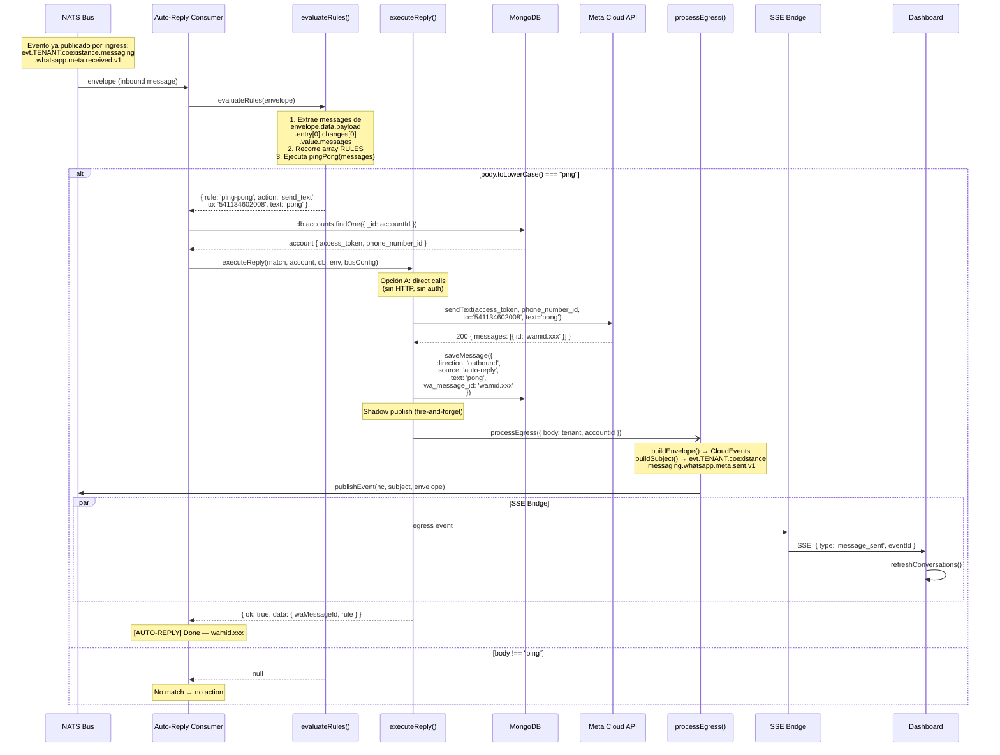

# Flujo 02 — Auto-reply "Pong" (respuesta automática)

## Resumen

Patrón de respuesta automática: cuando llega un mensaje entrante con el texto "ping", un consumer NATS lo detecta y dispara una respuesta "pong" llamando directamente a `sendText()` + `saveMessage()` + `processEgress()`, sin pasar por HTTP. Demuestra cómo agregar comportamiento reactivo sin modificar ningún servicio existente.

## Analogía

Pensalo como un buzón de correo con reglas automáticas. El cartero (ingress) deja la carta en el buzón. El archivador (persistence) la guarda. El notificador (SSE) te avisa. Y ahora agregás una regla: "si la carta dice PING, respondé PONG". La regla no toca al cartero ni al archivador — solo lee del buzón y genera una respuesta nueva.

## Actores

| Actor | Rol |
|-------|-----|
| **NATS Bus** | Broker — entrega el evento de ingress al auto-replier |
| **Auto-Reply Consumer** | Escucha eventos `received`, evalúa reglas, ejecuta respuesta |
| **evaluateRules()** | Extrae messages del envelope, recorre reglas hasta un match |
| **executeReply()** | sendText → saveMessage → processEgress (direct calls) |
| **Meta Cloud API** | Recibe el "pong" y lo entrega al usuario de WhatsApp |
| **MongoDB** | Persiste el mensaje saliente con `source: 'auto-reply'` |
| **SSE Bridge** | Notifica al dashboard del pong enviado (subscriber existente) |

## Diagrama de secuencia



## Estructura del servicio

```
server/src/services/auto-reply/
├── index.js              # startAutoReply({ nc, db, env, metrics })
├── evaluate-rules.js     # evaluateRules(envelope) → match | null
├── execute-reply.js      # executeReply(match, account, db, env, busConfig) → Result
└── rules/
    └── ping-pong.js      # pingPong(messages) → match | null
```

## Subject NATS (subscribe)

```
evt.*.coexistance.messaging.whatsapp.meta.received.v1
```

Solo escucha mensajes entrantes. Los eventos `sent` (egress) no le llegan — no hay riesgo de loop.

## Notas de diseño

- **Zero coupling:** no importa nada de ingress, persistence ni SSE. Solo lee del bus y llama funciones de meta/db.
- **Direct calls (Opción A):** bypasea HTTP y auth. No necesita JWT ni service token. Llama `sendText()` + `saveMessage()` + `processEgress()` directamente.
- **Extensible:** agregar reglas = crear archivo en `rules/` + registrarlo en el array `RULES`.
- **source: 'auto-reply':** el mensaje guardado en MongoDB se distingue de los enviados por el operador (`source: 'human'`).
- **Sin deduplicación (v0):** si NATS entrega el mismo evento dos veces, se envían dos pongs. Futuro: dedup con JetStream o cache de correlationIds.
- **Sin loop:** el auto-reply se subscribe a `received.v1`, y el pong que publica es `sent.v1`. No se escucha a sí mismo.
