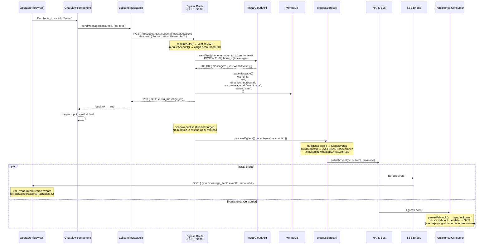

# Flujo 03 — Enviar mensaje desde el dashboard

## Resumen

El operador escribe un mensaje en el chat del dashboard y lo envía. El mensaje viaja al Meta Cloud API, se guarda en MongoDB, y se publica al bus NATS como evento egress (fire-and-forget). Los subscribers reciben la notificación del envío.

## Diagrama de secuencia



## Subject NATS

```
evt.{tenant}.coexistance.messaging.whatsapp.meta.sent.v1
```

## Notas

- El mensaje se guarda en MongoDB ANTES de publicar en NATS — así si NATS falla, el mensaje no se pierde.
- La respuesta al frontend NO espera al publish de NATS (fire-and-forget via `.then()`).
- El persistence consumer hace skip del evento egress porque el payload no tiene estructura de webhook Meta — esto es correcto, no hay doble-save.
- El SSE bridge sí propaga el evento, permitiendo que otros operadores vean el mensaje enviado en tiempo real.
