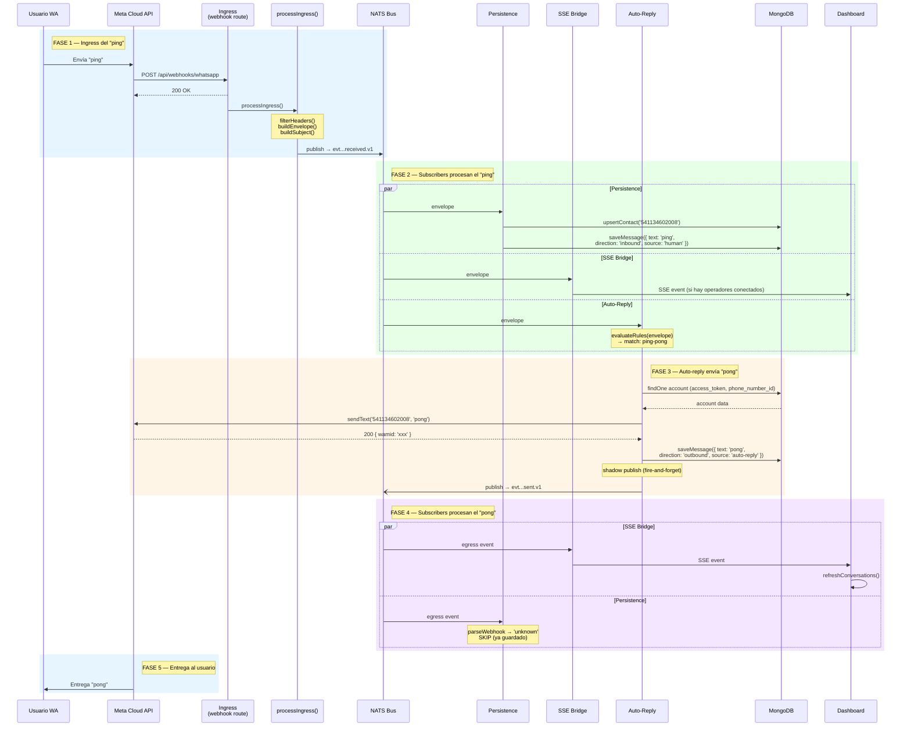

# Flujo 04 — Ciclo completo: ping → pong (end-to-end)

## Resumen

Muestra el recorrido completo de un mensaje "ping" desde que el usuario lo envía en WhatsApp hasta que recibe la respuesta "pong". Combina los flujos 01 (recibir), 02 (auto-reply) y partes del 03 (enviar). Es la prueba de integración más básica de toda la arquitectura.

## Actores

| Actor | Rol |
|-------|-----|
| **Usuario WA** | Envía "ping" desde WhatsApp |
| **Meta Cloud API** | Entrega webhook + recibe respuesta |
| **Ingress** | Recibe webhook, publica al bus |
| **NATS Bus** | Distribuye eventos a todos los subscribers |
| **Persistence** | Guarda "ping" inbound en MongoDB |
| **SSE Bridge** | Notifica al dashboard (si hay operadores conectados) |
| **Auto-Reply** | Detecta "ping", ejecuta envío de "pong" |
| **MongoDB** | Almacena ambos mensajes |
| **Dashboard** | Muestra la conversación en tiempo real |

## Diagrama de secuencia



## Timeline de eventos

```
t=0ms     Usuario envía "ping" en WhatsApp
t~200ms   Meta entrega webhook a Coexistance
t~201ms   Ingress responde 200 OK a Meta
t~203ms   processIngress: filterHeaders → buildEnvelope → buildSubject → publish
t~204ms   NATS distribuye a 3 subscribers (paralelo):
            ├── Persistence: save "ping" → MongoDB
            ├── SSE Bridge: notifica browser (si conectado)
            └── Auto-Reply: evalúa reglas → match "ping-pong"
t~210ms   Auto-Reply: carga account de MongoDB
t~220ms   Auto-Reply: sendText('pong') → Meta Cloud API
t~500ms   Meta responde 200 OK con wamid
t~502ms   Auto-Reply: saveMessage('pong') → MongoDB
t~503ms   Auto-Reply: processEgress → NATS publish (fire-and-forget)
t~504ms   NATS distribuye egress event:
            ├── SSE Bridge: notifica browser
            └── Persistence: skip (not a webhook payload)
t~1-3s    Meta entrega "pong" al usuario en WhatsApp
```

## Subjects NATS involucrados

| Fase | Subject | Kind |
|------|---------|------|
| Ingress (ping) | `evt.default.coexistance.messaging.whatsapp.meta.received.v1` | received |
| Egress (pong) | `evt.default.coexistance.messaging.whatsapp.meta.sent.v1` | sent |

## MongoDB después del ciclo

### Mensaje 1 — ping (inbound)

```json
{
  "account_id": "69bea8cd868e860918359cc7",
  "wa_message_id": "wamid.HBgN...",
  "wa_sender_id": "541134602008",
  "direction": "inbound",
  "source": "human",
  "type": "text",
  "content": { "text": "ping" },
  "status": "received"
}
```

### Mensaje 2 — pong (outbound)

```json
{
  "account_id": "69bea8cd868e860918359cc7",
  "wa_message_id": "wamid.xxx",
  "wa_sender_id": "541134602008",
  "direction": "outbound",
  "source": "auto-reply",
  "type": "text",
  "content": { "text": "pong" },
  "status": "sent"
}
```

El campo `source` distingue quién generó el mensaje: `"human"` (usuario WA o operador) vs `"auto-reply"`.

## Log esperado en el server

```
  [WEBHOOK] Matched account: conexistance (69bea8cd868e860918359cc7)
  [BUS] processIngress: start — tenant=default accountid=69bea8cd868e860918359cc7
  [BUS] Step: filterHeaders → ok
  [BUS] buildEnvelope: ok (id: 01KMBZ...)
  [BUS] Step: buildEnvelope → ok (id: 01KMBZ...)
  [BUS] Step: buildSubject → ok (evt.default.coexistance.messaging.whatsapp.meta.received.v1)
  [BUS] publishEvent: ok — subject=evt...received.v1 eventId=01KMBZ... bytes=478
  [BUS] Step: publishEvent → ok (latency: 1ms)
  [BUS] processIngress: done — eventId=01KMBZ...
  [PERSIST] envelope id=01KMBZ... parsed type=message
  [PERSIST] Matched account: conexistance (69bea8cd868e860918359cc7)
  [PERSIST] Message saved: text from 541134602008 (phone)
  [SSE] No clients for account 69bea8cd868e860918359cc7 — event dropped
  [AUTO-REPLY] Rule matched: "ping-pong" — account=69bea8cd... to=541134602008
  [AUTO-REPLY] Executing rule="ping-pong" → sendText to=541134602008 text="pong"
  [AUTO-REPLY] sendText ok — wa_message_id=wamid.xxx
  [AUTO-REPLY] Message saved to DB
  [AUTO-REPLY] NATS egress published: 01KMBZ...
  [AUTO-REPLY] Done — wa_message_id=wamid.xxx
```

## Notas

- **5 fases, 2 subjects NATS, 2 mensajes en MongoDB** — ese es el ciclo completo.
- **No hay loop:** auto-reply escucha `received.v1`, publica `sent.v1`. Nunca se escucha a sí mismo.
- **Latencia total ~1-3s:** la mayor parte la consume Meta Cloud API (sendText + delivery).
- **Sin dedup (v0):** si Meta reintenta el webhook, se enviarían dos pongs. Aceptable para v0.
- **El operador ve todo:** si el dashboard está conectado por SSE, ve el "ping" llegar y el "pong" salir en tiempo real.
