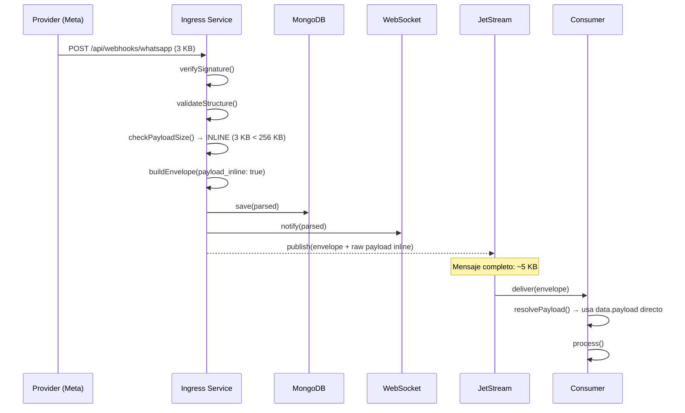
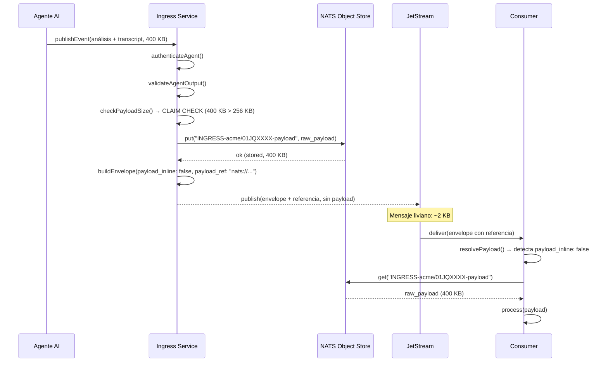
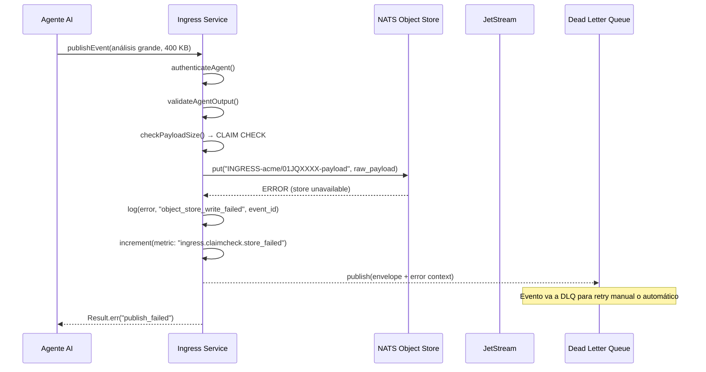
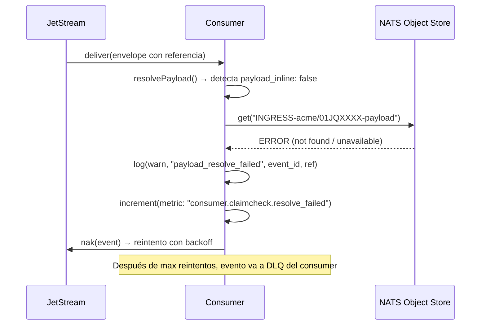
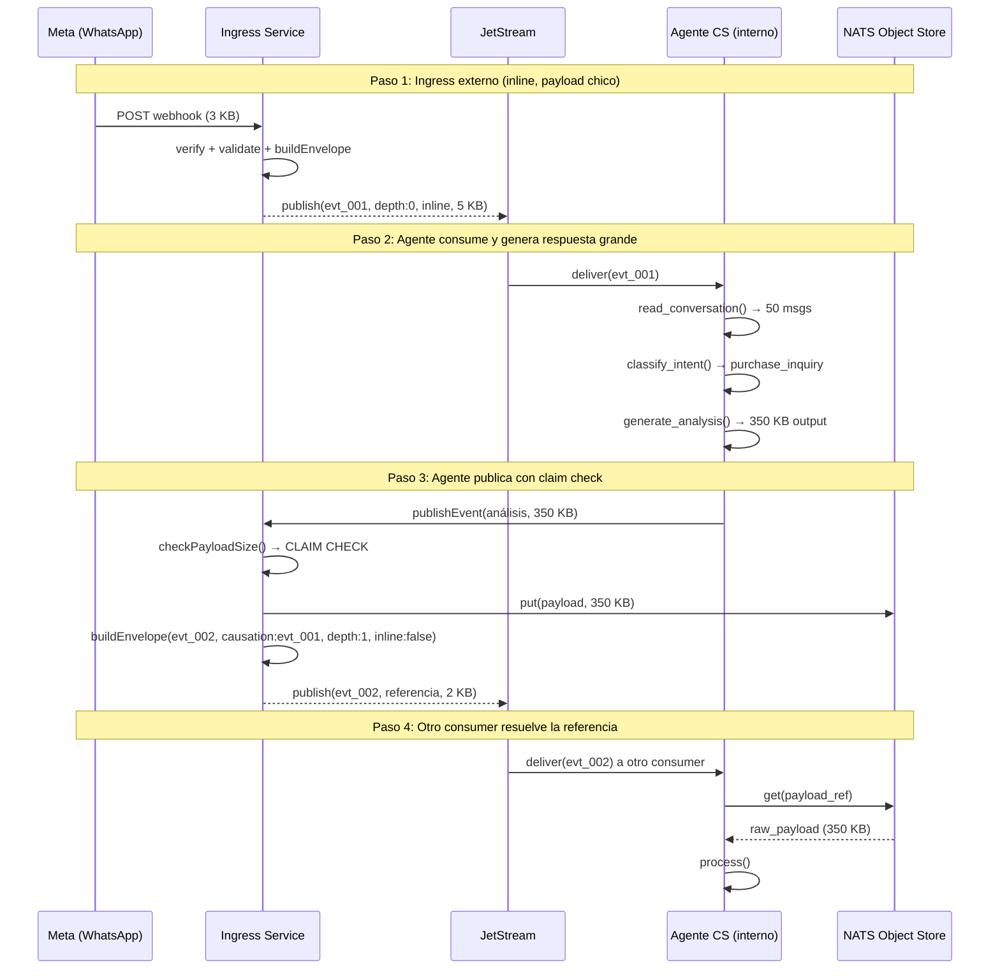
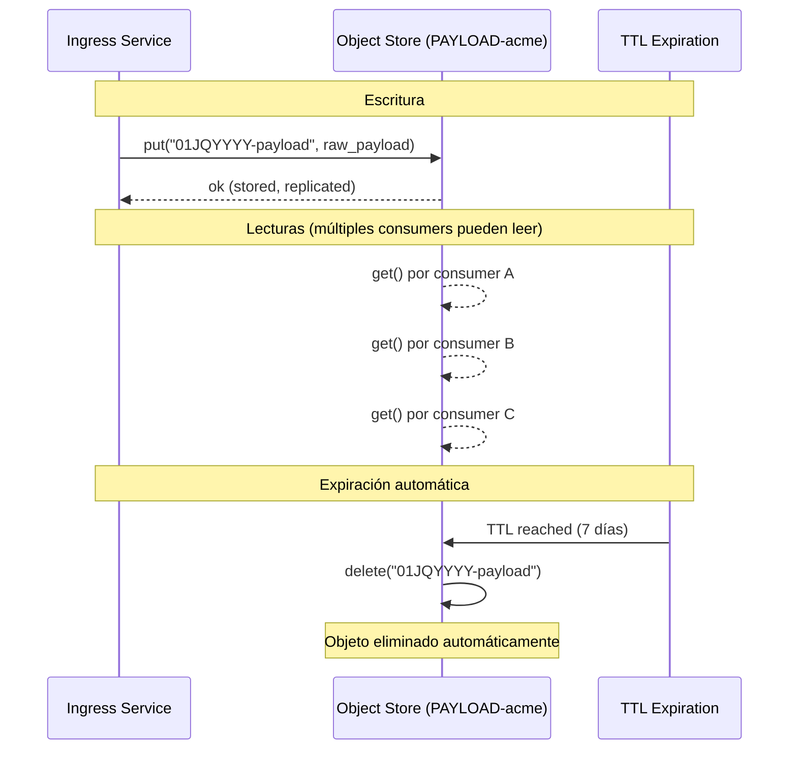

# Arquitectura: Claim Check para payloads grandes en NATS JetStream

**Estado:** Borrador para revisión
**Audiencia:** Infra + Dev
**Fecha:** 2026-03-21
**Documento relacionado:** `nats-ingress-spec-v1.md`

---

## 1. Problema

NATS está diseñado para mensajes pequeños. El `max_payload` por defecto del servidor es 1 MB y el sweet spot de rendimiento es sub-100 KB. Nuestro bus de ingress necesita transportar raw payloads de providers externos y agentes AI que pueden variar ampliamente en tamaño.

Payloads típicos estimados por fuente:

| Fuente | Caso común | Caso extremo |
|--------|------------|--------------|
| WhatsApp (texto) | 2-5 KB | 10 KB (batch multi-mensaje) |
| WhatsApp (media notification) | 5-10 KB | 15 KB |
| Instagram (comentario/DM) | 3-8 KB | 20 KB (thread largo) |
| TikTok | 2-6 KB | 15 KB |
| Agente interno (respuesta) | 5-15 KB | 50 KB (con contexto de conversación) |
| Agente interno (análisis) | 10-50 KB | 200 KB+ (transcript completo + análisis) |
| Agente de plataforma | 5-20 KB | 500 KB+ (respuesta con embeddings o metadata rica) |
| Provider futuro (desconocido) | ? | ? |

Sumando el overhead del envelope (~1-2 KB), la mayoría de los mensajes caen cómodamente debajo de 100 KB. Pero los casos extremos — especialmente de agentes con contexto extenso o providers futuros — pueden superar lo recomendado.

Subir `max_payload` a 4 MB resuelve el límite técnico pero trae consecuencias:

- Mayor consumo de memoria en el broker durante routing
- Replicación más lenta entre nodos del cluster
- Consumers lentos se ven más afectados (cada mensaje pendiente pesa más)
- No resuelve el problema de fondo: el bus no debería transportar blobs grandes

---

## 2. Solución: Patrón Claim Check

### 2.1 Concepto

El patrón Claim Check (también llamado Reference-Based Messaging) separa el payload grande del mensaje del bus. En vez de enviar el dato completo por el bus, se almacena el payload en un store externo y se envía solo una referencia (el "ticket de guardarropa") por el bus.

Analogía: en un guardarropa, dejás el abrigo, recibís un ticket, y entrás al salón solo con el ticket. Quien necesite el abrigo presenta el ticket y lo retira.

### 2.2 Componentes

```
┌──────────────┐     ┌──────────────────┐     ┌──────────────┐
│   Producer    │     │   NATS JetStream  │     │   Consumer    │
│  (ingress)    │     │   (bus liviano)   │     │  (downstream) │
└──────┬───────┘     └────────┬─────────┘     └──────┬───────┘
       │                      │                       │
       │  ┌──────────────────────────────────┐       │
       └──┤   NATS Object Store              ├───────┘
          │   (payloads grandes)             │
          └──────────────────────────────────┘
```

- **Producer:** decide si el payload viaja inline o por referencia según el umbral
- **NATS JetStream:** transporta el evento liviano con el envelope completo
- **NATS Object Store:** almacena el payload grande cuando supera el umbral
- **Consumer:** recibe el evento, resuelve la referencia si es necesario

---

## 3. Diagramas de secuencia

### 3.1 Flujo inline (payload pequeño, bajo el umbral)

El caso más común. El payload viaja completo dentro del mensaje del bus.



### 3.2 Flujo claim check (payload grande, sobre el umbral)

El payload se almacena en Object Store y viaja solo la referencia por el bus.



### 3.3 Flujo claim check con fallo en Object Store

Qué pasa si el Object Store no está disponible al momento de guardar.



### 3.4 Flujo claim check con fallo en lectura por el consumer

Qué pasa si el consumer no puede resolver la referencia.



### 3.5 Flujo completo end-to-end con cadena causal

Un webhook de WhatsApp genera un ingress, un agente interno consume y responde, el agente usa claim check porque su análisis es extenso.



---

## 4. Contrato del campo `data`

### 4.1 Campos

| Campo | Tipo | Descripción |
|-------|------|-------------|
| `received_at` | string | Timestamp ISO 8601 de recepción del evento |
| `payload_inline` | boolean | `true` si el payload viaja en `payload`. `false` si viaja por referencia |
| `payload_ref` | string \| null | URI de referencia al Object Store. `null` si `payload_inline: true` |
| `payload_bytes` | number | Tamaño en bytes del payload original (inline o no). Útil para métricas y capacity planning |
| `payload_checksum` | string | Checksum del payload original (`sha256:...`). Permite al consumer verificar integridad después de resolver la referencia |
| `payload` | object \| null | El payload raw cuando viaja inline. `null` si viaja por referencia |

### 4.2 Ejemplo inline

```json
{
  "data": {
    "received_at": "2026-03-21T15:40:11.382Z",
    "payload_inline": true,
    "payload_ref": null,
    "payload_bytes": 3200,
    "payload_checksum": "sha256:a1b2c3...",
    "payload": {
      "object": "whatsapp_business_account",
      "entry": [{ "...": "raw meta body" }]
    }
  }
}
```

### 4.3 Ejemplo claim check

```json
{
  "data": {
    "received_at": "2026-03-21T15:40:12.100Z",
    "payload_inline": false,
    "payload_ref": "nats://objstore/INGRESS-acme/01JQYYYY-payload",
    "payload_bytes": 358400,
    "payload_checksum": "sha256:d4e5f6...",
    "payload": null
  }
}
```

---

## 5. NATS Object Store

### 5.1 Por qué NATS Object Store

NATS Object Store es una feature nativa de JetStream que almacena blobs grandes fragmentándolos en chunks. Las razones para elegirlo como store del claim check son:

- **Zero infra adicional:** ya tenés NATS corriendo. No necesitás S3, MinIO, ni otro sistema
- **Retención unificada:** el ciclo de vida del objeto está atado al stream del tenant. Cuando el stream expira, el objeto también. No hay basura huérfana
- **Replicación integrada:** los objetos se replican con la misma política que los streams (`num_replicas`)
- **Acceso nativo:** los consumers ya tienen conexión a NATS, no necesitan un cliente adicional (HTTP, S3 SDK, etc.)
- **Consistencia:** los objetos se escriben con confirmación (ack), igual que los mensajes de JetStream

### 5.2 Configuración del Object Store

Un bucket de Object Store por tenant, alineado con la estrategia de streams por tenant.

```
Bucket name:    PAYLOAD-{tenant}
Storage:        file
Max chunk size: 128 KB (default de NATS)
TTL:            igual al max_age del stream del tenant (default: 7 días)
Replicas:       igual al num_replicas del stream del tenant
Max bucket size: 5 GB (configurable por tier)
```

### 5.3 Convención de keys

```
{event_id}-payload
```

Ejemplo: `01JQYYYY-payload`

La key es derivada del `id` del evento en el envelope, lo que hace trivial la correlación entre el evento en el bus y su payload en el Object Store.

### 5.4 Ciclo de vida



Los objetos se eliminan automáticamente cuando el TTL expira. No hay garbage collection manual.

### 5.5 Alternativas evaluadas

| Store | Ventaja | Desventaja | Veredicto |
|-------|---------|------------|-----------|
| **NATS Object Store** | Zero infra adicional, retención unificada, acceso nativo | No es un object store maduro, query solo por key | **Elegido para M1** |
| **MongoDB (GridFS)** | Ya está en el stack, equipo lo conoce | Retención desacoplada (hay que sincronizar TTLs), agrega dependencia al bus | Candidato si hay requerimientos de query complejos |
| **S3 / MinIO** | Durabilidad enterprise, lifecycle policies maduras, acceso HTTP | Infra adicional, latencia de red, complejidad operacional | Candidato para escala grande o compliance |
| **Redis** | Rápido para lecturas | In-memory (caro para blobs), durabilidad limitada | Descartado |

La decisión de store es reversible. El contrato `payload_ref` soporta distintos esquemas de URI:

- `nats://objstore/PAYLOAD-acme/01JQYYYY-payload` → NATS Object Store
- `s3://bucket-name/tenant/01JQYYYY-payload` → S3/MinIO
- `mongodb://collection/01JQYYYY` → MongoDB

La función `resolvePayload()` del consumer resuelve la URI según el esquema. Migrar de store es cambiar el producer y la implementación de `resolvePayload`, sin tocar el envelope.

---

## 6. Umbral de decisión

### 6.1 Valor recomendado

**256 KB** como umbral para activar claim check.

Justificación:

- El `max_payload` del servidor NATS queda en **1 MB** (default, sin tocar)
- 256 KB deja margen amplio: 256 KB de payload + ~2 KB de envelope = ~258 KB, muy lejos del límite de 1 MB
- El 99%+ de los mensajes de providers externos caen debajo de 50 KB — pasan inline sin overhead
- Solo los casos excepcionales (agentes con contexto extenso, providers con batching agresivo) activan el claim check

### 6.2 Configurabilidad

El umbral es configurable a tres niveles:

| Nivel | Config | Default | Ejemplo de override |
|-------|--------|---------|---------------------|
| Global | `CLAIM_CHECK_THRESHOLD_BYTES` | 262144 (256 KB) | Subir si el cluster tiene más capacidad |
| Por tenant | `tenant.{id}.claim_check_threshold` | hereda global | Tenant enterprise con payloads más grandes |
| Por categoría de agente | `agent.{category}.claim_check_threshold` | hereda tenant | Agentes de plataforma que retornan respuestas extensas |

### 6.3 `max_payload` del servidor

Con claim check implementado, **no es necesario subir el `max_payload` del servidor NATS por encima de 1 MB**. Los payloads grandes nunca viajan por el bus. Esto simplifica la configuración del cluster y evita los problemas de rendimiento asociados a mensajes grandes.

---

## 7. Función `resolvePayload`

### 7.1 Contrato

```
// resolve-payload.ts
resolvePayload(data: EventData) -> Result<RawPayload, err>
```

Esta función es la única interfaz que el consumer necesita para obtener el payload, sin importar si viaja inline o por referencia.

### 7.2 Pseudocódigo

```
resolvePayload(data):
  if data.payload_inline:
    return ok(data.payload)

  if not data.payload_ref:
    return err("payload_ref missing for non-inline event")

  raw = fetchFromStore(data.payload_ref)
  if raw is err:
    return err("failed to resolve payload", raw.error)

  checksum = sha256(raw)
  if checksum != data.payload_checksum:
    return err("payload checksum mismatch", expected: data.payload_checksum, got: checksum)

  return ok(raw)
```

### 7.3 Verificación de integridad

El campo `payload_checksum` permite al consumer verificar que el payload recuperado del Object Store es idéntico al original. Esto protege contra:

- Corrupción silenciosa en storage
- Lectura de un objeto incorrecto por key collision (improbable pero posible)
- Manipulación del objeto en el store

Si el checksum no coincide, el consumer debe loguear el error y enviar el evento a su DLQ.

---

## 8. Pipeline de ingress actualizado

### 8.1 Con claim check integrado

El pipeline de la sección 8 del spec principal se extiende con un paso de decisión de tamaño.

**Provider externo:**
```
verifySignature
  |> validateStructure
  |> checkPayloadSize
  |> storeIfClaimCheck   (condicional)
  |> buildEnvelope
  |> publish
```

**Agente interno:**
```
authenticateAgent
  |> validateAgentOutput
  |> enforceDepthLimit
  |> checkPayloadSize
  |> storeIfClaimCheck   (condicional)
  |> buildEnvelope
  |> publish
```

**Agente de tercero:**
```
authenticateApiKey
  |> validateTenantAuthorization
  |> validateAgentOutput (strict)
  |> enforceDepthLimit
  |> enforceRateLimit
  |> checkPayloadSize
  |> storeIfClaimCheck   (condicional)
  |> buildEnvelope
  |> publish
```

### 8.2 Funciones nuevas

```
// check-payload-size.ts
checkPayloadSize(rawBody, threshold) -> { inline: boolean, bytes: number }

// store-claim-check.ts
storeIfClaimCheck(rawBody, eventId, tenant, sizeCheck)
  -> Result<{ ref: string | null, checksum: string }, err>
```

---

## 9. Observabilidad adicional

### 9.1 Métricas nuevas

| Métrica | Tags | Tipo | Descripción |
|---------|------|------|-------------|
| `ingress.claimcheck.stored` | tenant, channel, provider | counter | Payloads guardados en Object Store |
| `ingress.claimcheck.inline` | tenant, channel, provider | counter | Payloads que viajaron inline |
| `ingress.claimcheck.store_failed` | tenant, channel, provider | counter | Fallos al escribir en Object Store |
| `ingress.claimcheck.store_latency_ms` | tenant | histogram | Latencia de escritura al Object Store |
| `consumer.claimcheck.resolved` | tenant, consumer_id | counter | Payloads resueltos exitosamente por referencia |
| `consumer.claimcheck.resolve_failed` | tenant, consumer_id | counter | Fallos al resolver referencia |
| `consumer.claimcheck.resolve_latency_ms` | tenant, consumer_id | histogram | Latencia de lectura desde Object Store |
| `consumer.claimcheck.checksum_mismatch` | tenant, consumer_id | counter | Checksums que no coinciden |
| `objstore.bucket.bytes` | tenant | gauge | Uso de storage por bucket de tenant |
| `objstore.bucket.objects` | tenant | gauge | Cantidad de objetos por bucket |

### 9.2 Alertas nuevas

| Condición | Severidad | Acción |
|-----------|-----------|--------|
| `claimcheck.store_failed` > 0 sostenido | critical | Object Store no disponible. Revisar estado del cluster NATS |
| `claimcheck.resolve_failed` rate > 5% por 5 min | warning | Posible expiración prematura o problema de conectividad |
| `claimcheck.checksum_mismatch` > 0 | critical | Posible corrupción de datos. Investigar inmediatamente |
| `objstore.bucket.bytes` > 80% de max bucket size | warning | Revisar retención o aumentar limits del bucket |

---

## 10. Consideraciones de implementación

### 10.1 Atomicidad

El patrón claim check introduce una operación de dos pasos: guardar en Object Store + publicar en JetStream. Si el publish al bus falla después de guardar en Object Store, queda un objeto huérfano. Esto es aceptable porque:

- El TTL del Object Store limpia automáticamente los huérfanos
- El costo de un objeto huérfano es solo storage temporal
- La alternativa (transacción distribuida) agrega complejidad desproporcionada

### 10.2 Orden de operaciones

Siempre guardar en Object Store **antes** de publicar al bus. Si se publica primero y el store falla, hay un evento en el bus con una referencia rota que todos los consumers van a intentar resolver y fallar.

```
CORRECTO:  store(payload) → publish(referencia)
INCORRECTO: publish(referencia) → store(payload)
```

### 10.3 Idempotencia del store

Si el mismo evento se reintenta (por fallo parcial), el `put` al Object Store con la misma key sobrescribe el valor anterior. Esto es idempotente por diseño — el resultado es el mismo independientemente de cuántas veces se ejecute.

### 10.4 Consumer sin acceso al Object Store

Puede haber consumers que no necesiten el payload completo — por ejemplo, un servicio de métricas que solo necesita el envelope (tenant, channel, timestamp, payload_bytes). Estos consumers pueden ignorar `payload_ref` y trabajar solo con la metadata del envelope. El campo `payload_bytes` les da información de tamaño sin necesidad de resolver la referencia.

---

## 11. Decisiones cerradas (este documento)

| # | Decisión | Justificación |
|---|----------|---------------|
| CC1 | Patrón Claim Check para payloads grandes | El bus no debe transportar blobs. Mantiene rendimiento del cluster |
| CC2 | NATS Object Store como store inicial | Zero infra adicional, retención unificada con JetStream |
| CC3 | Umbral de 256 KB para activar claim check | Margen amplio bajo el max_payload de 1 MB. Cubre 99%+ de casos inline |
| CC4 | `max_payload` del servidor se mantiene en 1 MB (default) | Con claim check no es necesario subirlo |
| CC5 | Un bucket de Object Store por tenant | Aislamiento de storage alineado con streams por tenant |
| CC6 | Checksum SHA256 para verificación de integridad | Protege contra corrupción y manipulación en el store |
| CC7 | Store antes de publish (orden de operaciones) | Evita referencias rotas en el bus |

---

## 12. Puntos abiertos

| # | Tema | Owner | Estado |
|---|------|-------|--------|
| CC-O1 | Definir max bucket size por tier (default propuesto: 5 GB) | Infra | Pendiente |
| CC-O2 | Definir política de cleanup para objetos huérfanos (¿solo TTL o también GC activo?) | Infra | Pendiente |
| CC-O3 | Definir si el umbral de 256 KB aplica antes o después de agregar el envelope | Dev | Pendiente |
| CC-O4 | Evaluar compresión del payload antes del store (gzip/zstd) para reducir storage | Dev | Pendiente |
| CC-O5 | Definir retry policy para fallos de escritura al Object Store | Dev | Pendiente |
| CC-O6 | Definir si los agentes de terceros tienen un umbral más bajo (propuesta: 128 KB) | Dev + Seguridad | Pendiente |
| CC-O7 | Evaluar migración a S3/MinIO si el volumen supera la capacidad del Object Store | Infra | Futuro |

---

## 13. Glosario

| Término | Definición |
|---------|------------|
| **Claim Check** | Patrón de mensajería donde el payload grande se almacena fuera del bus y viaja solo una referencia |
| **Object Store** | Feature nativa de NATS JetStream para almacenar blobs grandes fragmentados en chunks |
| **Bucket** | Contenedor lógico de objetos en NATS Object Store (análogo a un bucket de S3) |
| **Inline** | Modo donde el payload viaja completo dentro del mensaje del bus |
| **Payload ref** | URI de referencia al payload almacenado en el Object Store |
| **Umbral (threshold)** | Tamaño en bytes a partir del cual se activa el claim check |
| **Checksum** | Hash del payload original para verificar integridad después de resolver la referencia |
| **Objeto huérfano** | Payload almacenado en Object Store cuyo evento correspondiente falló al publicarse |
