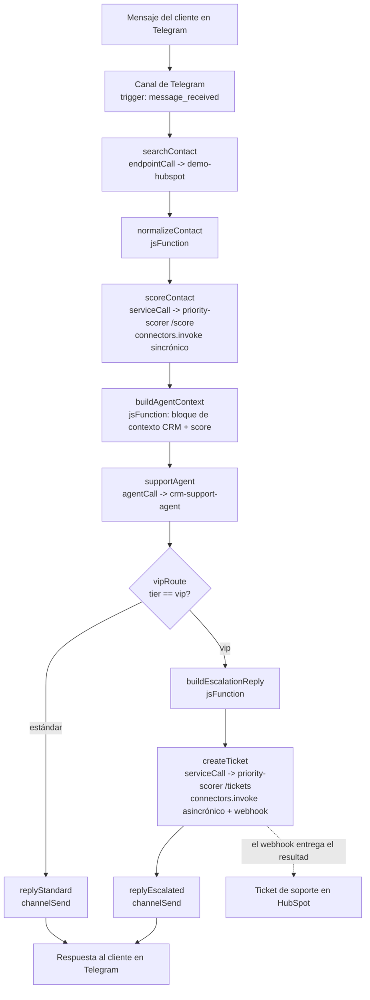

# crm-support-telegram — Documentación funcional (ES)

> Complemento en español del [README.md](./README.md). No es una traducción literal: explica qué
> hace el demo, cómo funciona por dentro y qué esperar al presentarlo.

## ¿Qué hace este demo?

Soporte al cliente de extremo a extremo sobre Telegram, respaldado por un CRM real en HubSpot. El
cliente escribe al bot de Telegram; un workflow low-code enriquece cada turno (busca o crea el
contacto en HubSpot, calcula un puntaje de prioridad mediante un servicio hosteado, invoca al
agente de IA y deriva a los clientes VIP por un camino de escalación); un agente de IA lidera la
conversación, personalizada con el contexto de CRM y prioridad ya enriquecido; los clientes VIP
reciben un aviso de escalación Y un ticket de soporte real en HubSpot, creado de forma asincrónica.

El demo cierra con **dos pantallas**: la **traza de ejecución** del admin-console (muestra todo el
workflow — trigger, búsqueda en HubSpot, puntaje de prioridad, turno del agente, rama condicional,
respuesta — como una cadena causal única que una persona puede inspeccionar) y el **ticket real de
HubSpot** creado por la rama VIP, abierto en una segunda pestaña. Nada en ese ticket es simulado —
es la misma llamada asincrónica `connectors.invoke()` que disparó el workflow, resuelta por
HubSpot.

Dos capacidades del SDK/la plataforma tienen su propio momento en el demo:

- **Código sobre low-code**: el servicio hosteado `priority-scorer` es lógica de negocio más
  simple de expresar en un lenguaje real que en el constructor de workflows (heurísticas sobre
  cantidad de deals, umbrales de tier) — desplegado como un servicio Knative común e invocado
  desde el workflow como cualquier otro recurso, sin tratamiento especial.
- **Los dos modos de `connectors.invoke()` en un mismo flujo**: una llamada **sincrónica en
  paralelo** para el camino rápido (el puntaje de prioridad está disponible antes de la respuesta
  del agente) y una **invocación asincrónica con `idempotencyKey` + callback por webhook** para el
  camino lento (creación del ticket en HubSpot) — ver "Invocación asincrónica: idempotencyKey y la
  ventana de polling" más abajo.
- **Provisioning declarativo**: todo el demo — canal, connectors, base de conocimiento, skill,
  variables de sistema, agente de IA, servicio hosteado y workflow — es UN `manifest.yaml`,
  aplicado con UN comando, idempotente (un segundo apply es un no-op completo) — ver "Provisioning
  declarativo" más abajo.

## Arquitectura



Cada nodo del diagrama, salvo los dos pasos `jsFunction`, es un recurso real de la plataforma
declarado en el manifest: el canal de Telegram, el connector `demo-hubspot` (+ sus 5 endpoints),
el agente de IA `crm-support-agent`, el servicio hosteado `priority-scorer` y el workflow
`crm-support-telegram` que los conecta.

## Provisioning declarativo

Todo el demo es **un único archivo YAML, un único apply**: `manifest.yaml` declara cada recurso de
la plataforma — canal, connector de HubSpot, connector LLM, base de conocimiento, skill, variables
de sistema, agente de IA, servicio hosteado `priority-scorer` y el workflow — y `yoizen manifests
apply -f manifest.yaml --secrets-from-env` converge el clúster real hacia ese estado. Volver a
aplicarlo siempre es seguro: un segundo apply sobre un clúster ya convergido es un **no-op**
completo (0 creates, 0 updates) — la misma prueba con la que se entregó este loop de provisioning
(`manual-loops/crm-support-telegram.md` T02–T05).

**Ningún secreto en texto plano en el spec.** Las cinco credenciales que necesita este demo (el
token del bot de Telegram, la Service Key de HubSpot, la API key de OpenAI y el login propio de la
plataforma para el servicio `priority-scorer`) se referencian por NOMBRE (`secretRef`) en
`manifest.yaml`, nunca por valor — los valores reales se entregan una sola vez, fuera de banda, vía
`--secrets-from-env`. Para los dos secretos con scope de servicio (`YOIZEN_EMAIL`/
`YOIZEN_PASSWORD`, vinculados al servicio `priority-scorer`), la historia va más allá de "no está
en el repo": resuelven de forma **nativa de Kubernetes**, vía `valueFrom.secretKeyRef` apuntando al
Secret de Kubernetes `psec-service-priority-scorer` que ya administra el broker de secretos de la
plataforma — el valor en texto plano nunca cruza hacia el manifest, los logs del motor de apply ni
el spec vivo del Knative Service (`kubectl get ksvc -o yaml` muestra una referencia al secreto,
nunca un valor). Este es el diseño nativo de Kubernetes que
`manual-loops/provisioning-manifest-gaps-4.md` entregó específicamente para cerrar esa exposición
— vale la pena mencionarlo en vivo como parte del pitch: una plataforma declarativa que trata
"sin secretos en el spec" como una garantía estructural, no como una convención que alguien debe
recordar seguir.

El resto de las referencias simbólicas del manifest sigue el mismo patrón "declarar por nombre,
resolver en tiempo de apply": `{ connectorRef: demo-hubspot }`, `{ agentRef: crm-support-agent }`,
`{ serviceRef: priority-scorer }`, incluso un ENDPOINT específico de un connector (`{ connectorRef:
demo-hubspot, endpointMethod: POST, endpointPath: /crm/v3/objects/tickets }`) — cada id que
necesitan el servicio `priority-scorer` y el workflow se resuelve por nombre, en el MISMO apply,
nunca copiado a mano de la salida de un paso de provisioning a la entrada del siguiente.

## Provisioning

**Un único camino declarativo**: `manifest.yaml` es el ÚNICO artefacto de provisioning para cada
recurso de la plataforma que necesita este demo. Los antiguos scripts secuenciales
`01-…05-*.sh`/`setup.sh` fueron ELIMINADOS — no existe otro camino de provisioning, no intentar
resucitarlos.

Orden de provisioning:

```
./bootstrap.sh                                                       # (1) ítems fuera de banda
yoizen manifests apply -f manifest.yaml --secrets-from-env            # (2) todo lo demás
./run.sh                                                              # (3) prueba de extremo a extremo
```

1. **`./bootstrap.sh`** — el ÚNICO paso de provisioning que queda fuera de `manifest.yaml`, y
   lleva exclusivamente lo que el motor de manifests genuinamente no puede expresar: construye/tagea
   la imagen Docker `dev.local/priority-scorer:local`, asegura la propiedad de contacto
   personalizada `telegram_user_id` en HubSpot (una mutación de esquema vía la Properties API, no
   un endpoint de connector), y registra el webhook de Telegram + resuelve `TELEGRAM_TEST_CHAT_ID`
   (llamadas directas a la API de Telegram Bot, no recursos de la plataforma). Idempotente —
   seguro de re-ejecutar. Su etapa de registro de webhook lee la cuenta de canal de Telegram que
   crea `manifests apply`, por lo que está escrito para funcionar tanto antes como después del
   primer apply — antes, registra el webhook contra una cuenta que todavía no existe y falla en
   forma explícita con un mensaje claro que nombra este mismo orden; después, tiene éxito de
   inmediato. Re-ejecutarlo después de `manifests apply` es el orden recomendado y siempre seguro.
2. **`yoizen manifests apply -f manifest.yaml --secrets-from-env`** — crea/actualiza cada recurso
   de la plataforma. Necesita el SDK clonado en `../../sdk` (ejecutar desde ahí, o `bunx yoizen`
   una vez publicado) y los cinco bindings de secretos de abajo presentes en el entorno.
3. **`./run.sh`** — la prueba de extremo a extremo (mensajes de Telegram simulados, polling de
   ejecución, aserciones, limpieza en HubSpot). Verifica por sí mismo que el manifest ya fue
   aplicado (falla rápido nombrando este mismo orden si el workflow o el servicio todavía no
   existen).

Volver a ejecutar `bootstrap.sh` y `manifests apply` siempre es seguro (ambos son idempotentes,
crean o actualizan) — es el camino de recuperación estándar si algún paso falla a mitad de camino.

## Variables de entorno

**Bindings para `--secrets-from-env`** (leídos por `yoizen manifests apply --secrets-from-env`; el
NOMBRE del binding debe coincidir exactamente con el nombre de la variable de entorno — ver el
bloque `secrets:` de `manifest.yaml`):

| Variable de entorno | Binding de secreto en el manifest | Scope |
| --- | --- | --- |
| `TELEGRAM_BOT_TOKEN` (como `telegram-bot-token`) | `telegram-bot-token` | `channel: crm-support-telegram-bot` |
| `HUBSPOT_SERVICE_KEY` (como `hubspot-service-key`) | `hubspot-service-key` | `connector: demo-hubspot` |
| `OPENAI_API_KEY` (como `crm-support-telegram-openai-api-key`) | `crm-support-telegram-openai-api-key` | `connector: sample-openai-llm` |
| `YOIZEN_EMAIL` (como `priority-scorer-yoizen-email`) | `priority-scorer-yoizen-email` | `service: priority-scorer` |
| `YOIZEN_PASSWORD` (como `priority-scorer-yoizen-password`) | `priority-scorer-yoizen-password` | `service: priority-scorer` |

Cada nombre de binding difiere del nombre habitual de la variable de entorno de su credencial
(por ejemplo, `TELEGRAM_BOT_TOKEN` se vincula bajo `telegram-bot-token`), por lo que
`--secrets-from-env` necesita el valor expuesto bajo el nombre del BINDING al momento de aplicar,
por ejemplo:

```
env "telegram-bot-token=$TELEGRAM_BOT_TOKEN" \
    "hubspot-service-key=$HUBSPOT_SERVICE_KEY" \
    "crm-support-telegram-openai-api-key=$OPENAI_API_KEY" \
    "priority-scorer-yoizen-email=$YOIZEN_EMAIL" \
    "priority-scorer-yoizen-password=$YOIZEN_PASSWORD" \
    bun run bin/yoizen.ts manifests apply -f ../demos/crm-support-telegram/manifest.yaml --secrets-from-env
```

(ejecutar desde `sdk/`; `YOIZEN_EMAIL`/`YOIZEN_PASSWORD` también funcionan como las credenciales de
login propias del servicio hosteado `priority-scorer` en tiempo de ejecución — los mismos valores,
dos propósitos distintos: la autenticación de sesión de la CLI, y el secreto vinculado del
servicio. Los bindings `priority-scorer-yoizen-*` resuelven de forma nativa de Kubernetes vía
`valueFrom.secretKeyRef`, nunca como variable de entorno en texto plano en el spec de Knative —
ver "Provisioning declarativo" más arriba y `manual-loops/provisioning-manifest-gaps-4.md`.)

**Variables de entorno del lado de ejecución** (no son secretos del manifest — las leen
directamente `bootstrap.sh`/`run.sh`):

| Variable | Propósito |
| --- | --- |
| `TG_PUBLIC_URL` | URL pública (por ejemplo, un túnel de cloudflared) donde es alcanzable el webhook de Telegram — la lee la etapa de registro de webhook de `bootstrap.sh` |
| `TELEGRAM_TEST_CHAT_ID` | Id de chat que usa `run.sh` para simular un mensaje de cliente. `bootstrap.sh` lo descubre automáticamente (enviar un DM al bot primero) y lo cachea si no está definido |
| `YOIZEN_TENANT`/`YOIZEN_EMAIL`/`YOIZEN_PASSWORD`/`YOIZEN_BASE_URL` | Login/sesión de la plataforma — no son específicos del demo, `lib/resolve-demo-env.sh` los completa automáticamente con la convención compartida de datos de desarrollo |

No se commitea ningún secreto — cada credencial de arriba se lee del entorno (`.env`, no
trackeado; ver `.env.example` para el formato documentado) en tiempo de ejecución, cargado por
`lib/resolve-demo-env.sh` (la misma convención que usan `bootstrap.sh` y `run.sh`).

## Invocación asincrónica: idempotencyKey y la ventana de polling

La creación del ticket VIP (`createTicket`, `priority-scorer/src/create-ticket.ts`) es una
llamada `connectors.invoke()` **asincrónica** — no bloquea el workflow esperando a HubSpot,
devuelve un `invocationId` de inmediato y entrega el resultado vía un webhook de vuelta al propio
endpoint `/webhooks/invoke` del scorer. Dos detalles importan operativamente:

- **`idempotencyKey`**: `ticket-<tenant>-<conversationId>-<turn>`, donde `turn` es
  `{{executionId}}` (un valor nuevo y único por cada ejecución del workflow — una ejecución
  equivale a un turno de conversación). Esta es una garantía de entrega AL MENOS UNA VEZ (un
  reintento del MISMO llamado invoke, del lado del caller, colapsa sobre la misma invocación en
  lugar de crear un segundo ticket), no una garantía de que volver a ejecutar TODO el demo
  se salte la creación del ticket — un nuevo turno de conversación de tier VIP siempre obtiene un
  `executionId` nuevo, por lo tanto una clave nueva, por lo tanto un ticket nuevo. Esto es
  intencional: cada turno real de un cliente debe producir su propio ticket.
- **Ventana de polling de 900 segundos (15 minutos)**: `connectors.invocations.get(invocationId)`
  solo devuelve un resultado mientras está almacenado en Redis, con un TTL de 900s por defecto. Un
  fallo en la entrega del webhook nunca bloquea la disponibilidad del resultado (sigue siendo
  posible obtenerlo por polling hasta que expire el TTL), pero pasados los 900s una invocación ya
  completada devuelve `status: "expired"` (HTTP 404) aunque el ticket se haya creado correctamente
  en HubSpot. **Hacer polling dentro de los 15 minutos posteriores a disparar la llamada
  asincrónica**, o depender de la entrega por webhook en su lugar — no asumir que un
  `invocationId` viejo puede resolverse indefinidamente después del hecho (esto es exactamente lo
  que hace la propia etapa de limpieza de tickets de `run.sh`: hace polling inmediatamente después
  de que termina la ejecución de tier VIP, bien dentro de la ventana).

## Guion para el día de la demo

**Antes de entrar a la sala**: confirmar que `bootstrap.sh` y `manifests apply` corrieron
limpiamente contra el clúster objetivo (una imagen desactualizada o un manifest sin aplicar es el
modo de falla más común — volver a ejecutar ambos, son idempotentes). Enviar un DM al bot de
Telegram una vez desde el teléfono/cuenta de la demo para que `TELEGRAM_TEST_CHAT_ID` sea
resoluble, y tener la cuenta de demo de HubSpot y el admin-console abiertos en pestañas separadas
de antemano.

**Qué mostrar, qué decir**:

1. Abrir el chat de Telegram con el bot en pantalla. Enviar una pregunta de soporte normal (por
   ejemplo, "¿dónde está mi pedido?"). Narrar: *"este mensaje llega a nuestro canal, un workflow
   low-code lo enriquece con el contexto real de CRM del cliente y un puntaje de prioridad, y
   luego un agente de IA — no un bot con guion fijo — responde usando ese contexto."* La respuesta
   llega en unos segundos.
2. Cambiar a la **traza de ejecución** del admin-console para esa ejecución (Procesos → la última
   ejecución del workflow). Recorrer la cadena de izquierda a derecha: trigger → búsqueda en
   HubSpot → puntaje de prioridad → turno del agente → respuesta. *"Cada paso acá está enlazado
   causalmente — esto no es un log, es el grafo de ejecución real, inspeccionable después del
   hecho."*
3. Enviar un SEGUNDO mensaje desde la misma cuenta de prueba, esta vez cruzando el umbral VIP (el
   contacto/deals de prueba sembrados del demo controlan esto — ver la lógica exacta de siembra en
   `VIP_DEAL_COUNT` de `src/06-run-e2e.ts`, o usar un contacto VIP ya sembrado para una sala en
   vivo). Narrar la rama condicional: *"el mismo workflow, el mismo agente — pero este cliente
   cruza un umbral de prioridad, así que el tono de la respuesta cambia a un aviso de escalación Y
   se crea un ticket de soporte real en HubSpot, de forma asincrónica, sin bloquear la
   respuesta."*
4. **El cierre de dos pantallas**: lado a lado, (a) la traza de ejecución del admin-console para
   la ejecución VIP (mostrando el paso `createTicket` y su `invocationId`) y (b) la cuenta de
   HubSpot, abierta en ese ticket exacto — mismo asunto, mismo cliente, creado en vivo, hace
   segundos. *"Nada acá está simulado — ese ticket existe ahora mismo en una cuenta real de
   HubSpot, creado por la misma llamada de la plataforma que acaban de ver ejecutarse."*
5. Cierre opcional, si la sala es técnica: abrir `manifest.yaml` y correr `yoizen manifests apply`
   una segunda vez en vivo — *"cero creates, cero updates — todo el demo que acaban de ver es un
   único archivo, y es completamente idempotente."* Ver "Provisioning declarativo" más arriba para
   la historia del manejo de secretos si preguntan cómo se gestionan las credenciales.

## Inventario de scripts

| Script | Propósito |
| --- | --- |
| `bootstrap.sh` | Wrapper delgado sobre `src/bootstrap.ts` — el paso de provisioning fuera de banda (build de imagen, propiedad personalizada de HubSpot, webhook + chat id de Telegram) — ver Provisioning más arriba |
| `run.sh` | Wrapper delgado sobre `src/06-run-e2e.ts` — envía dos mensajes de cliente simulados (tier estándar, luego tier VIP) de extremo a extremo y reporta la respuesta de Telegram resultante + el ticket de HubSpot |

`manifest.yaml` (aplicado vía la CLI `yoizen`, no un script de este directorio) provisiona todo lo
demás. `priority-scorer/` es el código + Dockerfile propios del servicio hosteado, no relacionado
con el provisioning.
