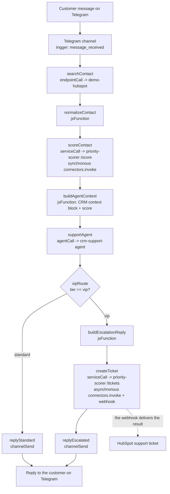

# crm-support-telegram

> Demo documentation. Explains what it does, how it works under the hood and what to expect when
> presenting it, including the step-by-step script for demo day with the real verified responses
> from the system (section "Demo-day script"). (The original English version of this document
> stayed in git history as the `README.md` prior to 2026-07-25.)

## What does this demo do?

End-to-end customer support over Telegram, backed by a real CRM in HubSpot. The customer writes to
the Telegram bot; a low-code workflow enriches every turn (looks up or creates the contact in
HubSpot, computes a priority score through a hosted service, invokes the AI agent and routes VIP
customers down an escalation path); an AI agent leads the conversation, personalized with the
already-enriched CRM and priority context; VIP customers get an escalation notice AND a real
support ticket in HubSpot, created asynchronously.

The demo closes with **two screens**: the admin-console's **execution trace** (shows the whole
workflow — trigger, HubSpot lookup, priority score, agent turn, conditional branch, reply — as a
single causal chain a person can inspect) and the **real HubSpot ticket** created by the VIP
branch, opened in a second tab. Nothing in that ticket is simulated — it is the same asynchronous
`connectors.invoke()` call the workflow fired, resolved by HubSpot.

Two SDK/platform capabilities get their own moment in the demo:

- **Code over low-code**: the `priority-scorer` hosted service is business logic that is simpler to
  express in a real language than in the workflow builder (heuristics over deal counts, tier
  thresholds) — deployed as an ordinary Knative service and invoked from the workflow like any
  other resource, with no special treatment.
- **Both modes of `connectors.invoke()` in a single flow**: a **synchronous parallel** call for the
  fast path (the priority score is available before the agent's reply) and an **asynchronous
  invocation with `idempotencyKey` + webhook callback** for the slow path (HubSpot ticket creation)
  — see "Asynchronous invocation: idempotencyKey and the polling window" below.
- **Declarative provisioning**: the whole demo — channel, connectors, knowledge base, skill, system
  variables, AI agent, hosted service and workflow — is ONE `manifest.yaml`, applied with ONE
  command, idempotent (a second apply is a complete no-op) — see "Declarative provisioning" below.

## Architecture



Every node in the diagram, except the three `jsFunction` steps (`normalizeContact`,
`buildAgentContext`, `buildEscalationReply`), is a real platform resource
declared in the manifest: the Telegram channel, the `demo-hubspot` connector (+ its 5 endpoints),
the `crm-support-agent` AI agent, the `priority-scorer` hosted service and the
`crm-support-telegram` workflow that wires them together.

## Declarative provisioning

The whole demo is **a single YAML file, a single apply**: `manifest.yaml` declares every platform
resource — channel, HubSpot connector, LLM connector, knowledge base, skill, system variables, AI
agent, `priority-scorer` hosted service and the workflow — and `yoizen manifests apply -f
manifest.yaml --secrets-from-env` converges the real cluster towards that state. Re-applying it is
always safe: a second apply against an already-converged cluster is a complete **no-op** (0
creates, 0 updates) — the same proof this provisioning loop shipped with
(`manual-loops/demos/crm-support-telegram.md` T02–T05).

**No plaintext secrets in the spec.** The five credentials this demo needs (the Telegram bot token,
the HubSpot Service Key, the OpenAI API key and the platform's own login for the `priority-scorer`
service) are referenced by NAME (`secretRef`) in `manifest.yaml`, never by value — the real values
are delivered once, out of band, via `--secrets-from-env`. For the two service-scoped secrets
(`YOIZEN_EMAIL`/`YOIZEN_PASSWORD`, bound to the `priority-scorer` service), the story goes beyond
"it is not in the repo": they resolve **Kubernetes-natively**, via `valueFrom.secretKeyRef`
pointing at the Kubernetes Secret `psec-service-priority-scorer` that the platform's secret broker
already manages — the plaintext value never crosses into the manifest, the apply engine's logs or
the live Knative Service spec (`kubectl get ksvc -o yaml` shows a reference to the secret, never a
value). This is the Kubernetes-native design that
`manual-loops/provisioning-manifest-gaps-4.md` shipped specifically to close that exposure —
worth mentioning live as part of the pitch: a declarative platform that treats
"no secrets in the spec" as a structural guarantee, not as a convention someone has to
remember to follow.

The rest of the manifest's symbolic references follow the same "declare by name, resolve at apply
time" pattern: `{ connectorRef: demo-hubspot }`, `{ agentRef: crm-support-agent }`,
`{ serviceRef: priority-scorer }`, even a specific connector ENDPOINT (`{ connectorRef:
demo-hubspot, endpointMethod: POST, endpointPath: /crm/v3/objects/tickets }`) — every id the
`priority-scorer` service and the workflow need is resolved by name, in the SAME apply,
never hand-copied from one provisioning step's output into the next one's input.

## Provisioning

**A single declarative path**: `manifest.yaml` is the ONLY provisioning artifact for every platform
resource this demo needs. The old sequential scripts
`01-…05-*.sh`/`setup.sh` were DELETED — there is no other provisioning path, do not try to
resurrect them.

Provisioning order:

```
./bootstrap.sh                                                       # (1) out-of-band items
yoizen manifests apply -f manifest.yaml --secrets-from-env            # (2) everything else
./run.sh                                                              # (3) end-to-end test
```

1. **`./bootstrap.sh`** — the ONLY provisioning step left outside `manifest.yaml`, and it carries
   exclusively what the manifest engine genuinely cannot express: it builds/tags
   the Docker image `dev.local/priority-scorer:local`, ensures the custom contact property
   `telegram_user_id` in HubSpot (a schema mutation via the Properties API, not
   a connector endpoint), and registers the Telegram webhook + resolves `TELEGRAM_TEST_CHAT_ID`
   (direct calls to the Telegram Bot API, not platform resources). Idempotent —
   safe to re-run. Its webhook-registration stage reads the Telegram channel account that
   `manifests apply` creates, so it is written to work both before and after the
   first apply — before, it registers the webhook against an account that does not exist yet and
   fails explicitly with a clear message naming this very order; after, it succeeds
   immediately. Re-running it after `manifests apply` is the recommended order and always safe.
2. **`yoizen manifests apply -f manifest.yaml --secrets-from-env`** — creates/updates every
   platform resource. It needs the SDK cloned at `../../sdk` (run from there, or `bunx yoizen`
   once published) and the five secret bindings below present in the environment.
3. **`./run.sh`** — the end-to-end test (simulated Telegram messages, execution polling,
   assertions, HubSpot cleanup). It verifies by itself that the manifest was already
   applied (fails fast naming this very order if the workflow or the service does not exist yet).

Re-running `bootstrap.sh` and `manifests apply` is always safe (both are idempotent, they
create or update) — it is the standard recovery path if some step fails halfway through.

## Environment variables

**Bindings for `--secrets-from-env`** (read by `yoizen manifests apply --secrets-from-env`; each
binding resolves from the env var named exactly like the binding or, as a fallback, its
UPPER_SNAKE form — see the `secrets:` block of `manifest.yaml`):

| Environment variable (UPPER_SNAKE fallback) | Secret binding in the manifest | Scope |
| --- | --- | --- |
| `TELEGRAM_BOT_TOKEN` | `telegram-bot-token` | `channel: crm-support-telegram-bot` |
| `HUBSPOT_SERVICE_KEY` | `hubspot-service-key` | `connector: demo-hubspot` |
| `CRM_SUPPORT_TELEGRAM_OPENAI_API_KEY` | `crm-support-telegram-openai-api-key` | `connector: sample-openai-llm` |
| `PRIORITY_SCORER_YOIZEN_EMAIL` | `priority-scorer-yoizen-email` | `service: priority-scorer` |
| `PRIORITY_SCORER_YOIZEN_PASSWORD` | `priority-scorer-yoizen-password` | `service: priority-scorer` |

`TELEGRAM_BOT_TOKEN` and `HUBSPOT_SERVICE_KEY` are the usual credential variables already, so
they resolve as-is. The other three are binding-specific names — bridge them from the usual
variables once (they can live in `.env`, see `.env.example`):

```
export CRM_SUPPORT_TELEGRAM_OPENAI_API_KEY="$OPENAI_API_KEY"
export PRIORITY_SCORER_YOIZEN_EMAIL="$YOIZEN_EMAIL"
export PRIORITY_SCORER_YOIZEN_PASSWORD="$YOIZEN_PASSWORD"
yoizen manifests apply -f manifest.yaml --secrets-from-env
```

(run from this demo's directory; `YOIZEN_EMAIL`/`YOIZEN_PASSWORD` also work as the own login credentials of the
`priority-scorer` hosted service at runtime — the same values, two different purposes: the CLI's
session authentication, and the service's bound secret. The `priority-scorer-yoizen-*` bindings
resolve Kubernetes-natively via `valueFrom.secretKeyRef`, never as a plaintext environment
variable in the Knative spec — see "Declarative provisioning" above and
`manual-loops/provisioning-manifest-gaps-4.md`.)

**Runtime-side environment variables** (they are not manifest secrets — `bootstrap.sh`/`run.sh`
read them directly):

| Variable | Purpose |
| --- | --- |
| `TG_PUBLIC_URL` | Public URL (for example, a cloudflared tunnel) where the Telegram webhook is reachable — read by the webhook-registration stage of `bootstrap.sh` |
| `TELEGRAM_TEST_CHAT_ID` | Chat id `run.sh` uses to simulate a customer message. `bootstrap.sh` discovers it automatically (send a DM to the bot first) and caches it if unset |
| `YOIZEN_TENANT`/`YOIZEN_EMAIL`/`YOIZEN_PASSWORD`/`YOIZEN_BASE_URL` | Platform login/session — not demo-specific, `lib/resolve-demo-env.sh` fills them automatically with the shared development-data convention |

No secret is committed — every credential above is read from the environment (`.env`, not
tracked; see `.env.example` for the documented format) at runtime, loaded by
`lib/resolve-demo-env.sh` (the same convention `bootstrap.sh` and `run.sh` use). That resolver
loads, in order and overriding, `integrations/ai/ai-agent-playground/.env`,
`integrations/channels/telegram-transform-reply/.env` and this demo's own `.env`; all three are
optional. The `YOIZEN_*` ones do NOT need to be put in any of them: the resolver itself applies
the development-seed defaults (`acme` / `yclawd@demo.io` / `admin123` and the gateway host
derived from `PLATFORM_ENVIRONMENT`/`DEV_DOMAIN`).

## Asynchronous invocation: idempotencyKey and the polling window

The VIP ticket creation (`createTicket`, `priority-scorer/src/create-ticket.ts`) is an
**asynchronous** `connectors.invoke()` call — it does not block the workflow waiting for HubSpot,
it returns an `invocationId` immediately and delivers the result via a webhook back to the scorer's
own `/webhooks/invoke` endpoint. Two details matter operationally:

- **`idempotencyKey`**: `ticket-<tenant>-<conversationId>-<turn>`, where `turn` is
  `{{executionId}}` (a new, unique value for every workflow execution — one execution
  equals one conversation turn). This is an AT LEAST ONCE delivery guarantee (a
  retry of the SAME invoke call, on the caller side, collapses onto the same invocation instead
  of creating a second ticket), not a guarantee that re-running the WHOLE demo
  skips the ticket creation — a new VIP-tier conversation turn always gets a
  new `executionId`, therefore a new key, therefore a new ticket. This is
  intentional: every real customer turn must produce its own ticket.
- **900-second (15-minute) polling window**: `connectors.invocations.get(invocationId)`
  only returns a result while it is stored in Redis, with a 900s TTL by default. A
  webhook delivery failure never blocks the availability of the result (it can still be
  obtained by polling until the TTL expires), but past those 900s an already-completed
  invocation returns `status: "expired"` (HTTP 404) even if the ticket was created correctly
  in HubSpot. **Poll within the 15 minutes following the firing of the asynchronous
  call**, or rely on the webhook delivery instead — do not assume an old
  `invocationId` can be resolved indefinitely after the fact (this is exactly what
  `run.sh`'s own ticket-cleanup stage does: it polls immediately after
  the VIP-tier execution finishes, well inside the window).

## Demo-day script

> Script verified live on 2026-07-25 against the dev cluster: every "expected" response
> below is the REAL response the system returned on that date (executions 15:37 and 15:40
> UTC), not a made-up example. Estimated duration: ~5 minutes. (This script lived in a separate
> `GUION-DEMO.md` until 2026-08-04; docs-truth-audit T10 absorbed it here when it deleted
> that file — ruling O1.) The customer messages are typed verbatim in Spanish, which is what
> the verified run sent, so the bot answers in Spanish; the agent replies quoted below are
> English translations of those Spanish answers, with every load-bearing value untouched.

### State the demo needs seeded

| What | Reference value (2026-07-25 seeding) |
| --- | --- |
| HubSpot contact with the presenter's `telegram_user_id` | `237594495271` ("Christian Demo VIP") |
| Associated open deals (>= 3 triggers VIP) | `63140996230`, `63142088072`, `63148403872` |
| Telegram bot | `@yzndev_bot` |
| Public tunnel (webhook) | `https://api.devmachina.net` (cloudflared, origin port 80 + gateway Host header) |

The ids change with every re-seeding; what is stable is the shape: a contact whose
`telegram_user_id` is the presenter's chat id, with 3+ associated open deals. To re-seed: create
the contact (`POST /crm/v3/objects/contacts` with the `telegram_user_id` property), create 3 deals
(`POST /crm/v3/objects/deals`, only `dealname` — the default pipeline leaves them open) and
associate them (`PUT /crm/v4/objects/deals/{dealId}/associations/default/contacts/{contactId}`).

**Critical warnings** (learned the hard way):

- **Do NOT run `run.sh` before or during a live demo**: its seeding reuses the demo's contact
  (create-or-reuse by `telegram_user_id`) and its cleanup DELETES IT along with its deals — the
  presenter ends up `tier=standard` halfway through the conversation. Re-seed afterwards.
- **Every VIP turn creates a new ticket** (the `idempotencyKey` is per execution) and repeats the
  escalation banner — keep the script short or narrate it as live re-verification.
- **Self-contained messages**: every message is a new execution with limited memory across
  turns; giving the data in instalments makes the agent ask for context again. The messages in the
  script below include all the context in a single turn.
- **60 s read cache** on the HubSpot connector (`list-deals-by-contact`): if the contact's deals
  were just touched, wait a minute before the first VIP message.

**Before walking into the room**: confirm that `bootstrap.sh` and `manifests apply` ran
cleanly against the target cluster (a stale image or an unapplied manifest is the most common
failure mode — re-run both, they are idempotent). Send a DM to the Telegram bot
once from the demo phone/account so that `TELEGRAM_TEST_CHAT_ID` is resolvable, and
have the HubSpot demo account and the admin-console open in separate tabs beforehand.

**Preparation (before the room)**:

- cloudflared up and `getWebhookInfo` pointing at the tunnel, with no `last_error_message`.
- Admin-console open on **Processes** (for the run-view) and HubSpot open on **Tickets →
  Support Pipeline**.
- `yoizen manifests plan -f manifest.yaml` as a sanity check: everything `noop` = converged cluster.

**The three acts, with the real verified responses**:

- **Act 1 — regular customer** (from ANOTHER Telegram account, not the seeded one). Send
  `Hola, tengo una consulta sobre mi pedido`. Expected: a standard polite reply, WITHOUT an
  escalation banner and WITHOUT a ticket. In the run-view: `searchContact` finds no contact →
  `scoreContact` → `tier=standard` → default branch → `replyStandard`.
- **Act 2 — VIP customer** (the seeded account; the key moment). Send in ONE single message:
  `Hola, tengo un problema con mi ultimo pedido, el 1122: las frutillas llegaron en mal estado.`
  Real verified response (2026-07-25 15:37 UTC): banner
  **"⚠️ VIP escalation — a specialist will follow up shortly."** followed by *"Hello, Christian.
  I am very sorry to hear that the strawberries arrived in bad condition… would you like us to
  arrange a refund or a replacement for the strawberries?…"*. Backstage in the run-view: `tier=vip`,
  `score=85`, `reasons=["open-deals-vip-threshold-met:3","open-deals:3","unresolved-tickets:0"]`,
  `createTicket` node fired in async mode. In HubSpot: new ticket in Support Pipeline → New,
  subject "VIP escalation via Telegram support bot", priority HIGH.
- **Act 3 — system variables live** (optional but effective). Send
  `Y cuanto tardan en darme una respuesta?`. Real verified response (2026-07-25 15:40 UTC):
  *"…our SLA is 24 hours for responses. However, given the urgent nature of your
  case…"*. The **24** comes from the `crm-support-sla-hours` system variable resolved at runtime —
  it can be changed in the admin-console and the bot quotes the new value with no code change and
  no redeploy. The per-turn ticket warning applies: this turn also produces a banner + a second
  ticket.

**Post-demo housekeeping**:

- Delete the seeded contact and its 3 deals (`DELETE /crm/v3/objects/contacts/{id}` and
  `/crm/v3/objects/deals/{id}`).
- Delete the "VIP escalation via Telegram support bot" tickets accumulated during the demo and the
  rehearsals (one per VIP turn).

**What to show, what to say** (the long narrative, same sequence as the three acts):

1. Open the Telegram chat with the bot on screen. Send a normal support question (for
   example, "where is my order?"). Narrate: *"this message reaches our channel, a low-code
   workflow enriches it with the customer's real CRM context and a priority score, and
   then an AI agent — not a scripted bot — answers using that context."* The reply
   arrives in a few seconds.
2. Switch to the admin-console's **execution trace** for that execution (Processes → the latest
   workflow execution). Walk the chain from left to right: trigger → HubSpot lookup
   → priority score → agent turn → reply. *"Every step here is causally
   linked — this is not a log, it is the real execution graph, inspectable after the
   fact."*
3. Send a SECOND message from the same test account, this time crossing the VIP threshold (the
   demo's seeded test contact/deals control this — see the exact seeding logic in
   `VIP_DEAL_COUNT` of `src/06-run-e2e.ts`, or use an already-seeded VIP contact for a live
   room). Narrate the conditional branch: *"the same workflow, the same agent — but this customer
   crosses a priority threshold, so the tone of the reply changes to an escalation notice AND
   a real support ticket is created in HubSpot, asynchronously, without blocking the
   reply."*
4. **The two-screen closing**: side by side, (a) the admin-console's execution trace for
   the VIP execution (showing the `createTicket` step and its `invocationId`) and (b) the HubSpot
   account, opened on that exact ticket — same subject, same customer, created live, seconds
   ago. *"Nothing here is simulated — that ticket exists right now in a real HubSpot
   account, created by the same platform call you just watched execute."*
5. Optional closing, if the room is technical: open `manifest.yaml` and run `yoizen manifests apply`
   a second time live — *"zero creates, zero updates — the whole demo you just saw is a
   single file, and it is completely idempotent."* See "Declarative provisioning" above for
   the secret-handling story if they ask how credentials are managed.

## Script inventory

| Script | Purpose |
| --- | --- |
| `bootstrap.sh` | Thin wrapper over `src/bootstrap.ts` — the out-of-band provisioning step (image build, HubSpot custom property, Telegram webhook + chat id) — see Provisioning above |
| `run.sh` | Thin wrapper over `src/06-run-e2e.ts` — sends two simulated customer messages (standard tier, then VIP tier) end to end and reports the resulting Telegram reply + the HubSpot ticket |

`manifest.yaml` (applied via the `yoizen` CLI, not a script in this directory) provisions everything
else. `priority-scorer/` is the hosted service's own code + Dockerfile, unrelated
to provisioning.
