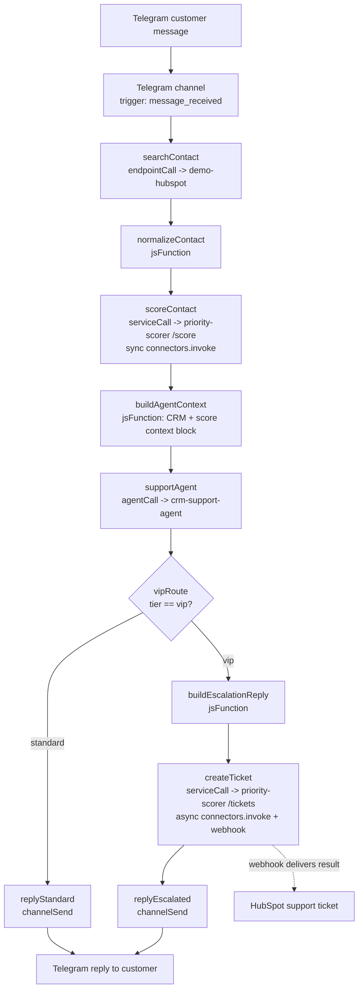

# crm-support-telegram

> Commercial showcase (see `../README.md`) — not an SDK feature sample.

## Pitch

End-to-end customer support over Telegram, backed by a real HubSpot CRM. A customer messages the
Telegram bot; a low-code workflow enriches every turn (looks up/creates the HubSpot contact,
scores priority via a hosted service, calls the AI agent, routes VIP customers to an escalation
path); an AI agent leads the actual conversation, personalized with the enriched CRM + priority
context; VIP customers get an escalation notice AND a real HubSpot support ticket, created
asynchronously.

The demo closes on **two screens**: the admin-console **run-view trace** (showing the whole
workflow execution — trigger, HubSpot lookup, priority score, agent turn, conditional branch,
reply — as one causally-linked chain a human can inspect) and the **real HubSpot ticket** the VIP
branch created, open in a second tab. Nothing in that ticket is faked — it is the SAME async
`connectors.invoke()` call the workflow fired, resolved by HubSpot itself.

Two SDK/platform capabilities get their own moment in the demo:

- **Code-over-low-code**: the `priority-scorer` hosted service is business logic that is easier to
  express in a real language than in the workflow builder (deal-count heuristics, tier thresholds)
  — deployed as an ordinary Knative service and invoked from the workflow like any other resource,
  no special casing.
- **Both `connectors.invoke()` modes in one flow**: a **parallel sync** call for the fast path
  (the priority score is available before the agent's next reply) and an **async invoke with
  `idempotencyKey` + webhook callback** for the slow path (ticket creation in HubSpot) — see
  "Async invoke: idempotencyKey and the polling window" below.
- **Declarative provisioning**: the entire demo — channel, connectors, knowledge base, skill,
  system variables, AI agent, hosted service, and workflow — is ONE `manifest.yaml`, applied with
  ONE command, idempotent (a second apply is a full no-op) — see "Declarative provisioning" below.

## Architecture



Every node above except the two `jsFunction` steps is a real platform resource the manifest
declares: the Telegram channel, the `demo-hubspot` connector (+ its 5 endpoints), the
`crm-support-agent` AI agent, the `priority-scorer` hosted service, and the
`crm-support-telegram` workflow that wires them together.

## Declarative provisioning

The whole demo is **one YAML file, one apply**: `manifest.yaml` declares every platform resource —
channel, HubSpot connector, LLM connector, knowledge base, skill, system variables, AI agent,
`priority-scorer` hosted service, and the workflow — and `yoizen manifests apply -f manifest.yaml
--secrets-from-env` converges the live cluster to match it. Re-applying is always safe: a second
apply against an already-converged cluster is a full **no-op** (0 creates, 0 updates) — the exact
proof this demo's own provisioning loop shipped with (`manual-loops/crm-support-telegram.md`
T02–T05).

**No plaintext secrets anywhere in the spec.** Five credentials this demo needs (the Telegram bot
token, the HubSpot Service Key, the OpenAI API key, and the `priority-scorer` service's own
platform login) are all referenced by NAME (`secretRef`) in `manifest.yaml`, never by value — the
real values are supplied once, out of band, via `--secrets-from-env`. For the two service-scoped
secrets (`YOIZEN_EMAIL`/`YOIZEN_PASSWORD`, bound to the `priority-scorer` service), the story goes
further than "not in the repo": they resolve **k8s-natively**, via `valueFrom.secretKeyRef`
pointing at the `psec-service-priority-scorer` Kubernetes Secret the platform's secrets broker
already manages — the resolved plaintext value never crosses into the manifest, the apply-engine's
own logs, or the live Knative Service spec (`kubectl get ksvc -o yaml` shows a secret reference,
never a value). This is the k8s-native design `manual-loops/provisioning-manifest-gaps-4.md`
shipped specifically to close that exposure — worth calling out live as part of the pitch: a
declarative platform that treats "no secrets in the spec" as a structural guarantee, not a
convention someone has to remember to follow.

The rest of the manifest's symbolic refs follow the same "declare by name, resolve at apply time"
pattern: `{ connectorRef: demo-hubspot }`, `{ agentRef: crm-support-agent }`,
`{ serviceRef: priority-scorer }`, even a specific connector ENDPOINT (`{ connectorRef:
demo-hubspot, endpointMethod: POST, endpointPath: /crm/v3/objects/tickets }`) — every id the
`priority-scorer` service and the workflow need is resolved from names, in the SAME apply, never
hand-copied from one provisioning step's output into the next step's input.

## Provisioning

**One declarative path**: `manifest.yaml` is the SOLE provisioning artifact for every platform
resource this demo needs. The former sequential `01-…05-*.sh`/`setup.sh` scripts are DELETED — there
is no other provisioning path, do not attempt to resurrect them.

Provisioning order:

```
./bootstrap.sh                                                       # (1) out-of-band items
yoizen manifests apply -f manifest.yaml --secrets-from-env            # (2) everything else
./run.sh                                                              # (3) end-to-end proof
```

1. **`./bootstrap.sh`** — the ONLY provisioning step left outside `manifest.yaml`, carrying
   exclusively what the manifest engine genuinely cannot express: builds/tags the
   `dev.local/priority-scorer:local` Docker image, ensures the HubSpot custom contact property
   `telegram_user_id` (a one-time Properties API schema mutation, not a connector endpoint), and
   registers the Telegram webhook + resolves `TELEGRAM_TEST_CHAT_ID` (direct Telegram Bot API
   calls, not platform resources). Idempotent — safe to re-run. Its webhook-registration stage
   reads the Telegram channel account `manifests apply` creates, so it is written to run either
   before OR after the first apply — before, it registers the webhook against a not-yet-existing
   account and fails loud with a clear message naming this same order; after, it succeeds
   immediately. Re-running it after `manifests apply` is the recommended order and always safe.
2. **`yoizen manifests apply -f manifest.yaml --secrets-from-env`** — creates/updates every
   platform resource. Needs the SDK checked out at `../../sdk` (run from there, or `bunx yoizen`
   once published) and the five secret bindings below present in the environment.
3. **`./run.sh`** — the end-to-end proof (simulated Telegram messages, execution polling,
   assertions, HubSpot cleanup). Verifies the manifest has been applied itself (fails fast naming
   this exact order if the workflow/service aren't found yet).

Re-running `bootstrap.sh` and `manifests apply` is always safe (both are idempotent,
create-or-update) — this is the standard recovery path if any step fails partway.

## Environment variables

**`--secrets-from-env` bindings** (read by `yoizen manifests apply --secrets-from-env`; binding
NAME must match the env var name exactly — see `manifest.yaml`'s `secrets:` block):

| Env var | Manifest secret binding | Scope |
| --- | --- | --- |
| `TELEGRAM_BOT_TOKEN` (as `telegram-bot-token`) | `telegram-bot-token` | `channel: crm-support-telegram-bot` |
| `HUBSPOT_SERVICE_KEY` (as `hubspot-service-key`) | `hubspot-service-key` | `connector: demo-hubspot` |
| `OPENAI_API_KEY` (as `crm-support-telegram-openai-api-key`) | `crm-support-telegram-openai-api-key` | `connector: sample-openai-llm` |
| `YOIZEN_EMAIL` (as `priority-scorer-yoizen-email`) | `priority-scorer-yoizen-email` | `service: priority-scorer` |
| `YOIZEN_PASSWORD` (as `priority-scorer-yoizen-password`) | `priority-scorer-yoizen-password` | `service: priority-scorer` |

Each binding name differs from its underlying credential's usual env var name (e.g.
`TELEGRAM_BOT_TOKEN` binds under `telegram-bot-token`), so `--secrets-from-env` needs the value
exposed under the BINDING name at apply time, e.g.:

```
env "telegram-bot-token=$TELEGRAM_BOT_TOKEN" \
    "hubspot-service-key=$HUBSPOT_SERVICE_KEY" \
    "crm-support-telegram-openai-api-key=$OPENAI_API_KEY" \
    "priority-scorer-yoizen-email=$YOIZEN_EMAIL" \
    "priority-scorer-yoizen-password=$YOIZEN_PASSWORD" \
    bun run bin/yoizen.ts manifests apply -f ../demos/crm-support-telegram/manifest.yaml --secrets-from-env
```

(run from `sdk/`; `YOIZEN_EMAIL`/`YOIZEN_PASSWORD` also double as the `priority-scorer` hosted
service's OWN platform login credentials at runtime — same values, two different purposes: the
CLI's own session auth, and the scorer's bound secret. The `priority-scorer-yoizen-*` bindings
resolve k8s-natively via `valueFrom.secretKeyRef`, never a plaintext env var in the Knative spec —
see "Declarative provisioning" above and `manual-loops/provisioning-manifest-gaps-4.md`.)

**Run-side env vars** (not manifest secrets — read directly by `bootstrap.sh`/`run.sh`):

| Var | Purpose |
| --- | --- |
| `TG_PUBLIC_URL` | Public URL (e.g. cloudflared tunnel) the Telegram webhook is reachable at — read by `bootstrap.sh`'s webhook-registration stage |
| `TELEGRAM_TEST_CHAT_ID` | Chat id used by `run.sh` to simulate a customer message. Auto-discovered by `bootstrap.sh` (DM the bot first) and cached if unset |
| `YOIZEN_TENANT`/`YOIZEN_EMAIL`/`YOIZEN_PASSWORD`/`YOIZEN_BASE_URL` | Platform login/session — not demo-specific, auto-defaulted by `lib/resolve-demo-env.sh` to the shared dev-seed convention |

No secrets are committed — every credential above is read from the environment (`.env`, not
tracked; see `.env.example` for the documented shape) at run time, sourced by
`lib/resolve-demo-env.sh` (same convention `bootstrap.sh`/`run.sh` both use).

## Async invoke: idempotencyKey and the polling window

VIP ticket creation (`createTicket`, `priority-scorer/src/create-ticket.ts`) is an **async**
`connectors.invoke()` call — it does not block the workflow waiting for HubSpot, it returns an
`invocationId` immediately and delivers the result via a webhook back to the scorer's own
`/webhooks/invoke` endpoint. Two details matter operationally:

- **`idempotencyKey`**: `ticket-<tenant>-<conversationId>-<turn>`, where `turn` is
  `{{executionId}}` (a fresh, unique value per workflow execution — one execution == one
  conversational turn). This is an AT-LEAST-ONCE delivery guarantee (a caller-side retry of the
  SAME invoke call collapses onto the same invocation instead of creating a second ticket), not a
  guarantee that re-running the WHOLE demo skips ticket creation — a new VIP-tier conversation
  turn always gets a new `executionId`, hence a new key, hence a new ticket. This is intentional:
  each real customer turn should produce its own ticket.
- **900-second (15-minute) polling window**: `connectors.invocations.get(invocationId)` only
  returns a result while it is parked in Redis, TTL 900s by default. Webhook delivery failure
  never blocks result availability (the result is still fetchable by polling until the TTL
  expires), but after 900s an otherwise-completed invocation returns `status: "expired"` (HTTP
  404) even though the ticket itself was created successfully in HubSpot. **Poll within 15 minutes
  of firing the async call**, or rely on the webhook delivery instead — do not assume a stale
  `invocationId` can be resolved indefinitely after the fact (this is exactly what `run.sh`'s own
  ticket-cleanup stage does: it polls immediately after the VIP-tier execution completes, well
  inside the window).

## Demo-day runbook

**Before the room**: confirm `bootstrap.sh` and `manifests apply` have both run cleanly against
the target cluster (a stale image or an un-applied manifest is the single most common failure
mode — re-run both, they are idempotent). DM the Telegram bot once from the demo phone/account so
`TELEGRAM_TEST_CHAT_ID` is resolvable, and have the HubSpot demo account and the admin-console open
in separate tabs ahead of time.

**What to click, what to say**:

1. Open the Telegram chat with the bot on screen. Send a normal support question (e.g. "where is
   my order?"). Narrate: *"this message hits our channel, a low-code workflow enriches it with the
   customer's real CRM context and a priority score, then an AI agent — not a scripted bot —
   replies using that context."* The reply arrives in a few seconds.
2. Switch to the admin-console **run-view trace** for that execution (Processes → the workflow's
   latest run). Walk the chain left to right: trigger → HubSpot lookup → priority score →
   agent turn → reply. *"Every step here is causally linked — this is not a log tail, it's the
   actual execution graph, inspectable after the fact."*
3. Send a SECOND message from the same test account, this time crossing the VIP threshold (the
   demo's seeded test contact/deals control this — see `src/06-run-e2e.ts`'s `VIP_DEAL_COUNT` for
   the exact seeding logic, or use a pre-seeded VIP contact for a live room). Narrate the
   conditional branch: *"the same workflow, same agent — but this customer crosses a priority
   threshold, so the reply tone shifts to an escalation notice AND a real support ticket gets
   created in HubSpot, asynchronously, without blocking the reply."*
4. **The two-screen close**: side by side, (a) the admin-console run-view trace for the VIP
   execution (showing the `createTicket` step and its `invocationId`) and (b) the HubSpot account,
   open on that exact ticket — same subject, same customer, created live, seconds ago. *"Nothing
   here is mocked — that ticket exists in a real HubSpot account right now, created by the same
   platform call you just watched execute."*
5. Optional close, if the room is technical: pull up `manifest.yaml` and run `yoizen manifests
   apply` a second time live — *"zero creates, zero updates — the whole demo you just watched is
   one file, and it's fully idempotent."* See "Declarative provisioning" above for the
   secret-handling story if asked how credentials are managed.

## Script inventory

| Script | Purpose |
| --- | --- |
| `bootstrap.sh` | Thin wrapper over `src/bootstrap.ts` — the out-of-band provisioning step (image build, HubSpot custom property, Telegram webhook + chat-id) — see Provisioning above |
| `run.sh` | Thin wrapper over `src/06-run-e2e.ts` — sends two simulated customer messages (standard-tier, then VIP-tier) end to end and reports the resulting Telegram reply + HubSpot ticket |

`manifest.yaml` (applied via the `yoizen` CLI, not a script in this directory) provisions
everything else. `priority-scorer/` is the hosted service's own source + Dockerfile, unrelated to
provisioning.
